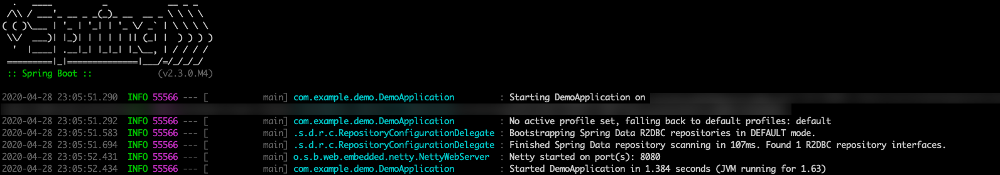
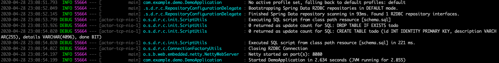

# Use Spring Data R2DBC with Azure SQL Database

This topic demonstrates creating a sample application that uses [Spring Data R2DBC](https://spring.io/projects/spring-data-r2dbc) to store and retrieve information in [Azure SQL Database](https://docs.microsoft.com/azure/sql-database/) by using the R2DBC implementation for Microsoft SQL Server from the [r2dbc-mssql GitHub repository](https://github.com/r2dbc/r2dbc-mssql).

[R2DBC](https://r2dbc.io/) brings reactive APIs to traditional relational databases. You can use it with Spring WebFlux to create fully reactive Spring Boot applications that use non-blocking APIs. It provides better scalability than the classic "one thread per connection" approach.

[!INCLUDE [spring-data-prerequisites.md](includes/spring-data-prerequisites.md)]

[!INCLUDE [spring-data-sql-server-setup.md](includes/spring-data-sql-server-setup.md)]

[!INCLUDE [spring-data-create-reactive.md](includes/spring-data-create-reactive.md)]

### Generate the application by using Spring Initializr

Generate the application on the command line by running the following command:

```bash
curl https://start.spring.io/starter.tgz -d dependencies=webflux,data-r2dbc -d baseDir=azure-database-workshop -d bootVersion=2.3.0.RELEASE -d javaVersion=8 | tar -xzvf -
```

### Add the reactive Azure SQL Database driver implementation

Open the generated project's *pom.xml* file to add the reactive Azure SQL Database driver from the [r2dbc-mssql GitHub repository](https://github.com/r2dbc/r2dbc-mssql).

After the `spring-boot-starter-webflux` dependency, add the following text:

```xml
<dependency>
    <groupId>io.r2dbc</groupId>
    <artifactId>r2dbc-mssql</artifactId>
    <scope>runtime</scope>
</dependency>
```

### Configure Spring Boot to use Azure SQL Database

Open the *src/main/resources/application.properties* file, and add the following text:

```properties
logging.level.org.springframework.data.r2dbc=DEBUG

spring.r2dbc.url=r2dbc:pool:mssql://$AZ_DATABASE_NAME.database.windows.net:1433/demo
spring.r2dbc.username=spring@$AZ_DATABASE_NAME
spring.r2dbc.password=$AZ_SQL_SERVER_PASSWORD
```

Replace the two `$AZ_DATABASE_NAME` variables and the `$AZ_SQL_SERVER_PASSWORD` variable with the values that you configured at the beginning of this article.

> [!NOTE]
> For better performance, the `spring.r2dbc.url` property is configured to use a connection pool using [r2dbc-pool](https://github.com/r2dbc/r2dbc-pool).

You should now be able to start your application by using the provided Maven wrapper as follows:

```bash
./mvnw spring-boot:run
```

Here's a screenshot of the application running for the first time:

[](media/configure-spring-data-r2dbc-with-azure-azure-sql/create-azure-sql-01.png#lightbox)

### Create the database schema

[!INCLUDE [spring-data-r2dbc-create-schema.md](includes/spring-data-r2dbc-create-schema.md)]

```sql
DROP TABLE IF EXISTS todo;
CREATE TABLE todo (id INT IDENTITY PRIMARY KEY, description VARCHAR(255), details VARCHAR(4096), done BIT);
```

Stop the running application, and start it again using the following command. The application will now use the `demo` database that you created earlier, and create a `todo` table inside it.

```bash
./mvnw spring-boot:run
```

Here's a screenshot of the database table as it's being created:

[](media/configure-spring-data-r2dbc-with-azure-azure-sql/create-azure-sql-02.png#lightbox)

## Code the application

Next, add the Java code that will use R2DBC to store and retrieve data from your Azure SQL Database server.

[!INCLUDE [spring-data-r2dbc-create-application.md](includes/spring-data-r2dbc-create-application.md)]

Here's a screenshot of these cURL requests:

[](media/configure-spring-data-r2dbc-with-azure-azure-sql/create-azure-sql-03.png#lightbox)

Congratulations! You've created a fully reactive Spring Boot application that uses R2DBC to store and retrieve data from Azure SQL Database.

[!INCLUDE [spring-data-conclusion.md](includes/spring-data-conclusion.md)]

### Additional resources

For more information about Spring Data R2DBC, see Spring's [reference documentation](https://docs.spring.io/spring-data/r2dbc/docs/current/reference/html/#reference).

For more information about using Azure with Java, see [Azure for Java developers](/azure/developer/java/) and [Working with Azure DevOps and Java](/azure/devops/).
