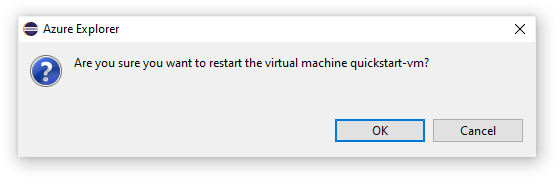
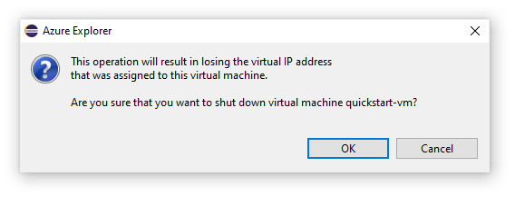
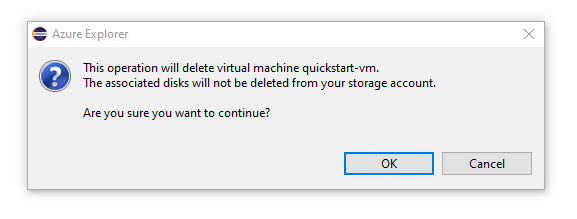

# Manage virtual machines by using the Azure Explorer for Eclipse

The Azure Explorer, which is part of the Azure Toolkit for Eclipse, provides Java developers with an easy-to-use solution for managing virtual machines in their Azure account from inside the Eclipse integrated development environment (IDE).

[!INCLUDE [prerequisites](includes/prerequisites.md)]

[!INCLUDE [show-azure-explorer](includes/show-azure-explorer.md)]

## Create a virtual machine

1. Sign in to your Azure account by using the [Sign-in instructions for the Azure Toolkit for Eclipse](./sign-in-instructions.md).

1. In the **Azure Explorer** view, expand the **Azure** node, right-click **Virtual Machines**, and then click **Create VM**.

   :::image type="content" source="media/managing-virtual-machines-using-azure-explorer/CR01.png" alt-text="Create VM option in Azure Explorer.":::

1. In the **Choose a Subscription** window, select your subscription, and then click **Next**.

1. In the **Select a Virtual Machine Image** window, select your **Location** (e.g. *West US*). You'll have the option to proceed with a recommended image or select a custom image. For this quickstart, we will proceed with the recommended image. 

   If you choose to select a custom image, enter the following information:
   * **Publisher**: Specifies the publisher that created the image you'll use to create your virtual machine (for example, *Microsoft*).

   * **Offer**: Specifies the virtual machine offering to use from the selected publisher (for example, *JDK*).

   * **Sku**: Specifies the stockkeeping unit (SKU) to use from the selected offering (for example, *JDK_8*).

   * **Version #**: Specifies which version of the selected SKU to use.

1. Click **Next**.

1. In the **Virtual Machine Basic Settings** window, enter the following information:

   * **Virtual Machine Name**: Specifies the name for your new virtual machine, which must start with a letter and contain only letters, numbers, and hyphens.

   * **Size**: Specifies the number of cores and memory to allocate for your virtual machine.

   * **User name**: Specifies the administrator account to create for managing your virtual machine.

   * **Password** : Specifies the password for your administrator account. Re-enter your password in the **Confirm** box to validate the credential.

1. Click **Next**.

1. In the **Associated Resources** window, enter the following information:
   * **Resource Group**: Specifies the resource group for your virtual machine. Select one of the following options:
      * **Create new**: Specifies that you want to create a new resource group.
      * **Use existing**: Specifies that you want to select a resource group that is already associated with your Azure account.

   * **Storage account**: Specifies the storage account to use for storing your virtual machine. You can use an existing storage account or create a new account.

   * **Virtual Network** and **Subnet**: Specifies the virtual network and subnet that your virtual machine will connect to. You can use an existing network and subnet, or you can create a new network and subnet. If you select **Create new**, the following dialog box is displayed:

   * **Public IP address**: Specifies an external-facing IP address for your virtual machine. You can choose to create a new IP address or, if your virtual machine will not have a public IP address, you can select **(None)**.

   * **Network security group**: Specifies an optional networking firewall for your virtual machine. You can select an existing firewall or, if your virtual machine will not use a network firewall, you can select **(None)**.

   * **Availability set**: Specifies an optional availability set that your virtual machine can belong to. You can select an existing availability set or create a new availability set or, if your virtual machine will not belong to an availability set, you can select **(None)**.

10. Click **Finish**.  

      > [!NOTE]
      > You can check the creation progress on the lower-right corner of your Eclipse workspace.

## Restart a virtual machine

To restart a virtual machine by using the Azure Explorer in Eclipse, do the following:

1. In the **Azure Explorer** view, right-click the virtual machine, and then select **Restart**.

1. In the confirmation window, click **OK**.

   

## Shut down a virtual machine

To shut down a running virtual machine by using the Azure Explorer in Eclipse, do the following:

1. In the **Azure Explorer** view, right-click the virtual machine, and then select **Shutdown**.

1. In the confirmation window, click **OK**.

   

## Delete a virtual machine

To delete a virtual machine by using the Azure Explorer in Eclipse, do the following:

1. In the **Azure Explorer** view, right-click the virtual machine, and then select **Delete**.

1. In the confirmation window, click **Yes**.

   

## Next steps

For more information about Azure virtual-machine sizes and pricing, see the following resources:

* Azure virtual-machine sizes
  * [Sizes for Windows virtual machines in Azure]
  * [Sizes for Linux virtual machines in Azure]
* Azure virtual-machine pricing
  * [Windows virtual-machine pricing]
  * [Linux virtual-machine pricing]

[!INCLUDE [additional-resources](includes/additional-resources.md)]

<!-- URL List -->

[Sizes for Windows virtual machines in Azure]: /azure/virtual-machines/sizes
[Sizes for Linux virtual machines in Azure]: /azure/virtual-machines/sizes
[Windows virtual-machine pricing]: https://azure.microsoft.com/pricing/details/virtual-machines/windows/
[Linux virtual-machine pricing]: https://azure.microsoft.com/pricing/details/virtual-machines/linux/

<!-- IMG List -->

[RE01]: media/managing-virtual-machines-using-azure-explorer/RE01.png
[RE02]: media/managing-virtual-machines-using-azure-explorer/RE02.png

[SH01]: media/managing-virtual-machines-using-azure-explorer/SH01.png
[SH02]: media/managing-virtual-machines-using-azure-explorer/SH02.png

[DE01]: media/managing-virtual-machines-using-azure-explorer/DE01.png
[DE02]: media/managing-virtual-machines-using-azure-explorer/DE02.png

[CR01]: media/managing-virtual-machines-using-azure-explorer/CR01.png
[CR02]: media/managing-virtual-machines-using-azure-explorer/CR02.png
[CR03]: media/managing-virtual-machines-using-azure-explorer/CR03.png
[CR04]: media/managing-virtual-machines-using-azure-explorer/CR04.png
[CR05]: media/managing-virtual-machines-using-azure-explorer/CR05.png
[CR06]: media/managing-virtual-machines-using-azure-explorer/CR06.png
[CR07]: media/managing-virtual-machines-using-azure-explorer/CR07.png
[CR08]: media/managing-virtual-machines-using-azure-explorer/CR08.png