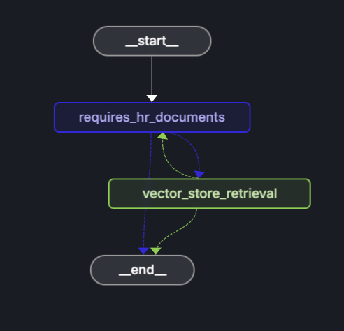
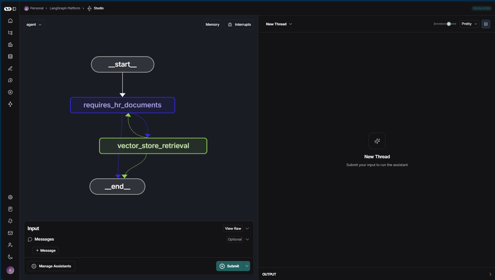

# Intelligent documentation search with LangChain.js and Azure AI Search

Use LangChain.js, as an AI framework to quickly create an AI agent which allows a _NorthWind_ company employee to ask human resources related questions. The benefit of adopting a framework is that much of the boilerplate code you need to write for AI agents and Azure service integration is abstracted away. This allows you to immediately focus on your business need.  

NorthWind has two data sources it pulls from: HR documentation internally available to all employees, and an HR database of confidential employee data that is secured to HR. Let's build an agent to determine if the employee's question can be answered by the internally public documents. If the question can be answered from these documents, provide the answer. 




## Agent architecture

The LangChain.js framework provides the decision flow for the agent as a graph. This graph is an orchestration structure that connects various nodes (like agents, tools, and processing steps) to form a workflow. The agent is one such node that makes decisions and generates responses based on inputs and available tools. Essentially, the graph manages the flow and state transitions between nodes (including multiple invocations of the agent), while the agent handles the logic for interacting with language models and optionally its tools. The agent is a LangChain.js graph which integrates with Azure AI Search and Azure OpenAI. Much of the work of integrating to the Azure services has been abstracted away so you just need to set configurations for the Azure services, organize the workflow, and provide any business logic. 

The Azure service integration includes: 
* The Azure AI Search service is used to provide a vector store for the HR documents. The document embeddings are created with an embeddings model from Azure OpenAI, such as `text-embedding-ada-002`, and inserted into the vector store using the _admin key_ for Azure AI Search.  
* The Azure OpenAI service is used as the large language model (LLM) such as `gpt-35-turbo-instruct` to be able to answer employee questions. It is also used to determine if the question is generally HR related so that the documents are relevant. 

|Question|Relevance to HR documents|
|--|--|
|`Does the NorthWind Health plus plan cover eye exams?`|This question is relevant to HR and general enough that the HR documents such as the employee handbook, the benefits handbook, and the employee role library should be able to answer it.|
|`How much of my perks + benefit have I spent`|This question isn't relevant to the general, impersonal HR documents. This question should be sent to an agent which has access to employee data. |

## Prerequisities

* [Node.js LTS](https://nodejs.org/)
* [TypeScript](https://www.typescriptlang.org/)
* [LangChain.js](https://www.npmjs.com/package/langchain)
* Optional [LangSmith](https://www.langchain.com/langsmith) project name, its key, and its endpoint. LangSmith allows you to observe your usage of AI. 
* Optional [LangGraph Studio](https://studio.langchain.com). This allows you to run and debug your LangGraph chains and agents.  
* [Azure AI Search resource](/azure/search/search-what-is-azure-search): the resource endpoint, the admin key to insert the documents, the query key to read the documents, and the index name. 
* [Azure OpenAI resource](/azure/ai-services/openai/): the resource instance name, the key, and 2 models and their API versions. An API version is not the same thing as a model version.
    * Embeddings model such as `text-embedding-ada-002` and its API version.
    * Large language model such as `gpt-35-turbo-instruct` and its API version. 
* Create a .env for local development with the to hold this information. 

    ```dotenv
    # Embedding resource
    AZURE_OPENAI_EMBEDDING_INSTANCE="<RESOURCE_INSTANCE_NAME>"
    AZURE_OPENAI_EMBEDDING_KEY=""
    AZURE_OPENAI_EMBEDDING_MODEL="text-embedding-ada-002"
    AZURE_OPENAI_EMBEDDING_API_VERSION="2023-05-15"
    
    ## LLM resource
    AZURE_OPENAI_COMPLETE_INSTANCE="<RESOURCE_INSTANCE_NAME>"
    AZURE_OPENAI_COMPLETE_KEY=""
    AZURE_OPENAI_COMPLETE_MODEL="gpt-35-turbo-instruct"
    AZURE_OPENAI_COMPLETE_API_VERSION="2024-10-21"
    AZURE_OPENAI_COMPLETE_MAX_TOKENS=1000
    
    # Azure AI Search connection settings
    AZURE_AISEARCH_ENDPOINT="https://<RESOURCE_INSTANCE_NAME>.search.windows.net"
    AZURE_AISEARCH_ADMIN_KEY=""
    AZURE_AISEARCH_QUERY_KEY=""
    AZURE_AISEARCH_INDEX_NAME="northwind"
    
    LANGSMITH_TRACING=true
    LANGSMITH_ENDPOINT="https://api.smith.langchain.com"
    LANGSMITH_API_KEY="lsv2_pt..."
    LANGSMITH_PROJECT=""
    NORTHWIND_PDF_LOADED=true
    ```

    The LangSmith functionality is optional and requires a LangSmith account. Set `LANGSMITH_TRACING` to true only for local development. Set this environment variable to false or remove it when you run the code in production. 


## Initialize your Node.js project

In a new directory, initialize your Node.js project for your esm TypeScript agent. 

```console
npm init -y
npm pkg set type=module
tsc init -y
```

## Install dependencies

1. Install the following Azure dependencies to use Azure AI Search.
    
    ```console
    npm install @azure/search-documents 
    ```

1. Install the following LangChain.js dependencies to create and use an agent.

    ```console
    npm install @langchain/community @langchain/core @langchain/langgraph @langchain/openai langchain
    ```

1. Install the following into your devDependencies to use with local development.

    ```console
    npm install --save-dev dotenv
    ```
    
## Azure resource configuration files

Because there are several resources and two models in the same Azure OpenAI resource instance, use a specific configuration file for each resource. 

The Azure AI Search configuration file to use the admin key to insert documents:

```typescript
// ./src/config/vector_store_admin.ts

const endpoint = process.env.AZURE_AISEARCH_ENDPOINT;
const adminKey = process.env.AZURE_AISEARCH_ADMIN_KEY;
const indexName = process.env.AZURE_AISEARCH_INDEX_NAME;

export const VECTOR_STORE_ADMIN = {
  endpoint,
  key: adminKey,
  indexName,
};
```

Typically, when using Azure AI Search, the developer needs to define a schema for how data is ingested into AI Search. By using LangChain.js, this need is abstracted away into a default schema which is usefully for most scenarios. 

When uploading data into Azure AI Search, you need to use the **admin** key. When querying the vector store, you should use the **query** key. In order to support these best practices, there are two configurations, one for admin and one for query. 

The same methodology is used for Azure OpenAI. The architecture needs two AI models: 1 to create embeddings to insert into AI Search vector store, and one to query with the LLM. Each Azure OpenAI has its own model. 

This specificity and clarity of configuration allows you to use the resource with the correct permission or model. 

> [!WARNING]
> This article uses keys to access resources. In a production environment, the recommended best practice is to use Azure RBAC and managed identity. This allows you to control authentication and access without managing or rotating keys.

Create other configuration files to manage the separate resources:

* [embeddings.ts](src/config/embeddings.ts)
* [llm.ts](src/config/llm.ts)
* [vector_store_query.ts](src/config/vector_store_query.ts)

AI applications in general, and LanChainjs in particular use some constant strings. Create files to hold these constants: 

* [system_prompt.ts](src/config/system_prompt.ts)
* [nodes.ts: define LangChain.js graph nodes](src/config/nodes.ts)
* [user_queries.ts: example user queries](src/config.ts)

## Load documents into Azure AI Search

Use LangChain.js to load the [PDF documents](data/) into Azure AI Search with the admin key. The LangChain.js orchestration makes it easy to create an Azure AI Search client and load the documents from the _data_ directory into AI Search for the vector store. 

Send the embeddings client and the directory path to **loadPdfsFromDirectory**. This uses the LangChain.js community **PDFLoader.load** method to load each file then return the document array, **Document[]**. This is the same document array you get with any of the LangChain loaders.  

```typescript
// src/azure/find_pdfs.ts

import { PDFLoader } from "@langchain/community/document_loaders/fs/pdf";
import { waiter } from "../utils/waiter.js";
import { loadDocsIntoAiSearchVector } from "./load_vector_store.js";
import fs from "fs/promises";
import path from "path";

export async function loadPdfsFromDirectory(
  embeddings: any,
  dirPath: string,
): Promise<void> {
  try {
    const files = await fs.readdir(dirPath);
    console.log(
      `PDF: Loading directory ${dirPath}, ${files.length} files found`,
    );
    for (const file of files) {
      if (file.toLowerCase().endsWith(".pdf")) {
        const fullPath = path.join(dirPath, file);
        console.log(`PDF: Found ${fullPath}`);

        const pdfLoader = new PDFLoader(fullPath);
        console.log(`PDF: Loading ${fullPath}`);
        const docs = await pdfLoader.load();

        console.log(`PDF: Sending ${fullPath} to index`);
        const storeResult = await loadDocsIntoAiSearchVector(embeddings, docs);
        console.log(`PDF: Indexing result: ${JSON.stringify(storeResult)}`);

        await waiter(1000 * 60); // waits for 1 minute between files
      }
    }
  } catch (err) {
    console.error("Error loading PDFs:", err);
  }
}
```

When you have the documents array for a PDF file, use the **loadDocsIntoAiSearchVector** with the embeddings client to send the array to Azure AI Search vector store. This sample code has a minimal effort to plan for TPM by using a wait function. In a production application, you would want to harden your wait/backoff/retry logic. 

```typescript
// src/azure/load_vector_store.ts

import { AzureAISearchVectorStore } from "@langchain/community/vectorstores/azure_aisearch";

import type { Document } from "@langchain/core/documents";
import type { EmbeddingsInterface } from "@langchain/core/embeddings";
import { VECTOR_STORE_ADMIN } from "../config/vector_store_admin.js";

export async function loadDocsIntoAiSearchVector(
  embeddings: EmbeddingsInterface,
  documents: Document[],
): Promise<AzureAISearchVectorStore> {
  const vectorStore = await AzureAISearchVectorStore.fromDocuments(
    documents,
    embeddings,
    VECTOR_STORE_ADMIN,
  );
  return vectorStore;
}
```

This solution to loading the files relied on LangChain.js for almost all of the work. This is the benefit of using an AI framework. Now that the data is loaded into the vector store, let's build the agent. 

## Agent workflow

In LangChain.js, build the agent with a LangGraph. This allows you to definition of the nodes, and edges:

* Node: where work is performed
* Edge: define the connection between nodes

In this application, the two work nodes are:

* **requiresHrResources** - determine if the question relevant to HR documentation with the Azure OpenAI LLM.
* **getAnswer** - get the answer. The answer comes from a LangChain.js retriever chain which uses the document embeddings from Azure AI Search which are sent to the Azure OpenAI LLM. This is the essence of retrieval augmented generation. 

The edges define where to start, end, and the condition needed to call the **getAnswer** answer node.

In order to use LangGraph Studio to run and debug the graph, export it as its own object. 

```typescript
import { StateGraph } from "@langchain/langgraph";
import { StateAnnotation } from "./langchain/state.js";
import { route as endRoute } from "./langchain/check_route_end.js";
import { getAnswer } from "./azure/vector_store.js";
import {
  START,
  ANSWER_NODE,
  DECISION_NODE,
} from "./config/nodes.js";
import {
  requiresHrResources,
  routeRequiresHrResources,
} from "./azure/requires_hr_documents.js";

const builder = new StateGraph(StateAnnotation)
  .addNode(DECISION_NODE, requiresHrResources)
  .addNode(ANSWER_NODE, getAnswer)
  .addEdge(START, DECISION_NODE)
  .addConditionalEdges(DECISION_NODE, routeRequiresHrResources)
  .addConditionalEdges(ANSWER_NODE, endRoute);

export const hr_documents_answer_graph = builder.compile();
hr_documents_answer_graph.name = "Azure AI Search + Azure OpenAI";
```

In the **addNode**, **addEdge**, and **addContionalEdges** methods, the first parameter is a name, as a string, to identify the object within the graph. The second parameter is either the function that should be called at that step, or the name of the node to call. 

For the **addEdge** method, its name is START ("__start__" defined in the ./src/config/nodes.ts file) and it always calls the DECISION_NODE. That node is defined with its two parameters: the first is its name, DECISION_NODE and the second is the function called **requiresHrResources**.

This app provides common LangChain functionality: 

* [state](./src/langchain/state.ts)
* [END route](./src/langchain/check_route_end.ts)

The only custom route for this application is the **routeRequiresHrResources**. This route is used to determine if the answer from **requiresHrResources** node indicates that the users's question should continue on to the **ANSWER_NODE** node. Because this route receives the output of **requiresHrResources**, it is in the same file. 

## Build the Azure OpenAI integration

The Azure OpenAI integration has two different models used. 

* **Embeddings**: The first is the embeddings model, used to insert the documents into the vector store. 
* **LLM**: The second integration is to be able to use Azure OpenAI to answer a question. 

The embeddings client the and LLM client, and their models, serve different purposes. Do not reduce them to a single model and client. 

### Embeddings model

Anytime we need documents out of the vector store, we also need the embedding client. The **embeddings** client is fairly simple, with one additional configuration provided of **maxRetries**. 

```typescript
// src/azure/embeddings.ts

import { AzureOpenAIEmbeddings } from "@langchain/openai";
import { EMBEDDINGS_CONFIG } from "../config/embeddings.js";

export function getEmbeddingClient(): AzureOpenAIEmbeddings {
  return new AzureOpenAIEmbeddings({ ...EMBEDDINGS_CONFIG, maxRetries: 1 });
}
```

### LLM model

This application has two questions the LLM needs to answer: 
    * **Relevant to HR**: is the user's question relevant to HR. 
    * **Answer**: what is the answer to the user's question, augmented with documents from Azure AI Search.

The **LLM** code creates the client and calls the model when an answer is necessary. 

```typescript
// src/azure/llm.ts

import { RunnableConfig } from "@langchain/core/runnables";
import { StateAnnotation } from "../langchain/state.js";
import { AzureOpenAI } from "@langchain/openai";
import { LLM_CONFIG } from "../config/llm.js";

export const getLlmClient = (): AzureOpenAI => {
  return new AzureOpenAI({
    ...LLM_CONFIG,
    temperature: 0,
  });
};

export const callCompletionModel = async (
  state: typeof StateAnnotation.State,
  _config: RunnableConfig,
): Promise<typeof StateAnnotation.Update> => {
  const llm = new AzureOpenAI({
    ...LLM_CONFIG,
    temperature: 0,
  });

  const completion = await llm.invoke(state.messages);
  completion;

  return {
    messages: [
      ...state.messages,
      {
        role: "assistant",
        content: completion,
      },
    ],
  };
};
```

The agent uses the LLM to determine if the question is relevant to HR documentation or whether the workflow should route to the end of the graph.

```typescript
// src/azure/requires_hr_documentation.ts

// @ts-nocheckimport { getLlmClient } from "./llm.js";
import { StateAnnotation } from "../langchain/state.js";
import { RunnableConfig } from "@langchain/core/runnables";
import { BaseMessage } from "@langchain/core/messages";
import { ANSWER_NODE, END } from "../config/nodes.js";

const HR_DOCS_REQUIRED = "HR resources required detected.";

export async function requiresHrResources(
  state: typeof StateAnnotation.State,
  _config: RunnableConfig,
): Promise<typeof StateAnnotation.Update> {

  const lastUserMessage: BaseMessage = [...state.messages].reverse()[0];

  let hrRequired = false;

  if (lastUserMessage && typeof lastUserMessage.content === "string") {
    
    const question = `Does the following question require a specific companies' HR resources such as employee handbook, company medical benefits, vacation policies, and promotion, salary, and role criteria. Answer no if this requires employee data specific to the asker: '${lastUserMessage.content}'. Answer with only "yes" or "no".`;

    const llm = getLlmClient();
    const answer = (await llm.invoke(question)).toLocaleLowerCase();
    hrRequired = answer === "yes";
  }

  // If HR documents (aka vector store) are required, append an assistant message to signal this.
  if (!hrRequired) {
    const updatedState = {
      messages: [
        ...state.messages,
        {
          role: "assistant",
          content: HR_DOCS_REQUIRED + "Aborting query.",
        },
      ],
    };

    return updatedState;
  } else {
    const updatedState = {
      messages: [
        ...state.messages,
        {
          role: "assistant",
          content: "Great question for our HR resources. Let me check.",
        },
      ],
    };

    return updatedState;
  }
}

export const routeRequiresHrResources = (
  state: typeof StateAnnotation.State,
): typeof END | typeof ANSWER_NODE => {
  const lastMessage: BaseMessage = [...state.messages].reverse()[0];

  if (lastMessage && lastMessage.content.includes(HR_DOCS_REQUIRED)) {
    return END;
  }

  return ANSWER_NODE;
};

```

The **requiresHrResources** function sets a message in the updated state with `HR resources required detected` content. The router, **routeRequiresHrResources** looks for that content to determine where to send the messages.

## Build the Azure AI Search integration

The Azure AI Search integration provides the vector store documents so the LLM can augment the answer for the **getAnswer** node. LangChain.js again provides much of the abstraction so the required code is minimal. The functions are:

* **getReadOnlyVectorStore**: get the client with the query key
* **getDocsFromVectorStore**: find relevant docs to the user's question

```typescript
// ./src/azure/vector_store.ts

import { AzureAISearchVectorStore } from "@langchain/community/vectorstores/azure_aisearch";
import { VECTOR_STORE_QUERY, DOC_COUNT } from "../config/vector_store_query.js";
import { getEmbeddingClient } from "./embeddings.js";

export function getReadOnlyVectorStore(): AzureAISearchVectorStore {
  const embeddings = getEmbeddingClient();
  return new AzureAISearchVectorStore(embeddings, VECTOR_STORE_QUERY);
}

export async function getDocsFromVectorStore(
  query: string,
): Promise<Document[]> {
  const store = getReadOnlyVectorStore();

  // @ts-ignore
  //return store.similaritySearchWithScore(query, DOC_COUNT);
  return store.similaritySearch(query, DOC_COUNT);
}
```

The LangChain.js integration code makes getting the relevant documents out of the vector store incredibly easy. 

## Get answer from LLM

Now that the integration components are built, let's build the **getAnswer** function to get the relevant vector store documents and answer the question from the LLM. 

```typescript
// src/azure/get_answer.ts

import { ChatPromptTemplate } from "@langchain/core/prompts";
import { createStuffDocumentsChain } from "langchain/chains/combine_documents";
import { createRetrievalChain } from "langchain/chains/retrieval";
import { getLlmClient } from "./llm.js";
import { StateAnnotation } from "../langchain/state.js";
import { AIMessage } from "@langchain/core/messages";
import { getReadOnlyVectorStore } from "./vector_store.js";

const EMPTY_STATE = { messages: [] };

export async function getAnswer(
  state: typeof StateAnnotation.State = EMPTY_STATE,
): Promise<typeof StateAnnotation.Update> {
  const vectorStore = getReadOnlyVectorStore();

  // Extract the last user message's content from the state as input
  const lastMessage = state.messages[state.messages.length - 1];

  const userInput =
    lastMessage && typeof lastMessage.content === "string"
      ? lastMessage.content
      : "";

  const questionAnsweringPrompt = ChatPromptTemplate.fromMessages([
    [
      "system",
      "Answer the user's questions based on the below context:\n\n{context}",
    ],
    ["human", "{input}"],
  ]);

  const combineDocsChain = await createStuffDocumentsChain({
    llm: getLlmClient(),
    prompt: questionAnsweringPrompt,
  });

  const retrievalChain = await createRetrievalChain({
    retriever: vectorStore.asRetriever(2),
    combineDocsChain,
  });
  const result = await retrievalChain.invoke({ input: userInput });
  const assistantMessage = new AIMessage(result.answer);

  return {
    messages: [...state.messages, assistantMessage],
  };
}
```

This function provides a prompt with two placeholders: one for the user's question and one for context. The context is all the relevant documents for the AI Search vector store. Pass the prompt and the LLM client to the **createStuffDocumentsChain**, to create an LLM chain. Pass the LLM chain to **createRetrievalChain** to create a chain which has the prompt, relevant documents, and the LLM. 

Run the chains with **retrievalChain.invoke** and the user's question as input to get the answer. Return the answer in the messages state. 

## Build the TypeScript agent

1. Add a script to **package.json** to build the TypeScript application: 

    ```json
    "build": "tsc",
    ```
    
1. Build the agent.

    ```console
    npm run build
    ```

## Optional - run the agent in local development with LangChain Studio

Optionally, for local development, use LangChain Studio to work with your agent. 

1. Create a `langgraph.json` file to define the graph.

    ```json
    {
        "dependencies": [],
        "graphs": {
          "agent": "./src/graph.ts:hr_documents_answer_graph"
        },
        "env": ".env"
      }
    ```

1. Install the LangGraph CLI.

    ```console
    npm install @langchain/langgraph-cli --save-dev
    ```

1. Create a script in **package.json** to pass the .env file to the CLI. 

    ```json
    "studio": "npx @langchain/langgraph-cli dev",
    ```

1. The CLI runs in your terminal and opens a browser to the LangGraph Studio.

    ```console
              Welcome to
    
    ╦  ┌─┐┌┐┌┌─┐╔═╗┬─┐┌─┐┌─┐┬ ┬
    ║  ├─┤││││ ┬║ ╦├┬┘├─┤├─┘├─┤
    ╩═╝┴ ┴┘└┘└─┘╚═╝┴└─┴ ┴┴  ┴ ┴.js
    
    - 🚀 API: http://localhost:2024
    - 🎨 Studio UI: https://smith.langchain.com/studio?baseUrl=http://localhost:2024
    
    This in-memory server is designed for development and testing.
    For production use, please use LangGraph Cloud.
    
    
    info:    ▪ Starting server...
    info:    ▪ Initializing storage...
    info:    ▪ Registering graphs from C:\Users\diberry\repos\diberry\azure-typescript-langchainjs\packages\langgraph-agent
    info:    ┏ Registering graph with id 'agent'
    info:    ┗ [1] { graph_id: 'agent' }
    info:    ▪ Starting 10 workers
    info:    ▪ Server running at ::1:2024
    ``` 
   

1. View the agent in the LangGraph Studio.

    

1. Select **+ Message** to add a user question then select **Submit**. 

    |Question|Relevance to HR documents|
    |--|--|
    `Does the NorthWind Health plus plan cover eye exams?`|This question is relevant to HR and general enough that the HR documents such as the employee handbook, the benefits handbook, and the employee role library should be able to answer it.|
    |`What is included in the NorthWind Health plus plan that is not included in the standard?`|This question is relevant to HR and general enough that the HR documents such as the employee handbook, the benefits handbook, and the employee role library should be able to answer it.|
    |`How much of my perks + benefit have I spent`|This question isn't relevant to the general, impersonal HR documents. This question should be sent to an agent which has access to employee data. |

1. If the question is relevant to the HR docs and should pass through the **DECISION_NODE** and on to the **ANSWER_NODE**. 

    Watch the terminal output to see the question to the LLM and the answer from the LLM. 

    View the LangGraph Studio run the agent. 

1. If the question isn't relevant to the HR docs, the flow goes directly to **__end__**

If the agent makes an incorrect decision, that can indicate an issue with one of the following:

* LLM model used
* Number of documents from vector store
* Prompt used in the decision node. 

## Run the agent from an app

To call the agent from a parent application, such as a web API, you need to provide the invocation of the agent.

```typescript
import { HumanMessage } from "@langchain/core/messages";
import { hr_documents_answer_graph as app } from "./graph.js";

const AIMESSAGE = "aimessage";

export async function ask_agent(question: string) {
  const initialState = { messages: [new HumanMessage(question)], iteration: 0 };
  const finalState = await app.invoke(initialState);

  return finalState;
}
export async function get_answer(question: string) {
  return ask_agent(question)
  .then((response: any) => {
    console.log(
      response.messages
        .filter(
          (m: any) =>
            m &&
            m.constructor?.name?.toLowerCase() ===
              AIMESSAGE.toLocaleLowerCase(),
        )
        .map((m: any) => m.content)
        .join("\n"),
    );
  })
  .catch(console.error);
}
```

The two functions are:

* **ask_agent**: This function returns state so it allows you to add the agent to a LangChain multi-agent workflow.
* **get_answer**: This function returns just the text of the answer. This function can be called from a API


## Troubleshooting

* For any issues with the procedure, create an issue on the [sample code repository](https://github.com/Azure-Samples/azure-typescript-langchainjs/issues)
