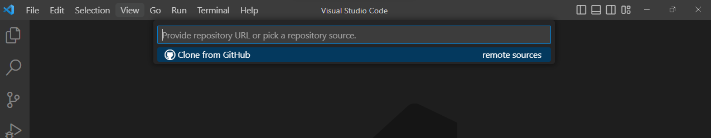
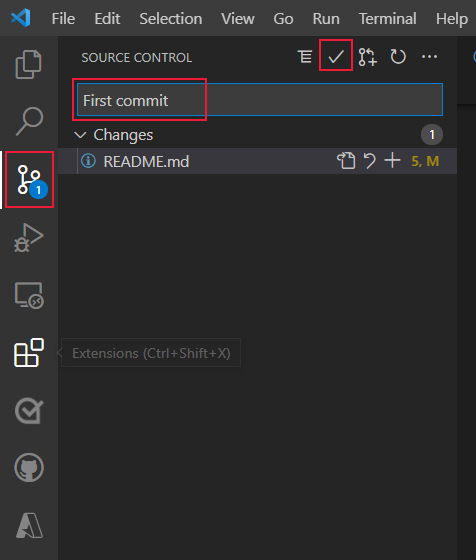

# Clone and work with a GitHub repository with Visual Studio Code

Learn the steps to clone a public repository from GitHub to your local computer using Visual Studio Code.

Working in Visual Studio Code with a repository uses separate tools:

|Icon|Information|Access from|
|--|--|--|
|| Git CLI |command palette - F1|
|:::image type="content" source="../../media/how-to-clone-github-repo/git-commit-icon-activity-bar.png" alt-text="Search for `git branch` and select `Git: Create Branch`.":::|Source control extension|Activity bar|
|:::image type="content" source="../../media/how-to-clone-github-repo/github-icon-activity-bar.png" alt-text="Search for `git branch` and select `Git: Create Branch`.":::|GitHub extension|Activity bar|

These tools are meant to be quick to accomplish common tasks. The following procedures use the named parts of the [Visual Studio Code user interface](https://code.visualstudio.com/docs/getstarted/userinterface). 

## Use command palette to clone repository

To get started, download the sample project using the following steps:

1. Press **F1** to display the command palette.

1. At the command palette prompt, enter `gitcl`, select the **Git: Clone** command, and press **Enter**.

    

1. When prompted for the **Repository URL**, enter a GitHub repository url, then press **Enter**.

1. Select (or create) the local directory into which you want to clone the project.

    

## Create a branch for changes with Git CL

Use Git in the command palette to create a new branch.

1. Press **F1** to display the command palette.
1. Search for `git branch` and select `Git: Create Branch`.

    :::image type="content" source="../../media/how-to-clone-github-repo/git-cli-branch-list.png" alt-text="Search for `git branch` and select `Git: Create Branch`.":::

1. Enter a new branch name. The branch name is visible in the status bar. 

    :::image type="content" source="../../media/how-to-clone-github-repo/git-branch-status-bar-vscode.png" alt-text="The branch name is visible in the status bar.":::

## Create a branch from status bar

1. Select the branch name in the status bar. 

    The status bar is usually found at the bottom of Visual Studio code. 

1. In the command palette, select **++Create a new branch**.
1. Enter your new branch name. 

1. Enter a new branch name. The branch name is visible in the status bar. 

    :::image type="content" source="../../media/how-to-clone-github-repo/git-branch-status-bar-vscode.png" alt-text="The branch name is visible in the status bar.":::

## Commit changes with Git 

Once you have made changes on your branch, commit the changes

1. Switch to the activity bar and select the Git icon.

1. In the **Message** box, enter a commit message, and press **Ctrl**+**Enter**, or select the check mark in the Source Control bar.

    

## Push a local branch to remote from status bar

1. Select the push icon to the right of the branch name. 
1. Select the remote name from the pop-up box. If you have just one remote, you won't be asked to select the remote name. 

## Push a local branch to remote from the Source Control extension
1. Select the Source Control icon from the activity bar. 
1. Select the ellipsis (...) then select **Pull, Push**, then select **Push to...*. 
1. Select the remote name from the pop-up box. If you have just one remote, you won't be asked to select the remote name. 

## Next steps

* How to [deploy a web app](deploy-web-app.md)
