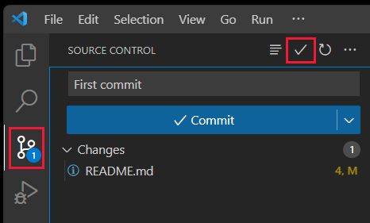

# Clone and use a GitHub repository in Visual Studio Code

Learn the steps to clone a public repository from GitHub to your local computer using Visual Studio Code.

## Clone repository

The act of cloning a GitHub repository means to bring the cloud-based source code into a local development environment.

#### [Activity bar](#tab/activity-bar)

This action isn't available from this feature. Select a different tab. 

#### [Status bar](#tab/status-bar)

This action isn't available from this feature. Select a different tab. 

#### [Command palette](#tab/command-palette)

1. Open the command palette with the key combination of <kbd>Ctrl</kbd> + <kbd>Shift</kbd> + <kbd>P</kbd>. 
1. At the command palette prompt, enter `gitcl`, select the **Git: Clone** command, then select **Clone from GitHub** and press **Enter**.
1. When prompted for the **Repository URL**, select clone from GitHub, then press **Enter**.
1. If you're asked to sign into GitHub, complete the sign-in process.
1. Enter [azure-samples/js-e2e-express-server](https://github.com/Azure-Samples/js-e2e-express-server) in the **Repository URL** field. 
1. Select (or create) the local directory into which you want to clone the project then select **Select as Repository Destination**.
1. When you receive the notification asking if you want to open the cloned repository, select **Open**. 

#### [Integrated terminal](#tab/integrated-terminal)

1. Open an integrated terminal from **Terminal -> New Terminal**. 
1. Clone your repo with the following git command:

    ```bash
    git clone https://github.com/YOUR-NAME-OR-ORGANIZATION/YOUR-REPO-NAME
    ```

1. Change your terminal into that new subdirectory:

    ```bash
    cd YOUR-REPO-NAME
    ```

1. Then open in Visual Studio Code:

    ```bash
    code .
    ```

---

## Initialize new repository

If you don't have a GitHub repository yet, but would like to start your project locally, initialize your folder with git. 

#### [Activity bar](#tab/activity-bar)

1. Select source control from the activity bar, or use the key combination of <kbd>Ctrl</kbd> + <kbd>Shift</kbd> + <kbd>G</kbd>.
1. Select **Initialize repository**. 

    :::image type="content" source="../../media/how-to-clone-github-repo/visual-studio-code-initialize-repository.png" alt-text="Screenshot of Visual Studio showing the Initialize repository button.":::

#### [Status bar](#tab/status-bar)

This action isn't available from this feature. Select a different tab. 

#### [Command palette](#tab/command-palette)

1. Open the command palette with the key combination of <kbd>Ctrl</kbd> + <kbd>Shift</kbd> + <kbd>P</kbd>. 
1. Filter with `Git`, then select `Initialize repository`.
1. Select the folder to select as the root of the repository.

#### [Integrated terminal](#tab/integrated-terminal)

1. Open an integrated terminal from **Terminal -> New Terminal**. 
1. Initialize your folder with git with the following git command:

    ```bash
    git init
    ```
---


## Create a branch for changes 

#### [Activity bar](#tab/activity-bar)

1. Select source control from the activity bar.
1. Select ellipsis (...) next to **Source Control**.
1. Select **Branch** -> **Create Branch**.

#### [Status bar](#tab/status-bar)

1. Select the branch name in the status bar. This opens the command palette.

    The status bar is found at the bottom of Visual Studio Code. 

1. In the command palette, select **+Create a new branch**.
1. Enter your new branch name. 

1. Enter a new branch name. The branch name is visible in the status bar. 

    :::image type="content" source="../../media/how-to-clone-github-repo/git-branch-status-bar-visual-studio-code.png" alt-text="The branch name is visible in the status bar.":::

#### [Command palette](#tab/command-palette)


1. Open the command palette with the key combination of <kbd>Ctrl</kbd> + <kbd>Shift</kbd> + <kbd>P</kbd>. 
1. Search for `git branch` and select `Git: Create Branch`.

    :::image type="content" source="../../media/how-to-clone-github-repo/git-cli-branch-list.png" alt-text="Screenshot of a search for `git branch` and select `Git: Create Branch`.":::

1. Enter a new branch name, such as `test`. 
1. The branch name is visible in the status bar. 

    :::image type="content" source="../../media/how-to-clone-github-repo/git-branch-status-bar-visual-studio-code.png" alt-text="Screenshot showing the branch name is visible in the status bar.":::

#### [Integrated terminal](#tab/integrated-terminal)

1. Open an integrated terminal from **Terminal -> New Terminal**. 
1. Create a new branch named `MY-BRANCH` with the following git command:

    ```bash
    git checkout -b MY-BRANCH
    ```

---


## Commit changes locally

Once you have made changes on your branch, commit the changes.

#### [Activity bar](#tab/activity-bar)

1. Select source control from the activity bar.
1. Enter your commit message, then select **Commit**.

    

#### [Status bar](#tab/status-bar)

This action isn't available from this feature. Select a different tab. 


#### [Command palette](#tab/command-palette)

1. Open the command palette with the key combination of <kbd>Ctrl</kbd> + <kbd>Shift</kbd> + <kbd>P</kbd>. 
1. In the command palette, filter with `Git` then select `Commit`.
1. Enter your commit message, then press <kbd>Enter</kbd>.

#### [Integrated terminal](#tab/integrated-terminal)

1. Open an integrated terminal from **Terminal -> New Terminal**. 
1. Create a new branch named `MY-BRANCH` with the following git command:

    ```bash
    git commit -m "YOUR COMMIT MESSAGE"
    ```

---

## Push a local branch to GitHub

#### [Activity bar](#tab/activity-bar)

1. Select the Source Control icon from the activity bar. 
1. Select **Publish Branch**. If the repository doesn't exist on GitHub, it creates the repository for you.

#### [Status bar](#tab/status-bar)

1. On the Visual Studio Code status bar, select the push icon to the right of the branch name. 

    :::image type="content" source="../../media/how-to-clone-github-repo/visual-studio-code-status-bar-push-commits.png" alt-text="Visual Studio Code status bar, with the push icon highlighted.":::

1. Select the remote name from the pop-up box. If you have just one remote, you won't be asked to select the remote name. 

#### [Command palette](#tab/command-palette)

1. Open the command palette with the key combination of <kbd>Ctrl</kbd> + <kbd>Shift</kbd> + <kbd>P</kbd>. 
1. In the command palette, filter with `Git` then select `Push`.
1. If you have multiple upstream remotes, select the remote then press <kbd>Enter</kbd>.


#### [Integrated terminal](#tab/integrated-terminal)

1. Open an integrated terminal from **Terminal -> New Terminal**. 
1. Create a new branch named `MY-BRANCH` with the following git command:

    ```bash
    git push <remote-name> <branch-name>
    ```

---

## View Git output

You can view the Git commands run when you use the Source control extension. This helps debug when a command fails. 

1. Select the Source Control icon from the activity bar. 
1. Select the ellipsis (...) then select **Show Git Output**.

    :::image type="content" source="../../media/how-to-clone-github-repo/visual-studio-code-show-git-output.png" alt-text="Visual Studio Code source control, with the Show Git Output selection highlighted.":::

## Visual Studio Code tools to work with Git and GitHub

Working in Visual Studio Code with a repository uses separate tools.

|Icon|Information|[Access from](https://code.visualstudio.com/docs/getstarted/userinterface)|
|--|--|--|
|| [Git commands](https://code.visualstudio.com/docs/getstarted/userinterface#_command-palette) in command palette|<kbd>F1</kbd>|
|:::image type="content" source="../../media/how-to-clone-github-repo/git-commit-icon-activity-bar.png" alt-text="Icon for Source control.":::|Source control extension|Activity bar|
|:::image type="content" source="../../media/how-to-clone-github-repo/github-icon-prs-issues.png" alt-text="Icon for GitHub PRs and Issues":::|[GitHub Pull Requests and Issues](https://marketplace.visualstudio.com/items?itemName=GitHub.vscode-pull-request-github) extension|Activity bar|
||[GitHub Repositories](https://marketplace.visualstudio.com/items?itemName=GitHub.remotehub) extension|You can quickly and easily open a GitHub repository either by searching for GitHub Repositories: Open Repository... from the Command Palette, <kbd>F1</kbd>, or by choosing Open GitHub Repository... from the remote indicator (the green button in the lower left corner of the status bar).|


## Next steps

* How to [deploy a web app](../deploy-web-app.md)
* [Working with GitHub in Visual Studio Code](https://code.visualstudio.com/docs/editor/github)
* [Using Visual Studio Code with other version control providers](https://code.visualstudio.com/docs/editor/versioncontrol)
