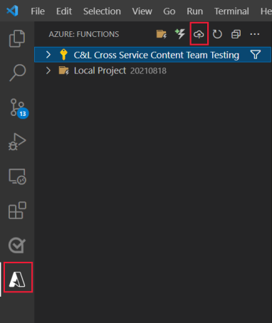

# 4. Add APIs to function app and redeploy to Azure

In this article of the series, you add APIs to add and delete resource groups, then redeploy your Azure Function app in Visual Studio Code. 

At this point in the article series, you created a local function app with one API to list your subscription's resource groups and you deployed that app to Azure. As an Azure developer, you may want to create or delete resource groups as part of your process automation pipeline. 

## Create resource-group API for your function app

Use the Visual Studio Code extension for Azure Functions to add the APIs files to your function app. 

1. Open the Visual Studio Code command palette: <kbd>Ctrl</kbd> + <kbd>Shift</kbd> + <kbd>p</kbd>.
1. Enter `Azure Functions: Create Function` then press enter to begin the process.
1. Use the following table to create the **/api/resource-group** API:

    |Prompt|Value|
    |--|--|
    |Select a template for your function|HTTP trigger|
    |Provide a function name|`resource-group`|
    |Authorization level|Select **anonymous**. If you continue with this project after this article series, change the authorization level to the function. Learn more about [Function-level authorization](/azure/azure-functions/security-concepts#function-access-keys).|
1. To limit the function to adding and deleting resource groups, open the `./resource-group/function.json` and edit the methods to `POST` and `DELETE`.

    :::code language="JSON" source="~/../js-e2e-azure-resource-management-functions/resource-group/function.json" highlight="9":::

## Add TypeScript code to add and delete resource groups

1. Open the `./resource-group/index.ts` file and replace the contents with the following: 

    :::code language="TypeScript" source="~/../js-e2e-azure-resource-management-functions/resource-group/index.ts" highlight="32,43,52,63":::

    This file depends on new functionality in the `./lib` directory.

1. Copy the following code into the bottom of the `azure-resource-groups.ts` file:

    :::code language="TypeScript" source="~/../js-e2e-azure-resource-management-functions/lib/azure-resource-groups.ts" range="18-32" highlight="25-28,31":::

## Start your local function app and test the new API

1. In the Visual Studio Code integrated terminal, run the local project:

    ```bash
    npm start
    ```

1. Wait until the integrated bash terminal displays the running function's URL.

    :::image type="content" source="../../../media/azure-function-resource-group-management/visual-studio-code-terminal-running-function-post-delete.png" alt-text="Partial screenshot of Visual Studio Code's integrated bash terminal when the Azure Function is running locally and displaying the local URLs for the APIs in the Function app.":::

1. Use the following curl command in a different integrated bash terminal, to call your API, to add a resource group to your subscription. Change the name of the resource group to use your own naming conventions.

    :::code language="TypeScript" source="~/../js-e2e-azure-resource-management-functions/resource-group/index.ts" range="11-13":::

1. Use the following curl command to see the new resource group listed in your subscription.

    :::code language="TypeScript" source="~/../js-e2e-azure-resource-management-functions/resource-groups/index.ts" range="8":::

1. Use the following curl command to delete the resource group you just added. 

    :::code language="TypeScript" source="~/../js-e2e-azure-resource-management-functions/resource-groups/index.ts" range="15-17":::

## Redeploy your function app with new APIs to Azure

1. In VS Code, select the Azure logo to open the **Azure Explorer**, then under **Functions**, select the blue up arrow to deploy your app:

    

    Alternately, you can deploy by opening the **Command Palette** with <kbd>Ctrl</kbd> + <kbd>Shift</kbd> + <kbd>p</kbd>, entering `deploy to function app`, and running the **Azure Functions: Deploy to Function App** command.

1. Select your function app from the list of apps.
1. Select **Deploy** from the pop-up window.
1. Wait until the deployment completes.

## Verify Function APIs with browser

In the following cURL commands, replace `YOUR-RESOURCE-NAME` with your Azure Function resource name and `REPLACE-WITH-YOUR-RESOURCE-GROUP-NAME` with your resource group name.

1. Use the following curl command in an integrated bash terminal, to call to add a resource group to your subscription. Change the name of the resource and resource group to use your own naming conventions.

    :::code language="bash" source="~/../js-e2e-azure-resource-management-functions/README.md" range="59-61":::

1. Use the following curl command to see the new resource group listed in your subscription.

    :::code language="bash" source="~/../js-e2e-azure-resource-management-functions/README.md" range="75":::

1. Use the following curl command to delete the resource group you just added. 

    :::code language="bash" source="~/../js-e2e-azure-resource-management-functions/README.md" range="67-39":::

    Deleting a resource group will delete all resources within the group and may take a minute to complete.

## Next steps

* [View and query application logs](view-and-query-application-logs.md)