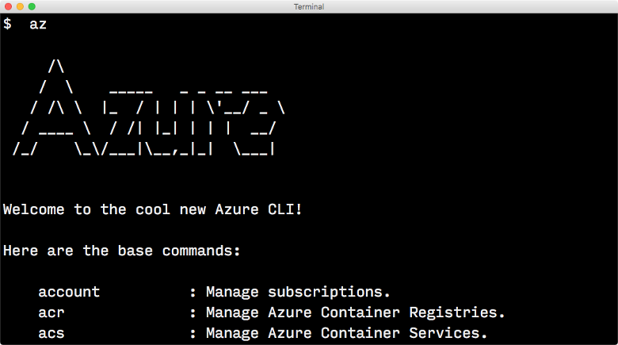
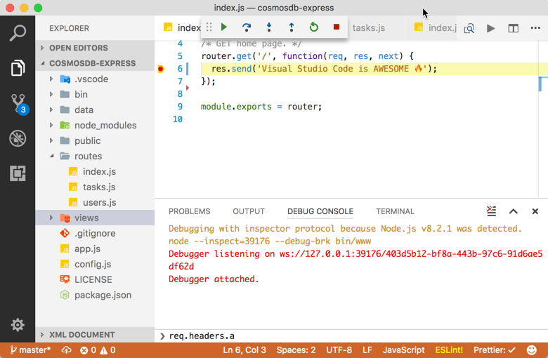

# Tools for JavaScript developers
The following tools are recommended for developing JavaScript apps on Azure.

## Azure CLI
Azure CLI is optimized for managing Azure resources from the command line.

 
> [!div class="nextstepaction"]
> [Install the Azure CLI 2.0](/cli/azure/install-az-cli2)

> [!div class="nextstepaction"]
> [Use Azure CLI 2.0 container](/cli/azure/run-azure-cli-docker)

## TypeScript

[TypeScript](https://www.typescriptlang.org/) stands in an unusual relationship to JavaScript. TypeScript offers all of JavaScript’s features, and an additional layer on top of these: TypeScript’s type system.

This means that your existing working JavaScript code is also TypeScript code. The main benefit of TypeScript is that it can highlight unexpected behavior in your code, lowering the chance of bugs.

> [!div class="nextstepaction"]
> [Install TypeScript](https://www.typescriptlang.org/download)

## Visual Studio Code
Edit and debug JavaScript apps on any OS.

> [!div class="nextstepaction"]
> [Download Visual Studio Code](https://code.visualstudio.com)

## Visual Studio Code Extensions
Use the following free extensions to interface with Azure services directly in Visual Studio Code.

| Tool | Description  |
|:---------:|---------|
| [Azure Functions](https://marketplace.visualstudio.com/items?itemName=ms-azuretools.vscode-azurefunctions "Link to Azure Functions extension")    | Create, manage, view, debug, and deploy functions|
| [Azure App Service](https://marketplace.visualstudio.com/items?itemName=ms-azuretools.vscode-azureappservice "Link to Azure App Service extension")    | Browse sites and the Azure portal, create new sites and deploy to slots |
| [Cosmos DB](https://marketplace.visualstudio.com/items?itemName=ms-azuretools.vscode-cosmosdb "Link to Cosmos DB extension" )    | Create, browse, and update globally distributed, multi-model databases in Azure |
| [Docker](https://marketplace.visualstudio.com/items?itemName=formulahendry.docker-explorer)     | Manage Docker containers and images, Docker Hub, and Azure container registry |

> [!div class="nextstepaction"]
> [Get more Azure extensions in the Visual Studio Code marketplace](https://marketplace.visualstudio.com/search?term=azure&target=VSCode&category=All%20categories&sortBy=Relevance)
