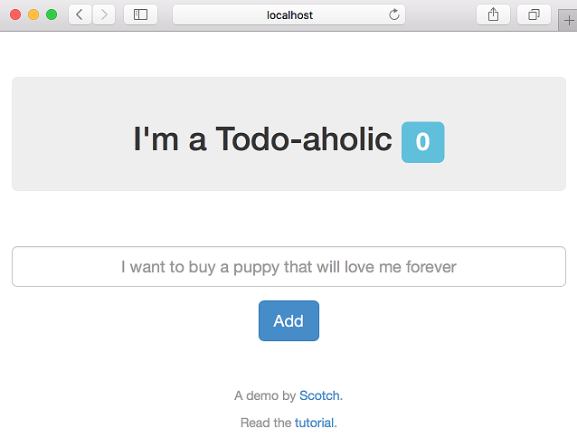

# Develop and deploy a containerized Node.js app with Visual Studio Code and Azure

This tutorial illustrates taking an existing Node.js app, "containerizing" it (with Docker), and then deploying the app to Azure using Visual Studio Code.

The tutorial makes use of a simple to-do app created by and published by [Scotch.io](https://scotch.io/tutorials/creating-a-single-page-todo-app-with-node-and-angular). It is a single-page MEAN app, and therefore, uses MongoDB as its database, Node/Express for the REST API/web server, and Angular.js 1.x for the front-end UI. 

## Prerequisites

In order to follow along with the demo, you'll need to have the following software installed:

- [Visual Studio Code](https://code.visualstudio.com/)
- [Docker](https://www.docker.com/products/docker)
- [DockerHub account](https://hub.docker.com/)
- [Azure CLI 2.0](/cli/azure/install-az-cli2)
- [Azure account](https://azure.microsoft.com/free/)
- [Yarn](https://yarnpkg.com/en/docs/install)
- [Chrome](https://www.google.com/chrome/browser/desktop/) - Used for debugging the demo app's front end.
- MongoDB - Since the demo app uses MongoDB, you need to have a locally running MongoDB instance that is listening on the standard `27017` port. The simplest way to run MongoDB locally is by running the following two commands after Docker is installed: `docker pull mongo` followed by `docker run -it -p 27017:27017 mongo`.

## Project setup

To get started, download the sample project using the following steps:

1. Open Visual Studio Code.

1. Press **F1** to display the command palette.

1. At the command palette prompt, enter `gitcl`, select the **Git: Clone** command, and press **Enter**.

    

1. When prompted for the **Repository URL**, enter `https://github.com/scotch-io/node-todo`, then press **Enter**.

1. Select (or create) the local directory into which you want to clone the project.

    

## Integrated terminal

With this Node.js project, you must first ensure that all of the project's dependencies are installed from npm.  

1. Press **Ctrl**+**`** to display the Visual Studio Code integrated terminal. 

1. Enter `yarn`, and press **Enter**.  

     

## Integrated Git version control

After installing the app's dependencies via Yarn, a *yarn.lock* file is created that provides a predictable way to reacquire the exact same dependencies in the future, without any surprises in either CI (continuous integration) builds, production deployments, or other developer machines.

The following steps illustrate how to check the *yarn.lock* file into source control:

1. Within Visual Studio Code, switch to the integrated Git tab (the tab with the Git logo).

1. In the **Message** box, enter a commit message, and press **Ctrl**+**Enter**.

    

## Project and code navigation

In order to orient ourselves within the codebase, let's play around with some examples of some of the navigation capabilities that Visual Studio Code provides.

1. Press **Ctrl**+**P**.

1. Enter `.js` to display all the JavaScript/JSON files in the project along with each file's parent directory 

    

1. Select *server.js*, which is the startup script for the app.

1. Hover your mouse over the **database** variable (imported on line 6) to see its type. This ability to quickly inspect variables/modules/types within a file is useful during the development of your projects. 

    

1. Clicking your mouse within the span of a variable - such as **database** - allows you to see all references to that variable within the same file. To view all references to a variable within the project, right-click the variable, and from the context menu, and select **Find All References**.

    

1. In addition to being to hover your mouse over a variable to discover its type, you can also inspect the definition of a variable, even if it's in another file. For example, right-click **database.localUrl** (line 12), and, from the context menu, select **Peek Definition**.

    

## Modifying the code and using autocompletion

The MongoDB connection string is hard-coded in declaration of the `database.localUrl` property. In this section, you'll modify the code to retrieve the connection string from an environment variable, and learn about Visual Studio Code's autocompletion feature.  

1. Open the *server.js* file

1. Replace the following code:

    ```javascript
    mongoose.connect(database.localUrl);
    ```

    with this code:

    ```javascript
    mongoose.connect(process.env.MONGODB_URL || database.localUrl);
    ```

Note that if you type the code in manually (instead of copy and paste), when you type the period after `process`, Visual Studio Code displays the available members of the Node.js process global API.


Autocompletion works because Visual Studio Code uses TypeScript behind the scenes - even for JavaScript - to provide type information that can then be used to inform the completion list as you type. Visual Studio Code is able to detect that this is a Node.js project, and as a result, automatically downloaded the TypeScript typings file for [Node.js from NPM](https://www.npmjs.com/package/@types/node). The typings file allows you to get autocompletion for other Node.js globals, such as `Buffer` and `setTimeout`, as well as all of the built-in modules such as `fs` and `http`.

In addition to the built-in Node.js APIs, this auto-acquisition of typings also works for over 2,000 third party modules, such as React, Underscore, and Express. For example, in order to disable Mongoose from crashing the sample app if it can't connect to the configured MongoDB database instance, insert the following line of code at  line 13:

```javascript
mongoose.connection.on("error", () => { console.log("DB connection error"); });
```

As with the previous code, you'll notice that you get autocompletion without any work on your part.


You can see which modules support this autocomplete capability by browsing the [DefinitelyTyped](https://github.com/DefinitelyTyped/DefinitelyTyped) project, which is the community-driven source of all TypeScript type definitions.

## Running the app

Once you've explored the code a bit, it's time to run the app. To run the app from Visual Studio Code, press **F5**. When running the code via **F5** (debug mode), Visual Studio Code launches the app and displays the **Debug Console** window that displays stdout for the app.


Additionally, the **Debug Console** is attached to the newly running app so you can type JavaScript expressions, which will be evaluated in the app, and also includes autocompletion. To see this behavior, type `process.env` in the console:


You were able to press **F5** to run the app because the currently open file is a JavaScript file (*server.js*). As a result, Visual Studio Code assumes that the project is a Node.js app. If you close all JavaScript files in Visual Studio Code, and then press **F5**, Visual Studio Code will query you as the environment:


Open a browser, and navigate to `http://localhost:8080` to see the running app. Type a message into the textbox and add/remove a few to-do's to get a feel for how the app works.



## Debugging

In addition to being able to run the app and interact with it via the integrated console, Visual Studio Code provides the ability to set breakpoints directly within your code. For example, press **Ctrl**+**P** to display the file picker. Once the file picker displays, type `route`, and select the *route.js* file.

Set a breakpoint on line 28, which represents the Express route that is called when the app tries to add a to-do entry. To set a breakpoint, simply click the area to the left of the line number within the editor as shown in the following figure.


> [!NOTE]
> In addition to standard breakpoints, Visual Studio Code supports conditional breakpoints that allow you to customize when the app should suspend execution. To set a conditional breakpoint, right-click the area to the left of the line on which you wish to pause execution, select **Add Conditional Breakpoint**, and specify either a JavaScript expression (for example, `foo = "bar"`) or execution count that defines the condition under which you want to pause execution.

Once the breakpoint has been set, return to the running app and add a to-do entry. Adding a to-do entry immediately causes the app to suspend execution on line 28 where you set the breakpoint:


Once the application has been paused, you can hover your mouse over the code's expressions to view their current value, inspect the locals/watches and call stack, and use the debug toolbar to step through the code execution. Press **F5** to resume execution of the app.

## Full-stack debugging

As mentioned earlier in the topic, the to-do app is a MEAN app - meaning that it's front-end and back-end are both written using JavaScript. So, while you're currently debugging the back-end (Node/Express) code, at some point, you may need to debug the front-end (Angular) code. For that purpose, Visual Studio Code has a huge ecosystem of extensions, including integrated Chrome debugging.

Switch to the **Extensions** tab, and type `chrome` into the search box:


Select the extension named **Debugger for Chrome**, and select **Install**. After installing the Chrome debugging extension, select **Reload** to close and reopen Visual Studio Code in order to activate the extension.


While you were able to run and debug the Node.js code without any Visual Studio Code-specific configuration, in order to debug a front-end web app, you need to generate a *launch.json* file that instructs Visual Studio Code how to run the app.

To generate the *launch.json* file, switch to the **Debug** tab, click the gear icon (which should have a little red dot on top of it), and select the **node.js** environment.


Once created, the *launch.json* file looks similar to the following, and tells Visual Studio Code how to launch and/or attach to the app in order to debug it.

```json
{
    "version": "0.2.0",
    "configurations": [
        {
            "type": "node",
            "request": "launch",
            "name": "Launch Program",
            "program": "${workspaceRoot}/server.js"
        },
        {
            "type": "node",
            "request": "attach",
            "name": "Attach to Port",
            "address": "localhost",
            "port": 5858
        }
    ]
}
```

Note that Visual Studio Code was able to detect that the app's startup script is *server.js*.

With the *launch.json* file open, select **Add Configuration** (bottom right), and select **Chrome: Launch with userDataDir**.


Adding a new run configuration for Chrome allows you to debug the front-end JavaScript code. 

You can hover your mouse over any of the settings that are specified to view documentation about what the setting does. Additionally, notice that Visual Studio Code automatically detects the URL of the app. Update the **webRoot** property to `${workspaceRoot}/public` so that the Chrome debugger will know where to find the app's front-end assets:

```json
{
   "type": "chrome",
   "request": "launch",
   "name": "Launch Chrome",
   "url": "http://localhost:8080",
   "webRoot": "${workspaceRoot}/public",
   "userDataDir": "${workspaceRoot}/.vscode/chrome"
}
```

In order to launch/debug both the front and back-end at the same time, you need to create a *compound* run configuration that tells Visual Studio Code which set of configurations to run in parallel.

Add the following snippet as a top-level property within the *launch.json* file (as a sibling of the existing **configurations** property).

```json
"compounds": [
   {
      "name": "Full-Stack",
      "configurations": ["Launch Program", "Launch Chrome"]
   }
]
```

The string values specified in the **compounds.configurations** array refer to the **name** of individual entries in the list of **configurations**. If you've modified those names, you'll need to make the appropriate changes in the array. For example, switch to the debug tab, and change the selected configuration to **Full-Stack** (the name of the compound configuration), and press **F5** to run it.


Running the configuration launches the Node.js app (as can be seen in the debug console output) and Chrome (configured to navigate to the Node.js app at `http://localhost:8080`).

Press **Ctrl**+**P**, and enter (or select) *todos.js*, which is the main Angular controller for the app's front end.

Set a breakpoint on line 11, which is the entry-point for a new to-do entry being created.

Return to the running app, add a new to-do entry, and notice that Visual Studio Code has now suspended execution within the Angular code.


Like Node.js debugging, you can hover your mouse over expressions, view locals/watches, evaluate expressions in the console, and so on. 

There are two cools things to note:

1. The **Call Stack** pane displays two different stacks: **Node** and **Chrome**, and indicates which one is currently paused.

1. You can step between front and back-end code: press **F5**, which will run and hit the breakpoint previously set in the Express route.

With this setup, you can now efficiently debug front, back, or full-stack JavaScript code directly within Visual Studio Code.

In addition, the compound debugger concept is not limited to just two target processes, and also isn't just limited to JavaScript. Therefore, if work on a microservice app (that is potentially polyglot), you can use the exact same workflow (once you've installed the appropriate extensions for the language/framework).

## Dockerizing the app

This section focuses on the experience that Visual Studio Code provides for developing with [Docker](https://www.docker.com/). Node.js developers use Docker to provide portable app deployments for both development, CI (continuous integration), and production environments. As Docker presents a steep-learning curve to some, Visual Studio Code provides an extension that tries to help simplify some using Docker in your apps.

Switch back to the **Extensions** tab, search for `docker`, and select the **Docker** extension.

Install the Docker extension, and then reload Visual Studio Code.


The Docker extension for Visual Studio Code includes a command for generating a *Dockerfile* and the *docker-compose.yml* file for an existing project.

To see the available Docker commands, display the command palette (**F1**) and type `docker`.


Select **Docker: Add docker files to workspace**, select **Node.js** as the app platform, and specify that the app exposes port `8080`.

The Docker command generates a complete *Dockerfile* and Docker-compose files that you can begin using immediately.


The Docker extension also provides autocompletion for your *Dockerfile* and *docker-compose.yml* files. For example, open the *Dockerfile* and change line 2 from:

```docker
FROM node:latest
```

To:

```docker
FROM mhart
```

With your cursor positioned after the `t` in `mhart`, press **Ctrl**+**Space** to view all the image repositories that `mhart` has published on DockerHub.


Select `mhart/alpine-node`, which provides everything that this app needs. 

Smaller images are typically better since you want your app builds and deployments to be as fast as possible, which makes distribution and scaling quicker.

Now, that you have generated the *Dockerfile*, you need to build the actual Docker image. Once again, you can use a command that the Docker extension installed in Visual Studio Code. Press **F1**, enter `dockerb` at the command palette, and select the **Docker: Build Image** command. Choose the *Dockerfile* that you just generated and modified. Specify a tag that includes your DockerHub username (for example, `lostintangent/node`). Press **Enter** to launch the integrated terminal window that displays the output of your Docker image being built.


Notice that the command automated the process of running `docker build` for you, which is another example of a productivity enhancer that you can either choose to use, or you can just use the Docker CLI directly.

At this point, to make this image easily acquirable for deployments, you need only push the image to DockerHub. To push the image, make sure you have already authenticated with DockerHub by running `docker login` from the CLI and entering your account credentials. Then, in Visual Studio Code, you can bring up the command palette, enter `dockerpush`, and select the `Docker: Push` command. Select the image tag that you just built (for example, `lostintangent/node`) and press **Enter**. The command automates the calling of `docker push` and displays the output in the integrated terminal.

## Deploying the app

Now that you created the app Dockerized and pushed to DockerHub, you need to deploy it to the cloud so the world can see it. For deployment, you can use Azure App Service, which is Azure's PaaS offering. App Service has two capabilities that are relevant to Node.js developers:

- Support for Linux-based VMs, which reduces incompatibilities for apps that are built using native Node modules, or other tools that might not support Windows and/or may behave differently.
- Support for Docker-based deployments, which allows you to specify the name of your Docker image, and allow App Service to pull, deploy, and scale the image automatically.

To get started, open up the Visual Studio terminal. You'll use the new Azure CLI 2.0 to manage your Azure account and provision the necessary infrastructure to run the to-do app. Once you've logged into your account from the CLI using the `az login` command (as mentioned in the pre-reqs), perform the following steps to provision the App Service instance and deploy the to-do app container:

1. Create a resource group, which you can think of as a *namespace* or *directory* to help organize Azure resources. The `-n` option is used to specify the name of the group and can be anything you want.

    ```shell
    az group create -n nina-demo -l westus
    ```

    The `-l` option indicates the location of the resource group. While in preview, the App Service on Linux support is available only in select regions. Therefore, if you aren't located in the Western US, and you want to check which other regions are available, run `az appservice list-locations --linux-workers-enabled` from the CLI to view your datacenter options.

1. Set the newly created resource group as the default resource group so that you can continue to use the CLI without needing to explicitly specify the resource group with each CLI call:

   ```shell
   az configure -d group=nina-demo
   ```

1. Create the App Service *plan*, which manages the creation and scaling of the underlying virtual machines to which your app is deployed. Once again, specify any value that you'd like for the `n` option.

    ```shell
    az appservice plan create -n nina-demo-plan --is-linux
    ```

    The `--is-linux option` indicates that you want Linux-based virtual machines. Without it, the CLI defaults to provisioning Windows-based virtual machines.

1. Create the App Service web app, which represents the actual to-do app that will be running within the plan and resource group just created. You can think of a web app as being synonymous with a process or container, and the plan as being the virtual machine/container host that they're running on. Additionally, as part of creating the web app, you'll need to configure it to use the Docker image you published to DockerHub:

    ```shell
    az webapp create -n nina-demo-app -p nina-demo-plan -i lostintangent/node
    ```

    > [!NOTE]
    > If instead of using a custom container, you'd prefer a Git deployment, refer to the article, [Create a Node.js web app in Azure](/azure/app-service-web/app-service-web-get-started-nodejs).

1. Set the web app as the default web instance:

    ```shell
    az configure -d web=nina-demo-app
    ```

1. Launch the app to view the deployed container, which will be available at an `*.azurewebsites.net` URL:

    ```shell
    az webapp browse
    ```

    It may take few minutes to load app the first time as App Service has to pull the Docker image from DockerHub and then start it.

    

At this point, you've just deployed and run the to-do app. However, the spinning icon indicates that the app can't connect to the database. This problem is due to the fact that you were using a local instance of MongoDB during development, which obviously isn't reachable from within the Azure datacenters. Since you modified the app to accept the connection string via an environment variable, you need only start a MongoDB server and reconfigure the App Service instance to reference the environment variable. These actions are explained in the next section.

## Provisioning a MongoDB server

While you could configure a MongoDB server, or replica set, and manage that infrastructure yourself, Azure provides a solution called [Cosmos DB](https://azure.microsoft.com/services/documentdb/). Cosmos DB is a fully-managed, geo-replicable, high-performance, NoSQL database that provides a MongoDB-compatibility layer. As a result, you can point an existing MEAN app at it (or any MongoDB client/tool such as [Studio 3T](https://studio3t.com/)) without needing to change anything but the connection string. The following steps illustrate this capability:

1. From the Visual Studio Code terminal, run the following command to create a MongoDB-compatible instance of the Cosmos DB service. Replace the **<NAME** placeholder with a globally unique value (Cosmos DB uses this name to generate the database's server URL):

   ```shell
   COSMOSDB_NAME=<NAME>
   az cosmosdb create -n $COSMOSDB_NAME --kind MongoDB
   ```

1. Retrieve the MongoDB connection string for this instance:

   ```shell
   MONGODB_URL=$(az cosmosdb list-connection-strings -n $COSMOSDB_NAME -otsv --query "connectionStrings[0].connectionString")
   ```

1. Update your web app's **MONGODB_URL** environment variable so that it connects to the newly provisioned Cosmos DB instance instead of attempting to connect to a locally running MongoDB server (that doesn't exist!):

    ```shell
    az webapp config appsettings set --settings MONGODB_URL=$MONGODB_URL
    ```

1. Return to your browser and refresh it. Try adding and removing a to-do item to prove that the app now works without needing to change anything! Set the environment variable to the created Cosmos DB instance, which is fully emulating a MongoDB database.

    

When needed, you can switch back to the Cosmos DB instance and scale up (or down) the reserved throughput that the MongoDB instance needs, and benefit from the added traffic without needing to manage any infrastructure manually.

Additionally, Cosmos DB automatically indexes every single document and property for you. That way, you don't need to profile slow queries or manually fine-tune your indexes. Just provision and scale as needed, and let Cosmos DB handle the rest.

## Hosting a private Docker registry

DockerHub provides an amazing experience for distributing your container images, but there may be scenarios where you'd prefer to host your own private Docker registry - such as for security/governance or performance benefits. For this purpose, Azure provides the [Azure Container Registry](https://azure.microsoft.com/services/container-registry/) (ACR) that allows you to spin up your own Docker registry whose backing storage is located in the same data center as your web app (which makes pulls quicker). The ACR also provides you with full control over the contents and access controls - such as who can push or pull images.

Provisioning a custom registry can be accomplished by running the following command. (Replace the **<NAME** placeholder with a globally unique value as ACR uses specified value to generate the registry's login server URL.

```shell
ACR_NAME=<NAME>
az acr create -n $ACR_NAME -l westus --admin-enabled
```

> [!NOTE]
> While this topic's example uses the **admin account** to keep things simple, it is not recommended for production registries.

The `az acr create` commands displays the login server URL (via the `LOGIN SERVER` column) that you use to log in using the Docker CLI (for example, `ninademo.azurecr.io`). Additionally, the command generates admin credentials that you can use in order to authenticate against it. To retrieve those credentials, run the following command and note the displayed username and password:

```shell
az acr credential show -n $ACR_NAME
```

Using the credentials from the previous step, and your individual login server, you can log in to the registry using the standard Docker CLI workflow.

```shell
docker login <LOGIN_SERVER> -u <USERNAME> -p <PASSWORD>
```

You can now tag your Docker container to indicate that it's associated with your private registry using the following command (replacing `lostintangent/node` with the name you gave the container image.

```shell
docker tag lostintangent/node <LOGIN_SERVER>/lostintangent/node
```

Finally, push the tagged image to your private Docker registry.

```shell
docker push <LOGIN_SERVER>/lostintangent/node
```

Your container is now stored in your own private registry, and the Docker CLI was happy to allow you to continue working in the same way as you did when using DockerHub. In order to instruct the App Service web app to pull from your private registry, you need only run the following command:

```shell
az appservice web config container set \
    -r <LOGIN_SERVER> \
    -c <LOGIN_SERVER>/lostintangent/node \
    -u <USERNAME> \
    -p <PASSWORD>
```

Make sure to add the `https://` prefix to the beginning of the `-r` option. However, don't add the prefix to the container image name.

If you refresh the app in your browser, everything should look and work the same. However, it's now running your app via your private Docker registry. Once you update your app, tag and push the changes as done above, and update the tag in your App Service container configuration.

## Configuring a custom domain name

While the `*.azurewebsites.net` URL is great for testing, at some point you may want to add a custom domain name to your web app. Once you have a domain name from a registrar, you need only add an `A` record to it  that points at your web app's external IP (which is actually a load balancer). You can retrieve this IP by running the following command:

```shell
az webapp config hostname get-external-ip
```

In addition to add an `A` record, you also need to add a `TXT` record to your domain that points at the `*.azurewebsites.net` domain you've been using thus far. The combination of the `A` and `TXT` records allows Azure to verify that you own the domain.

Once those records are created and the DNS changes have propagated, register the custom domain with Azure so that it knows to expect the incoming traffic correctly.

```shell
az webapp config hostname add --hostname <DOMAIN>
```

> [!NOTE]
> The command will not work until the DNS changes have propagated.

Open a browser and navigate to your custom domain to see that it now resolves to your deployed app on Azure.

## Scaling up and out

At some point, your web app may become popular enough that its allocated resources (CPU and RAM) aren't sufficient for handling the increase in traffic and operational demands. The App Service Plan that you created earlier (**B1**) comes with one CPU core and 1.75 GB of RAM, which can easily become overloaded. The **B2** plan comes with twice as much RAM and CPU, so if you notice that your app is beginning to run out of either, you can scale up the underlying virtual machine by running the following command:

```shell
az appservice plan update -n nina-demo-plan --sku B2
```

> [!NOTE]
> For Azure App Plan pricing details and specs, see the article, [App Service Pricing](https://azure.microsoft.com/pricing/details/app-service/)

After just a few moments, your web app will be migrated to the requested hardware, and can begin taking advantage of the associated resources. In addition to scaling up, you can also scale down by running the same command as above, specifying a `--sku` option that provides less resources at a lower price.

In addition to scaling up the virtual machine specs, as long as your web app is stateless, you also have the option to *scale out* by adding more underlying virtual machine instances. The App Service Plan you created earlier included only a single virtual machine (a *worker*), and therefore, all incoming traffic is ultimately bound by the limits of the available resources of that one instance. If you want to add a second virtual machine instance, you could run the same command you ran earlier, but instead of scaling up the SKU, you scale out the number of worker virtual machines.

```shell
az appservice plan update -n nina-demo-plan --number-of-workers 2
```

When you scale out a web app like this, incoming traffic will be transparently load balanced between all instances, which allows you to immediately increase your capacity without any code changes or worrying about the needed infrastructure.

Stateless web apps are considered a best practice as they make the ability to scale them (up, down, out) entirely deterministic as no single virtual machine or app instance includes state that is necessary in order to function.

> [!NOTE]
> While this article illustrates running a single web app as part of an App Service Plan, you can create and deploy multiple web apps into the same plan, allowing you to provision and pay for a single plan.

## Clean-up

To ensure that you don't get charged for any Azure resources you aren't using, run the following command from your Visual Studio Code terminal to delete all of the resources provisioned during this tutorial.

```shell
az group delete
```

The clean-up process can take several minutes to complete. Once finished, the `az group delete` command leaves your Azure account in the same state it was before you started the tutorial. The ability to organize, deploy, and delete Azure resources as a single unit is one of the primary benefits of resource groups. Therefore, as a recommended practice, you should group your resources together that you anticipate having the same lifespan.
