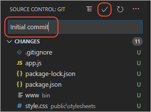
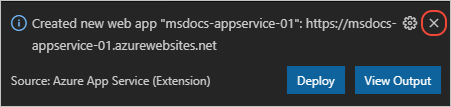
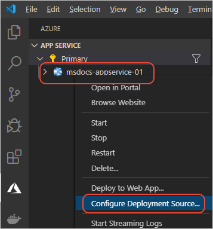

# Deploy the app to Azure

[Previous step: Create the app](tutorial-vscode-azure-app-service-node-02.md)

In this step, you deploy your Node.js app to Azure using Git deploy through the VS Code and the Azure App Service extension. To accomplish this goal, you first initialize a local Git repository, then create a web app on Azure, then configure VS Code to use Git deploy.

1. In the terminal, make sure you're in the *expressApp1* folder, then start Visual Studio Code with the following command:

    ```bash
    code .
    ```

1. In VS Code, select the source control icon to open the **Source Control** explorer, then select **+** to initialize a local Git repository:

    

1. At the prompts, choose *expressApp1* for the workspace folder.

1. After the repository is initialized, enter the message "Initial commit" and select the checkmark to create the initial commit of your source files.

    

1. From the command palette (**Ctrl**+**Shift**+**P**), type "create web" and select **Azure App Service: Create New Web App...Advanced**. You use the advanced command to have full control over the deployment including resource group, App Service Plan, and operating system rather than use Linux defaults.

1. Respond to the prompts as follows:

    - Select your **Subscription** account.
    - For **Enter a globally unique name**, enter a name that's unique across all of Azure. Use only alphanumeric characters ('A-Z', 'a-z', and '0-9') and hyphens ('-')
    - Select **Create new resource group** and provide a name like `AppServiceTutorial-rg`.
    - Select an operating system (Windows or Linux)
    - Linux only: select a Node.js version. (For Windows, you set the version using an app setting later on).
    - Select **Create a new App Service plan**, provide a name like `AppServiceTutorial-plan`, and select the **F1 Free** pricing tier.
    - Select **Skip for now** for the Application Insights resource.
    - Select a location near you.

1. After a short time, VS Code notifies you that creation is complete. Close the notification with the **X** button:

    

1. With the web app in place, you next instruct VS Code to deploy your code from the local Git repo. Select the Azure icon to open the **Azure App Service** explorer, expand your subscription node, right-click the name of the web app you just created, and select **Configure Deployment Source**.

    

1. When prompted, select **LocalGit**.

1. If deploying to App Service on Windows, you need to create two settings before deployment:

    1. In VS Code, expand the node for the new app service, right-click **Application Settings**, and select **Add New Setting**:

        

    1. Enter `WEBSITE_NODE_DEFAULT_VERSION` for the setting key and `10.15.2` for the setting value. This setting sets the Node.js version.
    1. Repeat the process to create a key for `SCM_DO_BUILD_DURING_DEPLOYMENT` with the value `1`. This setting forces the server to run `npm install` upon deployment.
    1. Expand the **Application Settings** node to verify the settings are in place.

1. Select the blue up arrow icon to deploy your code to Azure:

    

1. At the prompts, select the *expressApp1* folder, select your **subscription** account again and then select the name of the web app created earlier.

1. When deploying to Linux, select **Yes** when prompted to update your configuration to run `npm install` on the target server.

    

1. For Linux and Windows, select **Yes** when prompted with **Always deploy the workspace "nodejs-docs-hello-world" to (app name)"**. Selecting **Yes** tells VS Code to automatically target the same App Service web app with subsequent deployments.

1. Once deployment is complete, select **Browse Website** in the prompt to view your freshly deployed web app. The browser should display "Hello World!"

1. (Optional): You can make changes to your code files, then use the deploy button again to update the web app.

> [!div class="nextstepaction"]
> [My site is on Azure](tutorial-vscode-azure-app-service-node-04.md) [I ran into an issue](https://www.research.net/r/PWZWZ52?tutorial=node-deployment-azureappservice&step=deploy-app)
