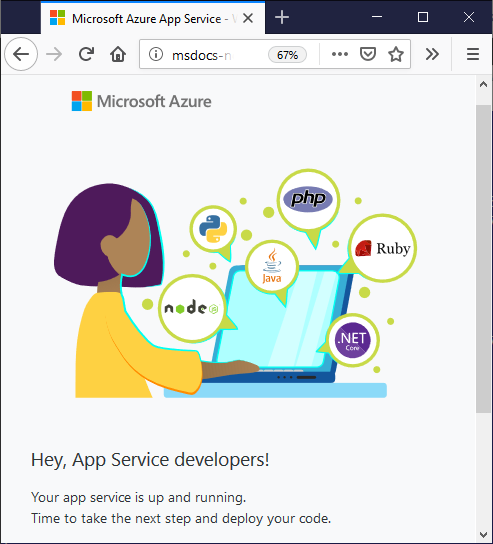

# Create the App Service

[Previous step: Create the app](tutorial-vscode-azure-cli-node-02.md)

In this step, you use the Azure CLI to create the Azure App Service to host your app code.

1. At a terminal or command prompt, use the following command to create a **resource group** for the App Service. A resource group is essentially a named collection of an app's resources in Azure, such as a website, a database, Azure Functions, etc.

    ```azurecli
    az group create --name myResourceGroup --location westus
    ```

    The command above creates a resource group called `myResourceGroup` in the `westus` data center. You can change these values as desired.

    Once the command runs successfully, it displays JSON output with the details of the resource group.

1. Run the following command to set the default resource group and region for subsequent commands. Doing so avoids the need to specify these values each time. (This command has no output on success.)

    ```azurecli
    az configure --defaults group=myResourceGroup location=westus
    ```

1. Run the following command to create an **app service plan** that defines the underlying virtual machine used by the App Service:

    ```azurecli
    az appservice plan create --name myPlan --sku F1
    ```

    The command above specifies a free hosting plan (`--sku F1`), which uses a shared virtual machine, and names the plan `myPlan`. Again, the command shows JSON output on success.

1. Run the following command to create the App Service, replacing `<your_app_name>` with a unique name that becomes the URL, `http://<your_app_name>.azurewebsites.net`. Note that the PowerShell command is slightly different. The `--runtime "node|6.9"` argument tells Azure to use node version 6.9.x on the server.

    ```azurecli
    az webapp create --name <your_app_name> --plan myPlan --runtime "node|6.9"
    ```

    > [!TIP]
    > You can also state the desired node version in your `package.json`. Azure applies this setting during deployment. For example, the following `package.json` entry tells Azure to use at least Node 7.0.0:
    >
    > ``` json
    > "engines": {
    >     "node": ">7.0.0"
    > },
    > ```

1. Run the following command to open a browser to the newly created App Service, again replacing `<your_app_name>` with the name you used:

    ```azurecli
    az webapp browse --name <your_app_name>
    ```

1. Because you haven't deployed any custom code for the app you, the browser should show a default page:

    

> [!div class="nextstepaction"]
> [I created the App Service](tutorial-vscode-azure-cli-node-04.md) [I ran into an issue](https://www.research.net/r/PWZWZ52?tutorial=node-deployment&step=create-website)
