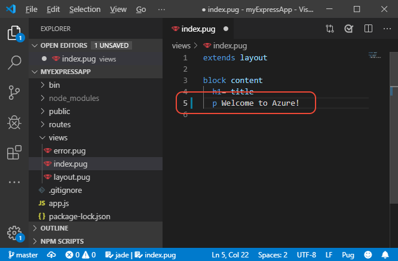
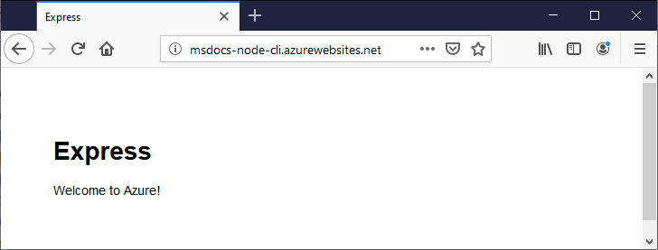

# Part 6 Make changes and redeploy

[Previous step: Stream logs](tutorial-vscode-azure-cli-node-05.md)

In this step, you make changes to your app code, commit them to the local Git repository, and then redeploy your site by pushing to Azure.

1. In the `myExpressApp` folder, open the *views/index.pug* file and change the message in line 5 to `p Welcome to Azure!`.

    

1. Save the file.

1. In a terminal or command prompt, commit the changes to git by running the following command:

    ```bash
    git commit -a -m "Edited message"
    ```

1. Push the changes to the Git remote named Azure that we created earlier:

    ```bash
    git push azure master
    ```

1. Because the App Service is already connected to the Git repository, the output from the command shows that changes are automatically published to Azure: 

    ```output
    Enumerating objects: 7, done.
    Counting objects: 100% (7/7), done.
    Delta compression using up to 4 threads
    Compressing objects: 100% (4/4), done.
    Writing objects: 100% (4/4), 405 bytes | 202.00 KiB/s, done.
    Total 4 (delta 2), reused 0 (delta 0)
    remote: Updating branch 'master'.
    remote: Updating submodules.
    remote: Preparing deployment for commit id '9fd89a25b6'.
    remote: Generating deployment script.
    remote: Running deployment command...
    remote: Handling node.js deployment.
    remote: Creating app_offline.htm
    remote: KuduSync.NET from: 'D:\home\site\repository' to: 'D:\home\site\wwwroot'
    remote: Copying file: 'views\index.pug'
    remote: Deleting app_offline.htm
    remote: Using start-up script bin/www from package.json.
    remote: Generated web.config.
    remote: The package.json file does not specify node.js engine version constraints.
    remote: The node.js application will run with the 
    remote: ..
    remote: Finished successfully.
    remote: Running post deployment command(s)...
    remote: Deployment successful.
    To https://msdocs-node-cli.scm.azurewebsites.net/msdocs-node-cli.git
       a98bad8..9fd89a2  master -> master
    ```

1. Refresh the app in the browser to see those changes:

    

> [!div class="nextstepaction"]
> [I see my changes](tutorial-vscode-azure-cli-node-07.md) [I ran into an issue](https://www.research.net/r/PWZWZ52?tutorial=node-deployment&step=publishing-changes)
