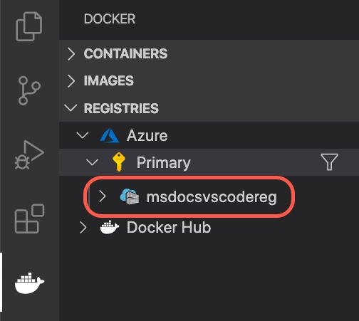

# Use a container registry

[Previous step: Introduction and prerequisites](tutorial-vscode-docker-node-01.md)

In this step, you set up a suitable container registry for your app image. Container-capable hosting services like Azure App Service can then pull images from the registry.

This tutorial uses [Azure Container Registry](https://azure.microsoft.com/services/container-registry/), a private, secure, hosted registry for your images. However, the tools and processes shown here also work with other registries like [Docker Hub](https://hub.docker.com/).

## Create an Azure container registry

1. In Visual Studio Code, select **F1** to open the command palette.

1. Enter **registry** in the search box. From the results, select **Azure Container Registry: Create Registry**.

   

1. Enter or select the following values:

    - In **Registry name**, enter a name that is unique in Azure and contains from 5 to 50 alphanumeric characters.
    - In **SKU**, select **Basic**.
    - In **Resource group**, enter a value that is unique within your subscription.
    - In **Location**, select a region close to you.

    Visual Studio Code begins the process of creating the registry in Azure. After it finishes, you'll see a notification like the following one. This notification confirms the registry was successfully created.

   

1. Open the **Docker** explorer. Ensure that the registry endpoint you just set up is visible under **Registries**.

   

## Sign in to Azure Container Registry

While you can see your Azure registries in the Docker extension, you can't push images to them until you sign in to Container Registry.

1. In Visual Studio, select **Ctrl**+**`** to open the integrated terminal.

1. Run the following Azure CLI command to sign in to Container Registry. Replace `<your-registry-name>` with the name of the registry you created.

    ```bash
    az acr login --name <your-registry-name>
    ```

> [!div class="nextstepaction"]
> [I created a registry](tutorial-vscode-docker-node-03.md) [I ran into a problem](https://www.research.net/r/PWZWZ52?tutorial=docker-extension&step=create-registry)
 