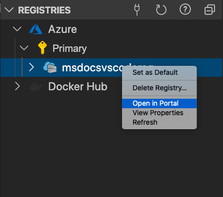
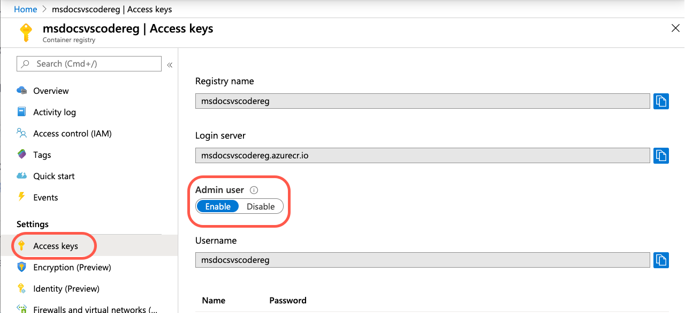
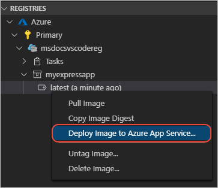
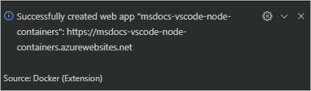
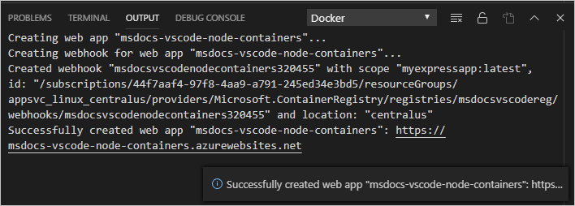

# Deploy the image to Azure App Service

[Previous step: Create the app image](tutorial-vscode-docker-node-04.md)

In this step, you deploy the image that you pushed to a registry to [Azure App Service](https://azure.microsoft.com/services/app-service/) directly from Visual Studio Code.

## Enable Admin access on the registry

In order to deploy your image to a web application, you need to enable "Admin" access on your registry in the Azure portal.

1. In the **Docker** explorer, right-click your registry name and select "Open in portal". 

    

    This will open your registry in the Azure portal.

1. Click on "Access keys" in the sidebar and then toggle the "Admin user" setting to "Enabled".  
    
    

## Deploy image

1. In the **DOCKER** explorer, expand the nodes for your image under **Registries**, right-click `:latest`, and select **Deploy Image to Azure App Service**.

    

1. When prompted, provide values for the App Service:

    - The name must be unique across Azure.
    - Select an existing resource group or create a new one. (A **Resource Group** is essentially a named collection of an application's resources in Azure.)
    - Select an existing App Service Plan or create a new one. (An **App Service Plan** defines the physical resources that host the website. You can use a basic or free plan tier for this tutorial.)

1. When deployment is complete, Visual Studio Code shows a notification with the website URL:

    

1. You can also see the results in the **Output** panel of Visual Studio Code, in the **Docker** section:

    

1. To browse the deployed website, you can **Ctrl**+**Click** the URL in the **Output** panel. The new App Service also appears in the **AZURE** explorer in Visual Studio Code under the **APP SERVICE** section, where you can right-click the website and select **Browse Website**.

> [!div class="nextstepaction"]
> [My site is on Azure](tutorial-vscode-docker-node-06.md) [I ran into an issue](https://www.research.net/r/PWZWZ52?tutorial=docker-extension&step=deploy-app)
