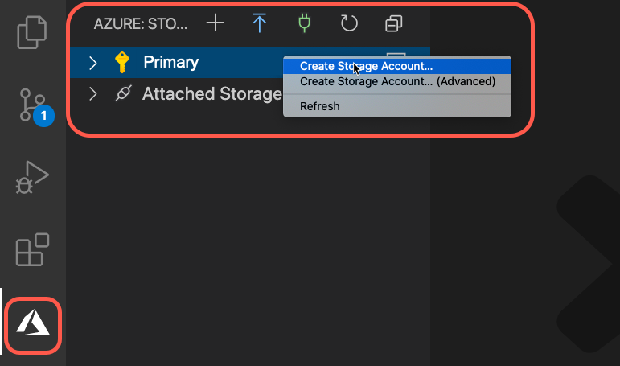

# Create an Azure Storage account

[Previous step: Create the app](tutorial-vscode-static-website-node-02.md)

In this step, you create an Azure Storage account, which serves as a simple file store (or CDN) with a built-in web server. This built-in server makes Azure Storage a great choice for quickly hosting static sites.

1. From the `my-static-app` folder created in the previous step, start Visual Studio Code so that it opens that folder automatically:

    ```bash
    code .
    ```

1. In VS Code, select the Azure logo to open the **Azure** explorer. Under **Azure Storage**, right-click on your Azure subscription and choose **Create Storage Account**:

    

1. At the prompt, "Enter the name of the new storage account", enter a globally unique name for your Storage Account and press Enter. Valid characters for an app name are 'a-z' and '0-9'.

    > [!NOTE]
    > This creates a storage account and a resource group with the same name. It automatically puts the storage account in West US. If you want to specify the resource group and location, select the "Create Storage Account (Advanced)" option from the context menu.

1. While the Storage account is created, progress appears in **Output** panel of VS Code:

    

1. Once the Storage account is complete, a message appears stating that static website hosting has been enabled for the storage account.

    

    > [!IMPORTANT]
    > We use *index.html* for the error document because modern single page apps (SPAs) such as React, Angular, and Vue, handle route errors in the client. For classic static websites, use a custom 404 error page.

> [!div class="nextstepaction"]
> [I created a storage container](tutorial-vscode-static-website-node-04.md) [I ran into an issue](https://www.research.net/r/PWZWZ52?tutorial=node-deployment-staticwebsite&step=create-storage)
