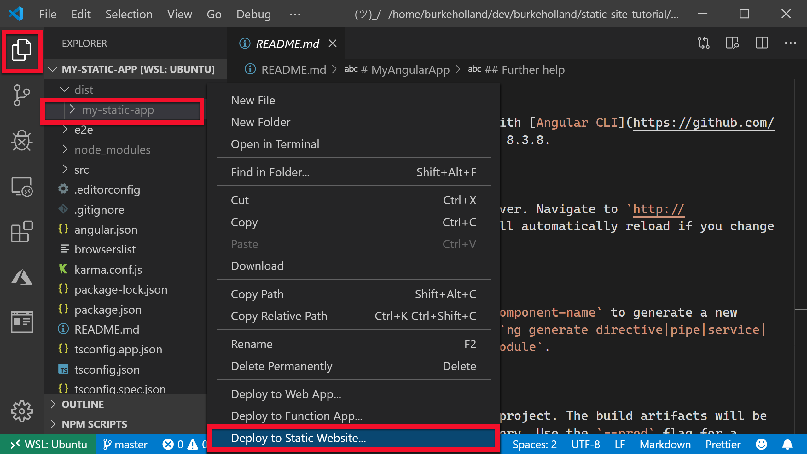

# Deploy the website to Azure Storage

[Previous step: Create a Storage account](tutorial-vscode-static-website-node-03.md)

In this step, you use Visual Studio Code to deploy the static website files created in the previous steps to Azure Storage, which then hosts and serves those files.

# [Angular](#tab/angular)

1. In Visual Studio Code, go to the **Azure Storage** explorer, expand your subscription, expand the node for the Azure Storage account that you created in the previous step, then expand the **Blob Containers** node. The `$web` container is where you deploy your app code.

   

1. Select the **Files** explorer, right-click on your _dist/my-static-app_ folder, and choose **Deploy to Static Website**:

    

1. When prompted, choose the Storage account that you created previously.

1. When deployment is complete, a message appears with a **Browse to website** button. Select that button to open the primary endpoint of the deployed app code.

    

    

# [React](#tab/react)

1. In Visual Studio Code, go to the **Azure Storage** explorer, expand your subscription, expand the node for the Azure Storage account that you created in the previous step, then expand the **Blob Containers** node. The `$web` container is where you deploy your app code.

   

1. Select the **Files** explorer, right-click on your _build_ folder, and choose **Deploy to Static Website**:

    

1. When prompted, choose the Storage account that you created previously.

1. When deployment is complete, a message appears with a **Browse to website** button. Select that button to open the primary endpoint of the deployed app code.

    

    

# [Vue](#tab/vue)

1. In Visual Studio Code, go to the **Azure Storage** explorer, expand your subscription, expand the node for the Azure Storage account that you created in the previous step, then expand the **Blob Containers** node. The `$web` container is where you deploy your app code.

   

1. Select the **Files** explorer, right-click on your _dist_ folder, and choose **Deploy to Static Website**:

    

1. When prompted, choose the Storage account that you created previously.

1. When deployment is complete, a message appears with a **Browse to website** button. Select that button to open the primary endpoint of the deployed app code.

    

    

# [Svelte](#tab/svelte)

1. In Visual Studio Code, go to the **Azure Storage** explorer, expand your subscription, expand the node for the Azure Storage account that you created in the previous step, then expand the **Blob Containers** node. The `$web` container is where you deploy your app code.

   

1. Select the **Files** explorer, right-click on your _public_ folder, and choose **Deploy to Static Website**:

    

1. When prompted, choose the Storage account that you created previously.

1. When deployment is complete, a message appears with a **Browse to website** button. Select that button to open the primary endpoint of the deployed app code.

    

    

---

> [!div class="nextstepaction"]
> [My site is on azure](tutorial-vscode-static-website-node-05.md) [I ran into an issue](https://www.research.net/r/PWZWZ52?tutorial=node-deployment-staticwebsite&step=create-storage)
