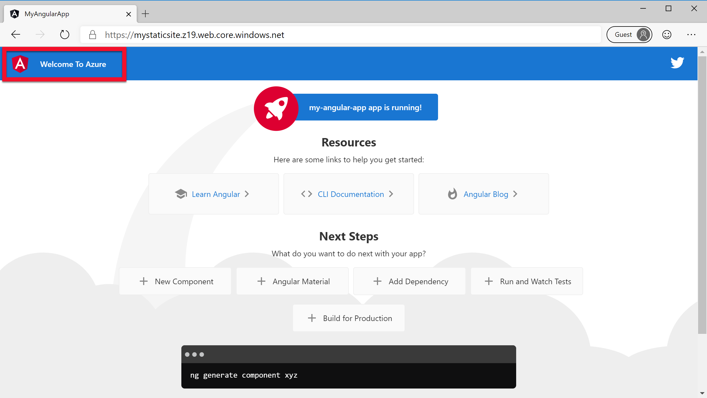
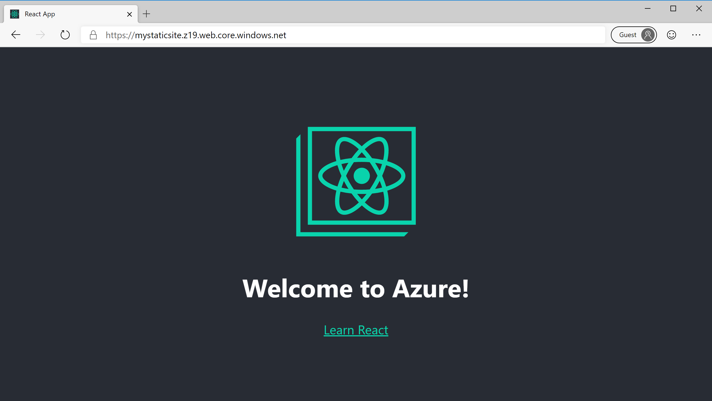
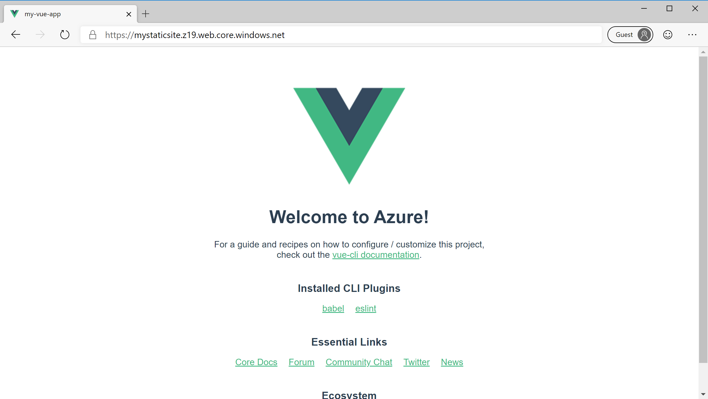

# Make changes and redeploy to a static website using Visual Studio Code

[Previous step: Deploy to Azure Storage](tutorial-vscode-static-website-node-04.md)

In this step, you make a simple change to the app's source code and redeploy the site to experience the end-to-end deployment workflow.

# [Angular](#tab/angular)

1. In Visual Studio Code, open the _src/app/app.component.html_ file and change line 305 to match the following:

    ```html
    <span>Welcome To Azure</span>
    ```

1. At a terminal or command prompt, run `npm run build`.

1. In VS Code, right-click your updated _dist/my-static-site_ folder and again choose **Deploy to Static Website**. Choose your Storage account and confirm that you want to deploy your changes. (The Azure extension automatically deletes old files before deploying changes to avoid caching issues.)

1. Once your deployment is complete, refresh the site in the browser to observe changes:

    

# [React](#tab/react)

1. In Visual Studio Code, open the _src/app.js_ file change line 11 to match the following:

    ```html
    <h1 className="App-title">Welcome to Azure!</h1>
    ```

1. At a terminal or command prompt, run `npm run build`.

1. In VS Code, right-click your updated _build_ folder and again choose **Deploy to Static Website**. Choose your Storage account and confirm that you want to deploy your changes. (The Azure extension automatically deletes old files before deploying changes to avoid caching issues.)

1. Once your deployment is complete, refresh the site in the browser to observe changes:

    

# [Vue](#tab/vue)

1. In Visual Studio Code, open the _src/App.vue_ file change line 11 to match the following:

    ```html
    <HelloWorld msg="Welcome to Azure!" />
    ```

1. At a terminal or command prompt, run `npm run build`.

1. In VS Code, right-click your updated _dist_ folder and again choose **Deploy to Static Website**. Choose your Storage account and confirm that you want to deploy your changes. (The Azure extension automatically deletes old files before deploying changes to avoid caching issues.)

1. Once your deployment is complete, refresh the site in the browser to observe changes:

    

# [Svelte](#tab/svelte)

1. In Visual Studio Code, open the _src/main.js_ file change line 6 to match the following:

    ```js
    import App from './App.svelte';

    const app = new App({
	    target: document.body,
	    props: {
		    name: 'Welcome to Azure!'
	    }
    });

    export default app;
    ```

2. Now, open the _src/App.svelte_ file change line 6 to match the following

    ```html
    <h1>{name}</h1>
    ```

1. At a terminal or command prompt, run `npm run build`.

1. In VS Code, right-click your updated _public_ folder and again choose **Deploy to Static Website**. Choose your Storage account and confirm that you want to deploy your changes. (The Azure extension automatically deletes old files before deploying changes to avoid caching issues.)

1. Once your deployment is complete, refresh the site in the browser to observe changes:

    

---

> [!div class="nextstepaction"]
> [I deployed changes](tutorial-vscode-static-website-node-06.md) [I ran into an issue](https://www.research.net/r/PWZWZ52?tutorial=node-deployment-staticwebsite&step=code-change)
