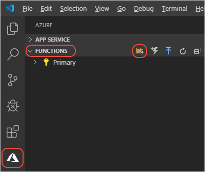

# JavaScript: Store data in MongoDB with Azure Function

Create an Azure Function API to store data with Mongoose API into Azure Cosmos DB, then deploy the Function application to the Azure cloud for hosting with a public HTTP endpoint. 

:::image type="content" source="../media/azure-function-cosmos-db-mongo-api/flow-client-serverless-cosmos-db.png" alt-text="Flow chart showing path of HTTP request to pass data through Azure Functions and store in Azure Cosmos DB.":::

Full source code for this Azure Function app:

* [Sample code](https://github.com/Azure-Samples/js-e2e-azure-function-mongodb)

## Prepare your development environment 

Install the following software: 

* Create a free [Azure subscription](https://azure.microsoft.com/free/)
* Install [Node.js LTS](https://nodejs.org/en/download) - this article was written and tested with Node.js 14
* Install [Visual Studio Code](https://code.visualstudio.com/) and use the following extensions:
    * [Azure Resources](https://marketplace.visualstudio.com/items?itemName=ms-azuretools.vscode-azureresourcegroups)
    * [Azure Functions](https://marketplace.visualstudio.com/items?itemName=ms-azuretools.vscode-azurefunctions)
    * [Azure Databases](https://marketplace.visualstudio.com/items?itemName=ms-azuretools.vscode-cosmosdb)

The following software is installed as part of the tutorial later:

* [Azure Functions Core Tools](https://github.com/Azure/azure-functions-core-tools) - to develop, run, and debug Azure Functions on your local workstation

## 1. Sign in to Azure in Visual Studio Code

[!INCLUDE [azure-sign-in](../includes/azure-sign-in-vscode.md)]


## 2. Create an Azure resource group

A resource group is a region-based collection of resources. By creating a resource group, then creating resources in that group, at the end of the tutorial, you can delete the resource group without having to delete each resource individually. 

1. In Visual Studio Code, open the **Azure** explorer by selecting the Azure icon in the primary side bar or use the keyboard shortcut (<kbd>Shift</kbd> + <kbd>Alt</kbd> + <kbd>A</kbd>).
1. Find your subscription under **Resources** and select the **+** icon then select **Create Resource Group**.
1. Use the following table to complete the prompts:

    |Prompt|Value|
    |--|--|
    |Enter the name of the new resource group.|`cosmosdb-mongodb-function-resource-group`|
    |Select a location for your new resources.|Select a geographical region close to you.|

## 3. Create the local Functions app

Create a local Azure Functions (serverless) application that contains an [HTTP trigger](/azure/azure-functions/functions-reference-node#http-triggers-and-bindings) function. 

1. In Visual Studio Code, open the **Azure** explorer by selecting the Azure icon in the primary side bar or use the keyboard shortcut (<kbd>Shift</kbd> + <kbd>Alt</kbd> + <kbd>A</kbd>).
1. In the **Workspace** section, select the **+** then select **Create function**.

    

1. A pop-up displays asking you if you want to **Create new project?**. Select **Yes**.
1. Use the following table to finish creating the local Azure Function project:

    |Prompt|Value|Notes|
    |--|--|--|
    |Select a language|TypeScript||
    |Select a template for your project's first function|HTTP Trigger|API is invoked with an HTTP request.|
    |Provide a function name|`category`|API route is `/api/category`|
    |Authorization Level|Function|This locks the remote API to requests that pass the function key with the request. While developing locally, you won't need the function key.|

1. When Visual Studio Code completes creation of the project, use the File explorer, <kbd>Ctrl</kbd> + <kbd>Shift</kbd> + <kbd>D</kbd>, to view your project with a folder named for the function, *category* with three files:

    | Filename | Description |
    | --- | --- |
    | *index.ts* |  The source code that responds to the HTTP request. |
    | *function.json* | The [binding configuration](/azure/azure-functions/functions-triggers-bindings) for the HTTP trigger. |
    | *sample.dat* | A placeholder data file to demonstrate that you can have other files in the folder. You can delete this file, if desired, as it's not used in this tutorial. |

1. In Visual Studio Code, open an integrated bash terminal, <kbd>Ctrl</kbd> + <kbd>`</kbd> and install the Azure Function app dependencies:

    ```bash
    npm install
    ```

1. Add the Azure Function core tools package, required to run the Azure Function app locally:

    ```bash
    npm install --global azure-functions-core-tools
    ```


1. <a name="http-function-javascript-template-code"></a>In the `./category/index.ts` file, add a new `context.log` message to print the name to the function's log, highlighted in the following code:
    
    :::code language="typescript" source="~/../js-e2e-azure-function-mongodb/edited-function-code.ts" highlight="6":::

## 4. Run the local serverless function

Run the Azure Functions project locally to test it before deploying to Azure. 

1. In Visual Studio Code, open the `./category/index.ts` file, set a break point on the final `context.res` block, at the end of the function. 

1. In Visual Studio Code, press <kbd>F5</kbd>  to launch the debugger and attach to the Azure Functions host. 

    You could also use the **Debug** > **Start Debugging** menu command.

1. Output from the Functions Core tools appears in the **Terminal** panel. 

    :::image type="content" source="../media/functions-extension/local-test-output.png" alt-text="Partial screenshot of VSCode output terminal panel when debugging locally" lightbox="../media/functions-extension/local-test-output.png":::

1. In Visual Studio Code, open the **Azure** explorer by selecting the Azure icon in the primary side bar or use the keyboard shortcut (<kbd>Shift</kbd> + <kbd>Alt</kbd> + <kbd>A</kbd>).
1. In the **Workspace** section, find and expand the **Local Project** -> **Functions** -> **category**.
1. Right-click the function name, **category**, then select **Copy Function Url**.

    :::image type="content" source="../media/functions-extension/visual-studio-code-function-extension-get-function-url.png" alt-text="Partial screenshot of Visual Studio Code, with the Azure Function's button named Copy Function URL highlighted." lightbox="../media/functions-extension/visual-studio-code-function-extension-get-function-url.png":::

1. In your browser, paste the URL, then add `?name=YOUR-NAME` to the end of URL, replacing `YOUR-NAME` with your name:

    :::image type="content" source="../media/functions-extension/local-test-browser.png" alt-text="Screenshot of web browser displaying results of HTTP trigger function parsing URL parameters.":::

    Because the function is running locally, your local API doesn't need the function key to work successfully.

1. In VS Code, when the breakpoint hits, review the variables and call stack. Step over the break point to let the function complete.
1. Optionally, to see the entire HTTP response, use the following cURL command in the terminal:

    ```bash
    curl http://localhost:7071/api/category?name=john --verbose
    ```

    The response is:

    ```console
    *   Trying ::1:7071...
    *   Trying 127.0.0.1:7071...
    * Connected to localhost (127.0.0.1) port 7071 (#0)
    > GET /api/category?name=john HTTP/1.1
    > Host: localhost:7071
    > User-Agent: curl/7.75.0
    > Accept: */*
    >
    * Mark bundle as not supporting multiuse
    < HTTP/1.1 200 OK
    < Date: Tue, 21 Sep 2021 17:35:05 GMT
    < Content-Type: text/plain; charset=utf-8
    < Server: Kestrel
    < Transfer-Encoding: chunked
    < Request-Context: appId=cid-v1:e981b763-c455-4e32-852c-73765b048a0f
    <
    Hello, john. This HTTP triggered function executed successfully.* Connection #0 to host localhost left intact
    ```

1. In VS Code, stop the debugger, <kbd>Shift</kbd> + <kbd>F5</kbd>.

## 5. Create the Azure Function app in Visual Studio Code

In this section, you create a function app and related resources in your Azure subscription.

1. Choose the Azure icon in the Activity bar. Then in the **Resources** area, select the **+** icon and choose the **Create Function App in Azure** option.

1. Provide the following information at the prompts:

    |Prompt|Selection|
    |--|--|
    |**Select subscription**| Choose the subscription to use. You won't see this prompt when you have only one subscription visible under **Resources**. |
    |**Enter a globally unique name for the function app**| Type a name that is valid in a URL path. The name you type is validated to make sure that it's unique in Azure Functions.|
    |**Select a runtime stack**| Choose the language version on which you've been running locally. |
    |**Select a location for new resources**| For better performance, choose a [region](https://azure.microsoft.com/regions/) near you.|

    The extension shows the status of individual resources as they're being created in Azure in the **Azure: Activity Log** panel.

## 6. Deploy the Azure Function app to Azure in Visual Studio Code

> [!IMPORTANT]
> Deploying to an existing function app always overwrites the contents of that app in Azure.

1. Choose the Azure icon in the Activity bar, then in the **Resources** area, right-click your function app resource and select the **Deploy to function app** button.
1. If you're asked if you're sure you want to deploy, select **Deploy**.
1. After deployment completes, a notification displays with severals options. Select **View Output** to view the results. If you miss the notification, select the bell icon in the lower right corner to see it again.

## 7. Run the remote serverless function

1. In Visual Studio Code, open the **Azure** explorer by selecting the Azure icon in the primary side bar or use the keyboard shortcut (<kbd>Shift</kbd> + <kbd>Alt</kbd> + <kbd>A</kbd>).
1. In the **Resources** section, expand your Azure Function app resource. Right-click the function name, `category`, in the Functions node, and select **Copy Function Url**:

    

1. Paste the URL into a browser. The URL includes the function key, `code`, as a query parameter. 

1. Append a querystring name/value pair,`&name=YOUR-NAME`, to the URL. The browser shows the successful function running in the cloud.

    :::image type="content" source="../media/functions-extension/api-request-succeeds-200.png" alt-text="Screenshot of a browser showing the result of the API returns successfully.":::

1. Now remove the `code=` querystring parameter from the URL and submit the URL in the browser again. This simulates an unauthorized request to your secured API.

    :::image type="content" source="../media/functions-extension/api-request-fails-401.png" alt-text="Screenshot of a browser showing the result of the API returns an HTTP error code of 401.":::

1. Review the streaming log in Visual Studio Code to find your `context.log` output. 

## 8. Add Azure Cosmos DB for MongoDB API integration 

Azure Cosmos DB provides a MongoDB API to provide a familiar integration point. 

1. In Visual Studio Code, open the **Azure** explorer by selecting the Azure icon in the primary side bar or use the keyboard shortcut (<kbd>Shift</kbd> + <kbd>Alt</kbd> + <kbd>A</kbd>).
1. In the **Resources** section, select the **+** then select **Create Database Server**.
    Use the following table to complete the prompts to create a new Azure Cosmos DB resource. 

    |Prompt|Value|Notes|
    |--|--|--|
    |Select an Azure Database Server|Azure Cosmos DB for MongoDB API||
    |Provide an Azure Cosmos DB account name.|`cosmosdb-mongodb-database`|The name becomes part of the API's URL.|
    |Select a capacity model.|Provisioned Throughput||
    |Select a resource group for new resources.|`cosmosdb-mongodb-function-resource-group`|Select or create a resource group|
    |Select a location for new resources.|Select the recommended region.||

1. In a Visual Studio Code terminal, <kbd>Ctrl</kbd> + <kbd>Shift</kbd> + <kbd>`</kbd>, then install the npm package:

    ```bash
    npm install mongoose
    ```

1. In Visual Studio Code, create a subdirectory named `lib`, create a file named `./azure-cosmosdb-mongodb.ts` and copy the following code into it.

    :::code language="typescript" source="~/../js-e2e-azure-function-mongodb/lib/azure-cosmosdb-mongodb.ts" :::

    This file contains a simple mongoose schema for a **Category** container. 

1. In Visual Studio Code, open the `./category/index.ts` file and replace the entire file's code with the following:

    :::code language="typescript" source="~/../js-e2e-azure-function-mongodb/category/index.ts" highlight="2,12,18,25,31,43":::


1. In Visual Studio Code, open the `./category/function.json` file and change the methods property to include **delete**.

    :::code language="typescript" source="~/../js-e2e-azure-function-mongodb/category/function.json" highlight="11":::
  
## 9. Add remote Azure Cosmos DB database connection string to local Node.js serverless project

1. In Visual Studio Code, open the **Azure** explorer by selecting the Azure icon in the primary side bar or use the keyboard shortcut (<kbd>Shift</kbd> + <kbd>Alt</kbd> + <kbd>A</kbd>).
1. In the **Resources** section, right-click your Azure Cosmos DB database and select **Copy Connection String**.

    :::image type="content" source="../media/functions-extension/visual-studio-code-cosmos-db-copy-connection-string.png" alt-text="Partial screenshot of Visual Studio Code, showing the Azure explorer with a database selected and the right-click menu highlighting Copy Connection String.":::

1. Open the `./local.settings.json` file and add a new property `CosmosDbConnectionString` and paste in the database connection string in as the value.

    :::code language="json" source="~/../js-e2e-azure-function-mongodb/local.settings.json" highlight="6":::

## 10. Use the Azure Function APIs

### Add items to database with serverless API using cURL command

1. In Visual Studio Code, press <kbd>F5</kbd> to launch the debugger and attach to the Azure Functions host. 

1. Use the following cURL command in a new terminal, <kbd>Ctrl</kbd> + <kbd>Shift</kbd> + <kbd>`</kbd>, to add **John** to your database:

    :::code language="bash" source="~/../js-e2e-azure-function-mongodb/curl.sh" range="3-5" :::
 
1. The response includes the new item's ID:

    ```console
    {
      "documentResponse": {
        "_id": "614a45d97ccca62acd742550",
        "categoryName": "John",
        "createdAt": "2021-09-21T20:51:37.669Z",
        "updatedAt": "2021-09-21T20:51:37.669Z",
        "__v": 0
      }
    }
    ```

1. Use the following curl command in the integrated bash terminal to add **Sally** to your database:

    :::code language="bash" source="~/../js-e2e-azure-function-mongodb/curl.sh" range="7-9" :::

1. The response includes the new item's ID:

    ```console
    {
      "documentResponse": {
        "_id": "614a45d97bbba62acd742550",
        "categoryName": "Sally",
        "createdAt": "2021-09-21T20:51:37.669Z",
        "updatedAt": "2021-09-21T20:51:37.669Z",
        "__v": 0
      }
    }
    ```

### Get all items from database with API

1. Use the following curl command to get all items from the database:

    :::code language="bash" source="~/../js-e2e-azure-function-mongodb/curl.sh" range="11-12" :::
 
1. The response includes the new item's ID:

    ```console
    {
      "documentResponse": [
        {
          "_id": "614a45d97ccca62acd742550",
          "categoryName": "John",
          "createdAt": "2021-09-21T20:51:25.288Z",
          "updatedAt": "2021-09-21T20:51:25.288Z",
          "__v": 0
        },
        {
          "_id": "614a45d97bbba62acd742550",
          "categoryName": "Sally",
          "createdAt": "2021-09-21T20:51:37.669Z",
          "updatedAt": "2021-09-21T20:51:37.669Z",
          "__v": 0
        }
      ]
    }
    ```

### View all data with VSCode extension for Azure Cosmos DB

1. In Visual Studio Code, open the **Azure** explorer by selecting the Azure icon in the primary side bar or use the keyboard shortcut (<kbd>Shift</kbd> + <kbd>Alt</kbd> + <kbd>A</kbd>).
1. In the **Resources** section, right-click your Azure Cosmos DB database and select **Refresh**.
1. Expand the **test** database and **Bookstore** collection node's to view the documents. 
1. Select one of the items listed to view the data in the Azure Cosmos DB instance. 

    :::image type="content" source="../media/functions-extension/visual-studio-code-databases-extension-showing-mongodb-doc.png" alt-text="Partial screenshot of Visual Studio Code, showing the Azure explorer with the Databases with a selected item displayed in the reading pane.":::

### Get one item from the database with API

1. Use the following curl command to get one item from the database. Replace `DOCUMENT_ID` with one of the IDs from a previous step's response:

    :::code language="bash" source="~/../js-e2e-azure-function-mongodb/curl.sh" range="14-16" :::
 
1. The response includes the new item's ID:

    ```console
    {
      "documentResponse": {
        "_id": "614a45cd7ccca62acd74254e",
        "categoryName": "John",
        "createdAt": "2021-09-21T20:51:25.288Z",
        "updatedAt": "2021-09-21T20:51:25.288Z",
        "__v": 0
      }
    }
    ```

1. Return to the Database section of the Azure Explorer in Visual Studio Code, right-click on your Azure Cosmos DB and select **Refresh** to verify that the item was removed from your cloud resource. 

### Delete one item from the database with API

1. Use the following curl command to delete one item from the database. Replace `DOCUMENT_ID` with one of the IDs from a previous step's response:

    :::code language="bash" source="~/../js-e2e-azure-function-mongodb/curl.sh" range="18-20" :::
 
1. The response includes the new item's ID:

    ```console
    {
      "documentResponse": {
        "_id": "614a45cd7ccca62acd74254e",
        "categoryName": "John",
        "createdAt": "2021-09-21T20:51:25.288Z",
        "updatedAt": "2021-09-21T20:51:25.288Z",
        "__v": 0
      }
    }
    ```
1. In VS Code, stop the debugger, <kbd>Shift</kbd> + <kbd>F5</kbd>.

## 11. Redeploy the function app to include database code

1. In Visual Studio Code, open the **Azure** explorer by selecting the Azure icon in the primary side bar or use the keyboard shortcut (<kbd>Shift</kbd> + <kbd>Alt</kbd> + <kbd>A</kbd>).
1. In the **Resources** section, right-click your Azure Function app and select **Deploy to Function App**.

    :::image type="content" source="../media/functions-extension/visual-studio-code-function-redeploy-to-azure.png" alt-text="Partial screenshot of Visual Studio Code, showing the Azure explorer with the Functions deploy icon highlighted.":::

1. In the pop-up asking if you're sure you want to deploy, select **Deploy**.
1. Wait until deployment completes before continuing.

## 12. Add Azure Cosmos DB database connection string to remote Azure Function app

1. In Visual Studio Code, open the **Azure** explorer by selecting the Azure icon in the primary side bar or use the keyboard shortcut (<kbd>Shift</kbd> + <kbd>Alt</kbd> + <kbd>A</kbd>).
1. In the **Resources** section, find your Azure Cosmos DB instance. Right-click the resource and select **Copy Connection String**.
1. In the same **Resources** section, find your Function App and expand the node.
1. Right-click on **Application Settings** and select **Add New Setting**.

    :::image type="content" source="../media/functions-extension/visual-studio-code-function-application-setting-add-new.png" alt-text="Partial screenshot of Visual Studio Code, showing the Azure explorer with the Functions Application Settings, with the Add new setting menu item highlighted.":::

1. Enter the app setting name, `CosmosDbConnectionString` and press enter. 
1. Paste the value you copied and press enter.

## 13. Use cloud-based Azure Function 

1. Still in the Azure Explorer, in the Functions area, selects and expands your function then the **Functions** node, which lists the API, **category**.
1. Right-click on the **category** item and select **Copy Function Url**.
1. Use the following cURL commands, and replace **YOUR-FUNCTION-URL**. Run each command in a terminal in order.

    :::code language="bash" source="~/../js-e2e-azure-function-mongodb/curl.sh" range="24-26" :::

    :::code language="bash" source="~/../js-e2e-azure-function-mongodb/curl.sh" range="28-30" :::

    :::code language="bash" source="~/../js-e2e-azure-function-mongodb/curl.sh" range="32-33" :::

1.  Use the following cURL commands, and replace **YOUR-FUNCTION-URL** and **DOCUMENT_ID** with an ID from the previous command. Run each command in a terminal in order.

    :::code language="bash" source="~/../js-e2e-azure-function-mongodb/curl.sh" range="35-37" :::

    :::code language="bash" source="~/../js-e2e-azure-function-mongodb/curl.sh" range="39-41" :::

## 14. Query your Azure Function logs

To search the logs, use the Azure portal. 

1. In Visual Studio Code, select the **Azure Explorer**, then under **Functions**, right-click on your function app, then select **Open in Portal**.

    This opens the Azure portal to your Azure Function.

1. From **Settings**, select **Application Insights**, then select **View Application Insights data**.

    :::image type="content" source="../media/functions-extension/azure-portal-function-application-insights-link.png" alt-text="Browser screenshot showing menu choices. Select **Application Insights** from the Settings, then select **View Application Insights data**." lightbox="../media/functions-extension/azure-portal-function-application-insights-link.png":::

    This link takes you to your separate metrics resource created for you when you created your Azure Function with Visual Studio Code.

1. From the **Monitoring** section, select **Logs**. If a **Queries** pop-up window appears, select the **X** in the top-right corner of the pop-up to close it. 
1. In the **New Query 1** pane, on the **Tables** tab, double-click the **traces** table. 

    This enters the [Kusto query](/azure/data-explorer/kusto/query/), `traces` into the query window. 
1. Edit the query to search for the custom logs:

    ```kusto
    traces 
    | where message startswith "***"
    ```

1. Select **Run**.

    If the log doesn't display any results, it may be because there's a few minute delay between the HTTP request to the Azure Function and the log availability in Kusto. Wait a few minutes and run the query again.

    :::image type="content" source="../media/functions-extension/azure-portal-application-insights-function-log-trace.png" alt-text="Browser screenshot showing Azure portal Kusto query result for Trace table." lightbox="../media/functions-extension/azure-portal-application-insights-function-log-trace.png":::

    You didn't need to do anything extra to get this logging information:

    * The code used the `context.log` function provided by the Function framework. By using `context`, instead of `console`, your logging can be filtered to the specific individual function. This is useful if your Function app has many functions. 
    * The Function app added Application Insights _for you_.
    * The Kusto Query tool is included in the Azure portal.
    * You can select `traces` instead of having to learn to write a [Kusto query](/azure/data-explorer/kusto/concepts/) to get even the minimum information from your logs.

[!INCLUDE [remove resource group](../includes/visual-studio-code-delete-resource-group.md)]

## Next steps

> [!div class="nextstepaction"]
> [Create an Azure Function to manage Azure resources](../how-to/with-web-app/azure-function-resource-group-management.md)


Learn more about Azure Functions:

* [Official YouTube Channel – Azure Functions](https://www.youtube.com/channel/UCtUYj6As_XFkOooUFnsJbYg)
* [Video: Migrating Your API to Serverless using Azure Functions - YouTube](https://youtu.be/89WXgaY-NqY)
* [Azure Functions JavaScript developer guide](/azure/azure-functions/functions-reference-node)
* [Securing Azure Functions](/azure/azure-functions/security-concepts)

Check out the other Azure extensions:

* [Azure Tools](https://marketplace.visualstudio.com/items?itemName=ms-vscode.vscode-node-azure-pack)
* [Azure Databases](https://marketplace.visualstudio.com/items?itemName=ms-azuretools.vscode-cosmosdb)
* [Azure Storage](https://marketplace.visualstudio.com/items?itemName=ms-azuretools.vscode-azurestorage)
* [Azure Functions](https://marketplace.visualstudio.com/items?itemName=ms-azuretools.vscode-azurefunctions)
* [Docker Tools](https://marketplace.visualstudio.com/items?itemName=ms-azuretools.vscode-docker)
* [Azure CLI Tools](https://marketplace.visualstudio.com/items?itemName=ms-vscode.azurecli)
* [Azure Resource Manager tools](https://marketplace.visualstudio.com/items?itemName=msazurermtools.azurerm-vscode-tools)

To learn more about working with Azure using Node.js, visit the resources below:

* [Azure SDK for JavaScript](https://github.com/Azure/azure-sdk-for-js)
