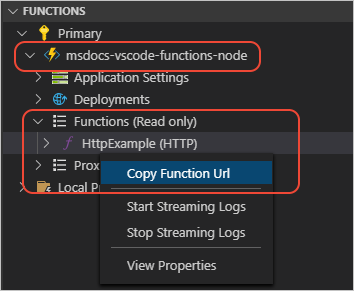

# Create and deploy a JavaScript Azure Function 

In this tutorial, create a secure API in Visual Studio Code with VS Code extensions and JavaScript, then deploy the application to the Azure cloud for hosting with a public HTTP endpoint. The API integrates with a Cosmos DB database using the MongoDB API. The MongoDB API is accessed from the [mongoose](https://www.npmjs.com/package/mongoose) npm package.

The MongoDB database functionality includes:

* Add item
* Delete item by ID
* Get item by ID
* Get all items

Full source code for this function app:

* [Sample code](https://github.com/Azure-Samples/js-e2e-azure-function-mongodb)

## Prepare your development environment 

Install the following software: 

* Create a free [Azure subscription](https://azure.microsoft.com/free/)
* Install [Node.js LTS](https://nodejs.org/en/download)
* Install [Visual Studio Code](https://code.visualstudio.com/) and use the following extensions:
    * [Azure Resources](https://marketplace.visualstudio.com/items?itemName=ms-azuretools.vscode-azureresourcegroups)
    * [Azure Functions](https://marketplace.visualstudio.com/items?itemName=ms-azuretools.vscode-azurefunctions)
    * [Azure Databases](https://marketplace.visualstudio.com/items?itemName=ms-azuretools.vscode-cosmosdb)

The following software is installed as part of the tutorial later:

* [Azure Functions Core Tools](https://github.com/Azure/azure-functions-core-tools) - to use Azure Functions 3.x

## Sign in to Azure in Visual Studio Code

[!INCLUDE [azure-sign-in](../includes/azure-sign-in-vscode.md)]

## Install the Azure Functions Core Tools 

1. In Visual Studio Code, open the integrated terminal at a location you want to create and run the local project.

1. Install Azure Functions Core Tools with the npm [azure-functions-core-tools](https://www.npmjs.com/package/azure-functions-core-tools):

    ```bash
    npm install --global azure-functions-core-tools@4 --unsafe-perm true
    ```

## Create a resource group

A resource group is a region-based collection of resources. By creating a resource group, then creating resources in that group, at the end of the tutorial, you can delete the resource group without having to delete each resource individually. 

1. In Visual Studio Code, select Azure explorer, then your subscription under **Resource Groups**.
1. Select **+** to create a new resource group.
1. Use the following table to complete the prompts:

    |Prompt|Value|
    |--|--|
    |Enter the name of the new resource group.|`cosmosdb-mongodb-function-resource-group`|
    |Select a location for your new resources.|Select a geographical region close to you.|

## Create the local Functions app with the Visual Studio Code _Functions_ extension

Create a local Azure Functions (serverless) application that contains an [HTTP trigger](/azure/azure-functions/functions-reference-node#http-triggers-and-bindings) function. 

1. Create a new directory on your local workstation, then open Visual Studio Code in this directory. 

1. In Visual Studio Code, select the Azure logo to open the **Azure Functions** explorer, then select the **Create New Project** command:

    

1. Use the following table to finish creating the local Azure Function project:

    |Prompt|Value|Notes|
    |--|--|--|
    |Select the folder that will contain your function project.|Select the current folder, which is the default value.||
    |Select a language|TypeScript||
    |Select a template for your project's first function|HTTP Trigger|API is invoked with an HTTP request.|
    |Provide a function name|`category`|API route is `/api/category`|
    |Authorization Level|Function|This locks the remote API to requests that pass the function key with the request. While developing locally, you won't need the function key.|
    |Select how you would like to open your project|Open in current window.||

    This process doesn't create cloud-based Azure Function resource. That [step](tutorial-vscode-serverless-node-deploy-hosting.md) will come later.

1. After a few moments, VS Code completes creation of the project. You have a folder named for the function, *category*, within which are three files:

    | Filename | Description |
    | --- | --- |
    | *index.js* |  The source code that responds to the HTTP request. |
    | *function.json* | The [binding configuration](/azure/azure-functions/functions-triggers-bindings) for the HTTP trigger. |
    | *sample.dat* | A placeholder data file to demonstrate that you can have other files in the folder. You can delete this file, if desired, as it's not used in this tutorial. |

## Install npm package dependencies from bash terminal

1. In Visual Studio Code, open an integrated bash terminal, <kbd>Ctrl</kbd> + <kbd>`</kbd>.
1. Install npm dependencies:

    ```bash
    npm install
    ```

## Change the function's code

The basic code to respond to the HTTP request is provided for you. If you are familiar with the HTTP request (the _req_ parameter) and response objects, the function should seem familiar. You return response information with the **context** object on the `res` property.  

<a name="http-function-javascript-template-code"></a>

Create a new context.log message after the name variable and change it to appear more obvious when scanning the logs.

```typescript
context.log(`*** HTTPExample name: ${name}`);
```

The new function code is:

:::code language="typescript" source="~/../js-e2e-azure-function-mongodb/edited-function-code.ts" highlight="6":::

## Run and debug the Azure Function locally with Visual Studio Code

Run the Azure Functions project locally to test it before deploying to Azure. Set a break point just before the serverless function returns the response. 

## Run the local serverless function

1. In Visual Studio Code, press <kbd>F5</kbd>  to launch the debugger and attach to the Azure Functions host. 

    You could also use the **Debug** > **Start Debugging** menu command.

1. Output from the Functions Core tools appears in the VS Code **Terminal** panel. 

    :::image type="content" source="../media/functions-extension/local-test-output.png" alt-text="Partial screenshot of VSCode output terminal panel when debugging locally" lightbox="../media/functions-extension/local-test-output.png":::

1. To copy the URL of the local function, use the Azure Function extension, right-click the function name, **category**.

    :::image type="content" source="../media/functions-extension/visual-studio-code-function-extension-get-function-url.png" alt-text="Partial screenshot of Visual Studio Code, with the Azure Function's button named Copy Function URL highlighted." lightbox="../media/functions-extension/visual-studio-code-function-extension-get-function-url.png":::

1. In your browser, enter the URL displayed in the terminal, then add `?name=YOUR-NAME` to the end of URL, replacing `YOUR-NAME` with your name:

    :::image type="content" source="../media/functions-extension/local-test-browser.png" alt-text="Screenshot of web browser displaying results of HTTP trigger function parsing URL parameters.":::

    Because the function is running locally, your local API doesn't need the function key to work successfully.

1. To see the entire HTTP response, use the following cURL command in a new integrated bash terminal:

    ```bash
    curl http://localhost:7071/api/category?name=john --verbose
    ```

1. The response is:

    ```console
    *   Trying ::1:7071...
    *   Trying 127.0.0.1:7071...
    * Connected to localhost (127.0.0.1) port 7071 (#0)
    > GET /api/category?name=john HTTP/1.1
    > Host: localhost:7071
    > User-Agent: curl/7.75.0
    > Accept: */*
    >
    * Mark bundle as not supporting multiuse
    < HTTP/1.1 200 OK
    < Date: Tue, 21 Sep 2021 17:35:05 GMT
    < Content-Type: text/plain; charset=utf-8
    < Server: Kestrel
    < Transfer-Encoding: chunked
    < Request-Context: appId=cid-v1:e981b763-c455-4e32-852c-73765b048a0f
    <
    Hello, john. This HTTP triggered function executed successfully.* Connection #0 to host localhost left intact
    ```

## Set and stop at break point in serverless app

With your function running locally, set breakpoints on different parts of the code. 

1. Open *index.js*, then click in the margin to the left of last `context.res`, in the editor window. 
1. A small red dot appears to indicate a breakpoint. 
1. Change the `?name=` value for the URL in the integrated bash terminal and resubmit the request to the function. 
1. When the browser makes that request, VS Code stops the function code on that breakpoint:

    :::image type="content" source="../media/functions-extension/visual-studio-code-function-break-point-request-variables.png" alt-text="Screenshot of Visual Studio Code with breakpoint activated and Closure variables displaying request values." lightbox="../media/functions-extension/visual-studio-code-function-break-point-request-variables.png":::

    Expand the **Variables** element named **Closure** to see the request properties. You can view all the properties passed into the function.

1. Stop the debugger in Visual Studio Code, <kbd>Shift</kdb> + <kbd>F5</kbd>. 

## Same Local and Azure Function runtime 

When you created the Functions app, the Azure Functions extension automatically added a VS Code launch configuration to your project, which is found in the *.vscode/launch.json* file. This configuration uses the same runtime that runs on Azure, so you can be sure that your source code works before deploying to the cloud.

## Deploy the Functions app to Azure cloud

[Previous step: Test the function locally](tutorial-vscode-serverless-node-test-local.md)

In this step, use the Visual Studio Code extension for Azure Functions to deploy the Functions app to the Azure cloud. Verify the Functions app is publicly available with a browser. 

## Use Visual Studio Code extension to deploy to hosting environment

1. In Visual Studio Code, select the Azure logo to open the **Azure Explorer**, then under **Functions**, select the **Deploy to Function app** icon to deploy your app:

    

    Alternately, you can deploy by opening the **Command Palette** (**F1**), entering 'deploy to function app', and running the **Azure Functions: Deploy to Function App** command.

1. Use the following table to complete the prompts to create a new Azure Function resource. 

    |Prompt|Value|Notes|
    |--|--|--|
    |Select Function App in Azure|Create new Function app in Azure (Advanced)|Create a cloud-based resource for your function.|
    |Enter a globally unique name for the new Function App|The name becomes part of the API's URL.|API is invoked with an HTTP request. Valid characters for a function app name are 'a-z', '0-9', and '-'. An example is `cosmosdb-mongodb-function-app`.|
    |Select a runtime stack|Select a Node.js stack with the `LTS` descriptor.||
    |Select an OS.|Windows||
    |Select a resource group for new resources.|`cosmosdb-mongodb-function-resource-group`|Select the [resource group](tutorial-vscode-serverless-node-install.md#create-a-resource-group) you created in the first article of this series.|
    |Select a location for new resources.|Select the recommended region.||
    |Select a hosting plan.|Consumption||
    |Select a storage account.|+ Create new storage account||
    |Enter the name of the new storage account.|`cosmosdbmongodbstorage`||
    |Enter an Application Insights resource for your app.|`cosmosdb-mongodb-function-app-insights`||

1. The Visual Studio Code **Output** panel for **Azure Functions** shows progress:

    ```console
    12:26:48 PM: Creating new function app "Visual Studio Codecosmosdb-mongodb-function-app"...
    12:27:09 PM: Successfully created function app "Visual Studio Codecosmosdb-mongodb-function-app": https://Visual Studio Codecosmosdb-mongodb-function-app.azurewebsites.net
    12:27:38 PM Visual Studio Codecosmosdb-mongodb-function-app: Starting deployment...
    12:27:40 PM Visual Studio Codecosmosdb-mongodb-function-app: Creating zip package...
    12:27:41 PM Visual Studio Codecosmosdb-mongodb-function-app: Uploading zip package to storage container...
    12:27:41 PM Visual Studio Codecosmosdb-mongodb-function-app: Zip package size: 2.73 kB
    12:27:44 PM Visual Studio Codecosmosdb-mongodb-function-app: Deployment successful.
    12:27:44 PM Visual Studio Codecosmosdb-mongodb-function-app: Started postDeployTask "npm install (functions)".
    12:27:55 PM Visual Studio Codecosmosdb-mongodb-function-app: Syncing triggers...
    12:27:57 PM Visual Studio Codecosmosdb-mongodb-function-app: Querying triggers...
    12:28:01 PM Visual Studio Codecosmosdb-mongodb-function-app: WARNING: Some http trigger urls cannot be displayed in the output window because they require an authentication token. Instead, you may copy them from the Azure Functions explorer.
    ```

    When deploying, the entire Functions application is deployed, any changes to individual APIs are deployed at once.

1. In the notifications, select **Stream logs** and keep the view open while you make a request to the API in the next section.

## Verify Functions app is available with browser

1. Once deployment is completed, go to the **Azure Functions** explorer, expand the node for your Azure subscription, expand the node for your Functions app, then expand **Functions (read only)**. Right-click the function name and select **Copy Function Url**:

    

1. Paste the URL into a browser. The URL includes the function key, `code` query parameter. 

1. Append a querystring name/value pair,`&name=YOUR-NAME`, to the URL. The browser shows the successful function running in the cloud.

    :::image type="content" source="../media/functions-extension/api-request-succeeds-200.png" alt-text="Screenshot of a browser showing the result of the API returns successfully.":::

1. Now remove the `code=` querystring parameter from the URL and submit the URL in the browser again. This simulates an unauthorized request to your secured API.

    :::image type="content" source="../media/functions-extension/api-request-fails-401.png" alt-text="Screenshot of a browser showing the result of the API returns an HTTP error code of 401.":::

1. Review the streaming log in Visual Studio Code to find your `context.log` output. 

## Query your Azure Function logs

Streaming logs is good for in-the-moment scanning. To search the logs, use the Azure portal. 

1. In Visual Studio Code, select the Azure logo to open the **Azure Explorer**, then under **Functions**, right-click on your function app, then select **Open in Portal**.

    This opens the Azure portal to your Azure Function.

1. Select **Application Insights** from the Settings, then select **View Application Insights data**.

    :::image type="content" source="../media/functions-extension/azure-portal-function-application-insights-link.png" alt-text="Browser screenshot showing menu choices. Select **Application Insights** from the Settings, then select **View Application Insights data**." lightbox="../media/functions-extension/azure-portal-function-application-insights-link.png":::

    This link takes you to your separate metrics resource created for you when you created your Azure Function with Visual Studio Code.

1. Select **Logs** in the Monitoring section. If a **Queries** pop-up window appears, select the **X** in the top-right corner of the pop-up to close it. 
1. In the **New Query 1** pane, on the **Tables** tab, double-click the **traces** table. 

    This enters the [Kusto query](/azure/data-explorer/kusto/query/), `traces` into the query window. 
1. Edit the query to search for the custom logs:

    ```kusto
    traces 
    | where message startswith "***"
    ```

1. Select **Run**.

    If the log doesn't display any results, it may be because there is a few minutes delay between the HTTP request to the Azure Function and the log availability in Kusto. Wait a few minutes and run the query again.

    :::image type="content" source="../media/functions-extension/azure-portal-application-insights-function-log-trace.png" alt-text="Browser screenshot showing Azure portal Kusto query result for Trace table." lightbox="../media/functions-extension/azure-portal-application-insights-function-log-trace.png":::

    You didn't need to do anything extra to get this logging information:

    * The code used the standard `console.log` function.
    * The Function app added Application Insights _for you_.
    * The Query tool is included in the Azure portal.
    * You can click on `traces` instead of having to learn to write a [Kusto query](/azure/data-explorer/kusto/concepts/) to get even the minimum information from your logs.


## Add Cosmos DB for MongoDB API integration 

[Previous step: Deploy the function](tutorial-vscode-serverless-node-test-local.md)

In this step, create a [Cosmos DB](/azure/cosmos-db/mongodb/mongodb-introduction) for MongoDB API resource and the use [mongoose](https://www.npmjs.com/package/mongoose) npm package to add, delete, and list items in the database. 

## Create an Azure Cosmos DB for MongoDB API resource

Cosmos DB provides a MongoDB API to provide a familiar integration point. 

1. In Visual Studio Code, select the Azure logo to open the **Azure Explorer**, then under **Databases**, select **+** to begin the creation process.

1. Use the following table to complete the prompts to create a new Azure Cosmos DB resource. 

    |Prompt|Value|Notes|
    |--|--|--|
    |Select an Azure Database Server|Azure Cosmos DB for MongoDB API||
    |Provide a Cosmos DB account name.|`cosmosdb-mongodb-database`|The name becomes part of the API's URL.|
    |Select a capacity model.|Provisioned Throughput||
    |Select a resource group for new resources.|`cosmosdb-mongodb-function-resource-group`|Select the [resource group](tutorial-vscode-serverless-node-install.md#create-a-resource-group) you created in the first article of this series.|
    |Select a location for new resources.|Select the recommended region.||

## Install the mongoose npm package

In a Visual Studio Code integrated bash terminal, install the npm package:

```bash
npm install mongoose
```

## Create database code file 

1. In Visual Studio Code, create a subdirectory of the project named `lib`.
1. Create a file in the directory named `./lib/azure-cosmosdb-mongodb.ts` and copy the following code into it.

    :::code language="typescript" source="~/../js-e2e-azure-function-mongodb/lib/azure-cosmosdb-mongodb.ts" :::

    This file contains a simple mongoose schema for a **Category** container. 

## Integrate mongoose code into Azure function API

In Visual Studio Code, open the `./category/index.ts` file and replace the entire file's code with the following:

:::code language="typescript" source="~/../js-e2e-azure-function-mongodb/category/index.ts" highlight="2,12,18,25,31,43":::

## Change function.json to include delete method

In Visual Studio Code, open the `./category/function.json` file and change the methods property to include **delete**.

:::code language="typescript" source="~/../js-e2e-azure-function-mongodb/category/function.json" highlight="11":::
  
## Add Cosmos DB connection string to local project

1. In Visual Studio Code, select the Azure logo to open the **Azure Explorer**, then under **Databases**, right-click your database and select **Copy Connection String**.

    :::image type="content" source="../media/functions-extension/visual-studio-code-cosmos-db-copy-connection-string.png" alt-text="Partial screenshot of Visual Studio Code, showing the Azure explorer with a database selected and the right-click menu highlighting Copy Connection String.":::

1. Open the `./local.settings.json` file and add a new property `CosmosDbConnectionString` and paste in the database connection string in as the value.

    :::code language="json" source="~/../js-e2e-azure-function-mongodb/local.settings.json" highlight="6":::

## Add items to database by calling Azure Function API

1. In Visual Studio Code, press <kbd>F5</kbd>  to launch the debugger and attach to the Azure Functions host. 

    You could also use the **Debug** > **Start Debugging** menu command.

1. Use the following curl command in the integrated bash terminal to add **John** to your database:

    :::code language="bash" source="~/../js-e2e-azure-function-mongodb/curl.sh" range="3-5" :::
 
1. The response includes the new item's ID:

    ```console
    {
      "documentResponse": {
        "_id": "614a45d97ccca62acd742550",
        "categoryName": "John",
        "createdAt": "2021-09-21T20:51:37.669Z",
        "updatedAt": "2021-09-21T20:51:37.669Z",
        "__v": 0
      }
    }
    ```

1. Use the following curl command in the integrated bash terminal to add **Sally** to your database:

    :::code language="bash" source="~/../js-e2e-azure-function-mongodb/curl.sh" range="7-9" :::

1. The response includes the new item's ID:

    ```console
    {
      "documentResponse": {
        "_id": "614a45d97bbba62acd742550",
        "categoryName": "Sally",
        "createdAt": "2021-09-21T20:51:37.669Z",
        "updatedAt": "2021-09-21T20:51:37.669Z",
        "__v": 0
      }
    }
    ```

## Get all items from database by calling Azure Function API

1. Use the following curl command to get all items from the database:

    :::code language="bash" source="~/../js-e2e-azure-function-mongodb/curl.sh" range="11-12" :::
 
1. The response includes the new item's ID:

    ```console
    {
      "documentResponse": [
        {
          "_id": "614a45d97ccca62acd742550",
          "categoryName": "John",
          "createdAt": "2021-09-21T20:51:25.288Z",
          "updatedAt": "2021-09-21T20:51:25.288Z",
          "__v": 0
        },
        {
          "_id": "614a45d97bbba62acd742550",
          "categoryName": "Sally",
          "createdAt": "2021-09-21T20:51:37.669Z",
          "updatedAt": "2021-09-21T20:51:37.669Z",
          "__v": 0
        }
      ]
    }
    ```

## View all data with Database extension

1. In Visual Studio Code, select the Azure logo to open the **Azure Explorer**, then under **Databases**, right-click your Cosmos DB resource, then the **Test** database, then the **Bookstore** collection.
1. Select one of the items listed. 

    :::image type="content" source="../media/functions-extension/visual-studio-code-databases-extension-showing-mongodb-doc.png" alt-text="Partial screenshot of Visual Studio Code, showing the Azure explorer with the Databases with a selected item displayed in the reading pane.":::

## Get one item from the database by calling Azure Function API

1. Use the following curl command to get all items from the database. Replace `DOCUMENT_ID` with one of the IDs from a previous step's response:

    :::code language="bash" source="~/../js-e2e-azure-function-mongodb/curl.sh" range="14-16" :::
 
1. The response includes the new item's ID:

    ```console
    {
      "documentResponse": {
        "_id": "614a45cd7ccca62acd74254e",
        "categoryName": "John",
        "createdAt": "2021-09-21T20:51:25.288Z",
        "updatedAt": "2021-09-21T20:51:25.288Z",
        "__v": 0
      }
    }
    ```

## Delete one item from the database by calling Azure Function API

1. Use the following curl command to get all items from the database. Replace `DOCUMENT_ID` with one of the IDs from a previous step's response:

    :::code language="bash" source="~/../js-e2e-azure-function-mongodb/curl.sh" range="18-20" :::
 
1. The response includes the new item's ID:

    ```console
    {
      "documentResponse": {
        "_id": "614a45cd7ccca62acd74254e",
        "categoryName": "John",
        "createdAt": "2021-09-21T20:51:25.288Z",
        "updatedAt": "2021-09-21T20:51:25.288Z",
        "__v": 0
      }
    }
    ```

## Redeploy the function app to include mongoose code

1. In Visual Studio Code, select the Azure logo to open the **Azure Explorer**, then under **Functions**, select the deploy icon to begin the deployment process.

    :::image type="content" source="../media/functions-extension/visual-studio-code-function-redeploy-to-azure.png" alt-text="Partial screenshot of Visual Studio Code, showing the Azure explorer with the Functions deploy icon highlighted.":::

1. In the pop-up window, select the same function app, `cosmosdb-mongodb-function-app`. 
1. In the next pop-up window, select **Deploy**.
1. Wait until deployment completes before continuing.

## Add Cosmos DB connection string to remote function 

1. In Visual Studio Code, select the Azure logo to open the **Azure Explorer**, then under **Databases**, right-click your database and select **Copy Connection String**.
1. Still in the Azure Explorer, under **Functions**, select and expand your function.
1. Right-click on **Application Settings** and select **Add New Setting**.

    :::image type="content" source="../media/functions-extension/visual-studio-code-function-application-setting-add-new.png" alt-text="Partial screenshot of Visual Studio Code, showing the Azure explorer with the Functions Application Settings, with the Add new setting menu item highlighted.":::

1. Enter the app setting name, `CosmosDbConnectionString` and press enter. 
1. Paste the value.

## Copy the secure function's URL

1. Still in the Azure Explorer, in the **Functions** area, select and expand your function then the **Functions** node, which lists the API, **category**.
1. Right-click on the **category** item and select **Copy Function Url**.
1. Use the URL and Code querystring name/value pair to replace `YOUR-FUNCTION-RESOURCE-NAME` and `YOUR-FUNCTION-KEY` in the following cURL commands. Run each command in a bash terminal in order.

    :::code language="bash" source="~/../js-e2e-azure-function-mongodb/curl.sh" range="24-41" :::

## Clean up Azure resources for Azure Functions tutorial

Use the Visual Studio Code extension, Azure Resource Groups, to delete the resource group and all resources within the group.

## Remove remote Azure resources

The Functions App you created includes resources that can incur minimal costs (refer to [Functions Pricing](https://azure.microsoft.com/pricing/details/functions/)).  

1. Find the resource group name, `cosmosdb-mongodb-function-resource-group`, in the list.
1. Right-click the resource group name and select **Delete**.

    :::image type="content" source="../media/visual-studio-code-azure-resources-extension-remove-resource-group.png" alt-text="Use the Visual Studio Code extension, Azure Resource Groups, to delete the resource group and all resources within the group.":::

## Learn more about Azure Functions

* [Official YouTube Channel – Azure Functions](https://www.youtube.com/channel/UCtUYj6As_XFkOooUFnsJbYg)
* [Video: Migrating Your API to Serverless using Azure Functions - YouTube](https://youtu.be/89WXgaY-NqY)
* [Azure Functions JavaScript developer guide](/azure/azure-functions/functions-reference-node)
* [Securing Azure Functions](/azure/azure-functions/security-concepts)

[!INCLUDE [Next steps for using VSCode extensions](../includes/tutorial-next-steps-vscode-extensions.md)]

[!INCLUDE [Next steps for using JavaScript on Azure](../includes/tutorial-next-steps-js-azure.md)]

## Next steps

> [!div class="nextstepaction"]
> [Create an Azure Function to manage Azure resources](../how-to/with-web-app/azure-function-resource-group-management/introduction.md)