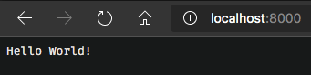

# Deploy Deno apps to Azure App Service from the Azure CLI

Deploy a Deno application to Azure App Service (on Linux or Windows) using the Azure CLI. The Deno runtime for Azure App Service is provided with an experimental Docker image. 



## 1. Prepare your environment

- An Azure account with an active subscription. [Create one for free](https://azure.microsoft.com/free/?utm_source=campaign&utm_campaign=vscode-tutorial-appservice-deno&mktingSource=vscode-tutorial-appservice-deno)
- Install [Visual Studio Code](https://code.visualstudio.com/)
- Install [Deno](https://deno.land/#installation)
- Use [Azure Cloud Shell](/azure/cloud-shell/quickstart) using the bash environment.

   [](https://shell.azure.com)   
- If you prefer, [install](/cli/azure/install-azure-cli) the Azure CLI to run CLI reference commands.
   - If you're using a local install, sign in with Azure CLI by using the [az login](/cli/azure/reference-index#az-login) command.  To finish the authentication process, follow the steps displayed in your terminal.  See [Sign in with Azure CLI](/cli/azure/authenticate-azure-cli) for additional sign-in options.
  - When you're prompted, install Azure CLI extensions on first use.  For more information about extensions, see [Use extensions with Azure CLI](/cli/azure/azure-cli-extensions-overview).
  - Run [az version](/cli/azure/reference-index?#az_version) to find the version and dependent libraries that are installed. To upgrade to the latest version, run [az upgrade](/cli/azure/reference-index?#az_upgrade).

## 2. Sign in to Azure CLI

If you are using Azure CLI from your local command line, before using any CLI commands, you need to sign in with [az login](/cli/azure/reference-index#az-login).

[!INCLUDE [interactive-login](../../azure-cli/includes/interactive-login.md)]

3. After logging in, you see a list of subscriptions associated with your Azure account. The subscription information with `isDefault: true` is the currently activated subscription after logging in. 

4. If you need to select another subscription, use the [az account set](/cli/azure/account#az-account-set) command with the subscription ID to switch to. For more information about subscription selection, see [Use multiple Azure subscriptions](/cli/azure/manage-azure-subscriptions-azure-cli).

## 3. Create local Deno API app

Create a Deno app using Deno's built-in webserver. You then run the app locally.

1. In a terminal or command prompt, navigate to a location where you want to create the app folder and create a new folder called `deno-demo`.

1. Create a new file called `demo.ts`.
1. Deno accepts running code from URLs directly. Write an HTTP server that answers all the requests with "Hello World". Use the following code:

    ```typescript
    import { serve } from "https://deno.land/std@0.54.0/http/server.ts"
    const handler = serve({ port: 80 })

    console.log("Serving at 80")

    for await (const req of handler) {
     req.respond({ body: "Hello World!\n" })
    }
    ```

1. Execute the app by running the following script:

    ```bash
    deno run --allow-net ./demo.ts
    ```

1. Test the app by opening a browser to `http://localhost:80`. The site should appear as follows:

    

    You can also run this code by typing `deno run --allow-net https://gist.githubusercontent.com/khaosdoctor/cd2bbb28e682feb8d20a7aba47fc1e17/raw/92de998fd11f2a24ae40bbcb84f5262cfe9389b2/deno-demo.ts`

1. Press **Ctrl**+**C** in the terminal to stop the server.

## 4. Deploy Deno app to Azure

Deploy your Deno app to Azure using Azure CLI.

1. Create a resource group named `deno-quickstart` with the following command:

    ```azurecli
    az group create --name deno-quickstart --location eastus
    ```

    If you decide to change the name of the resource group, be sure to update all the `-g` flags in the following steps

1. Create an AppService Plan named `deno-plan` that will hold your website using this command:

    ```azurecli
    az appservice plan create --resource-group deno-quickstart --name deno-plan --is-linux
    ```

1. Next up, you'll create the webapp itself. This command will create a new AppService and will bind it to the previously created Plan. Change the `<your-app-name>` tag to the name you want to give to your Webapp, remember, it needs to be unique!

    ```azurecli
    az webapp create -n <your-app-name> --resource-group deno-quickstart -p deno-plan -i anthonychu/azure-webapps-deno:1.0.2
    ```

    This AppService runs the `anthonychu/azure-webapps-deno:1.0.2` Docker image, which provides the base functionality to run any Deno code. This process may take a few seconds to complete.

## 5. Configure the Azure app service webapp

1. Tell the webapp where to get the Docker container image for the experimental Deno image name:

    ```azurecli
    az webapp config container set --name <your-app-name> --resource-group deno-quickstart -i anthonychu/azure-webapps-deno:1.0.2 -r 'https://index.docker.io' -u '' -p  '' -t true
    ```

1. Set the web app to have no startup file:

    ```azurecli
    az webapp config set --name <your-app-name> --resource-group deno-quickstart --startup-file ''

1. Set the webapp to have runtime environment variables:

    ```azurecli
    az webapp config appsettings set --name <your-app-name> --resource-group deno-quickstart --settings WEBSITE_RUN_FROM_PACKAGE=1 WEBSITES_ENABLE_APP_SERVICE_STORAGE=true
    ```

## 6. Configure Deno app deployment to web app 

The Azure Web app is configured and ready to use but doesn't have the Deno package yet. Package the app in a `.zip` package, tell the web app that the file is on your local computer, then set the startup file, which is within the zip file. 

1. Go to the `deno-demo` folder

    ```bash
    cd deno-demo
    ```

1. Run the `zip` command:

    ```bash
    zip demo demo.ts
    ```

    The result of this command will be a file called `demo.zip` in the same folder as the `demo.ts` file.

1. Configure the package as your code source for the deployment:

    ```azurecli
    az webapp deployment source config-zip --name <your-app-name> --resource-group deno-quickstart --src ./demo.zip
    ```

1. Configure the file, within the package, to run:

    ```azurecli
    az webapp config set --name <your-app-name> --resource-group deno-quickstart --startup-file 'deno run --allow-net demo.ts'
    ```

1. Test the application by going to `https://<your-app-name>.azurewebsites.net`. 

## 7. Clean up resources

Delete your resource group, which also deletes the web app resources, with the following command:

```azurecli
az group delete deno-quickstart
```

## Next steps

Learn more about:
* [Learn about how to configure your app settings](../how-to/configure-web-app-settings)
* [Deploy to App service](../tutorial-vscode-azure-app-service-node-01.md) with Visual Studio Code extensions
* [Deploy to a Virtual Machine](./nodejs-virtual-machine-vm/introduction.md)
* [Deploy Deno function](https://github.com/anthonychu/azure-functions-deno-worker) as a [custom handler](/azure/azure-functions/functions-custom-handlers)