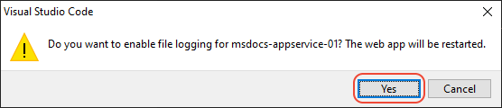

# Deploy Node.js to Azure App Service using Visual Studio Code

Deploy a Node.js application to Azure App Service (on Linux or Windows) using the Visual Studio Code [App Service extension](https://marketplace.visualstudio.com/items?itemName=ms-azuretools.vscode-azureappservice).

Deploy your Node.js app to Azure using Git and the Azure App Service extension. To accomplish this goal:

* Create Express.js app
* Initialize a local Git repository
* Create a web app resource to host app
* Deploy app to resource
* View remote logs locally

## Walkthrough video

Watch this video for a complete walkthrough of the content in this article.

> [!VIDEO https://channel9.msdn.com/Shows/Docs-Azure/Deploy-to-Azure-App-Service-using-Visual-Studio-Code/player]

## 1. Set up your development environment

- An Azure account with an active subscription. [Create one for free](https://azure.microsoft.com/free/?utm_source=campaign&utm_campaign=vscode-tutorial-appservice-extension&mktingSource=vscode-tutorial-appservice-extension).
- [Visual Studio Code](https://code.visualstudio.com/).
- The [Azure App Service extension](https://marketplace.visualstudio.com/items?itemName=ms-azuretools.vscode-azureappservice) for VS Code (installed from within VS Code).
- [Node.js 12+ and npm](https://nodejs.org/en/download).

## 2. Sign in to Azure

[!INCLUDE [azure-sign-in](../includes/azure-sign-in.md)]

## 3. Create a local Express.js app

Create a Node.js app using the Express.js application generator. 

1. In a terminal or command prompt, navigate to a location where you want to create the app folder.

1. Run the following command to create a new Express app named *expressApp1* using the Express Generator. (The `--view pug --git` parameters tell the generator to use the [pug](https://pugjs.org/api/getting-started.html) template engine, formerly known as Jade, and to create a *.gitignore* file.)

    ```bash
    npx express-generator expressApp1 -–git --view pug 
    ```

1. Navigate into the app folder:

    ```bash
    cd expressApp1
    ```

1. Install the application's dependencies:

    ```bash
    npm install
    ```

## 4. Run your local Express.js app

1. Start the server:

    ```bash
    npm start
    ```

1. Test the app by opening a browser to `http://localhost:3000`. The site should appear as follows:

    

1. Press **Ctrl**+**C** in the terminal to stop the server.

## 5. Initialize Git in Visual Studio Code for current app

1. In the terminal, make sure you're in the *expressApp1* folder, then start Visual Studio Code with the following command:

    ```bash
    code .
    ```

1. In Visual Studio Code, select the source control icon to open the **Source Control** explorer, then select **Initialize Repository** to initialize a local Git repository:

    

1. At the prompts, choose *expressApp1* for the workspace folder.

1. After the repository is initialized, enter the message "Initial commit" and select the checkmark to create the initial commit of your source files.

    

## 6. Create App service resource in Visual Studio Code

1. From the command palette (**Ctrl**+**Shift**+**P**), type "create web" and select **Azure App Service: Create New Web App...Advanced**. You use the advanced command to have full control over the deployment including resource group, App Service Plan, and operating system rather than use Linux defaults.

1. Respond to the prompts as follows:

    - Select your **Subscription** account.
    - For **Enter a globally unique name**, enter a name that's unique across all of Azure. Use only alphanumeric characters ('A-Z', 'a-z', and '0-9') and hyphens ('-')
    - Select **Create new resource group** and provide a name like `AppServiceTutorial-rg`.
    - Select an operating system (Windows or Linux)
    - Linux only: select a Node.js version. (For Windows, you set the version using an app setting later on).
    - Select **Create a new App Service plan**, provide a name like `AppServiceTutorial-plan`, and select the **F1 Free** pricing tier.
    - Select **Skip for now** for the Application Insights resource.
    - Select a location near you.

1. After a short time, VS Code notifies you that creation is complete. Close the notification with the **X** button:

    

1. With the web app in place, you next instruct VS Code to deploy your code from the local Git repo. Select the Azure icon to open the **Azure App Service** explorer, expand your subscription node, right-click the name of the web app you just created, and select **Configure Deployment Source**.

    

1. When prompted, select **LocalGit**.

1. If deploying to App Service on Windows, you need to create two settings before deployment:

    1. In VS Code, expand the node for the new app service, right-click **Application Settings**, and select **Add New Setting**:

        

    1. Enter `WEBSITE_NODE_DEFAULT_VERSION` for the setting key and `10.15.2` for the setting value. This setting sets the Node.js version.
    1. Repeat the process to create a key for `SCM_DO_BUILD_DURING_DEPLOYMENT` with the value `1`. This setting forces the server to run `npm install` upon deployment.
    1. Expand the **Application Settings** node to verify the settings are in place.

1. Select the blue up arrow icon to deploy your code to Azure:

    

1. At the prompts, select the *expressApp1* folder, select your **subscription** account again and then select the name of the web app created earlier.

1. When deploying to Linux, select **Yes** when prompted to update your configuration to run `npm install` on the target server.

    

1. For Linux and Windows, select **Yes** when prompted with **Always deploy the workspace "nodejs-docs-hello-world" to (app name)"**. Selecting **Yes** tells VS Code to automatically target the same App Service web app with subsequent deployments.

1. Once deployment is complete, select **Browse Website** in the prompt to view your freshly deployed web app. The browser should display "Hello World!"

1. (Optional): You can make changes to your code files, then use the deploy button again to update the web app.

## 7. Stream remote service logs in Visual Studio Code

View (tail) any output that the running app generates through calls to `console.log`. This output appears in the **Output** window in Visual Studio Code.

1. In the **Azure App Service** explorer, right-click the app node and choose **Start Streaming Logs**.

    

1. When prompted, choose to enable logging and restart the application.

    

1. Once the app is restarted, the VS Code **Output** window opens with a connection to the log stream that shows output.

    <pre>
    Connecting to log stream...
    2020-03-04T19:29:44  Welcome, you are now connected to log-streaming service. The default timeout is 2 hours.
    Change the timeout with the App Setting SCM_LOGSTREAM_TIMEOUT (in seconds).
    </pre>

1. Refresh the web page a few times in the browser to see additional log output.

## 8. Clean up resources

When you want to clean up the resources, right-click on the App service in the Visual Studio Code's App Service extension, then select **Delete**.

:::image type="content" source="../media/deploy-azure/delete-azure-app-service-with-visual-studio-code-extension.png" alt-text="When you want to clean up the resources, right-click on the App service in the Visual Studio Code's App Service extension, then select **Delete**.":::

## Next steps

* [Learn about how to configure your app settings](../how-to/configure-web-app-settings.md)

[!INCLUDE [tutorial-next-steps](../includes/tutorial-next-steps.md)]
