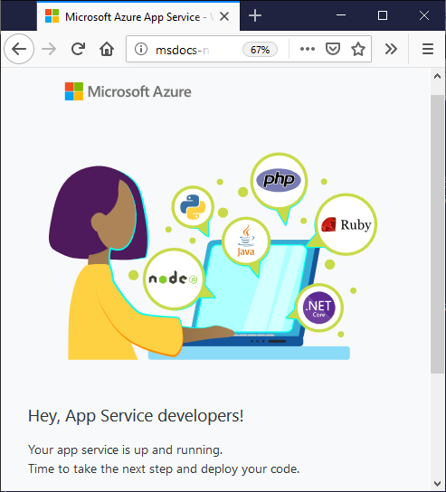

# Create the App Service

[Previous step: Create the app](tutorial-vscode-azure-cli-node-02.md)

In this step, you use the Azure CLI to create the Azure App Service to host your app code.

## Create resource group

1. At a terminal or command prompt, use the following command to create a **resource group** for the App Service. A resource group is essentially a named collection of an app's resources in Azure, such as a website, a database, Azure Functions, etc.

    ```azurecli
    az group create --name myResourceGroup --location westus
    ```

    The Azure CLI command, [`az group create`](/cli/azure/group?view=azure-cli-latest#az_group_create) above creates a resource group called `myResourceGroup` in the `westus` data center. You can change these values as desired.

    Once the command runs successfully, it displays JSON output with the details of the resource group.

1. Run the following Azure CLI command, [`az configure`](/cli/azure/config?view=azure-cli-latest), to set the default resource group and region for subsequent commands. Doing so avoids the need to specify these values each time. (This command has no output on success.)

    ```azurecli
    az configure --defaults group=myResourceGroup location=westus
    ```

## Create app service plan

Run the following Azure CLI command, [`az appservice plan create`](/cli/azure/appservice/plan?view=azure-cli-latest#az_appservice_plan_create),  to create an **app service plan** that defines the underlying virtual machine used by the App Service:

```azurecli
az appservice plan create --name myPlan --sku F1
```

The command above specifies a [free hosting plan](../../core/what-is-azure-for-javascript-development.md#free-tier-resources) (`--sku F1`), which uses a shared virtual machine, and names the plan `myPlan`. 

## Create web app service

Run the following Azure CLI command,  [`az webapp create`](/cli/azure/webapp?view=azure-cli-latest#az_webapp_create), to create the App Service, replacing `<your_app_name>` with a unique name that becomes the URL, `http://<your_app_name>.azurewebsites.net`, with the [latest Node.js runtime](/cli/azure/webapp?view=azure-cli-latest#az_webapp_list_runtimes&preserve-view=false). 

```azurecli
az webapp create --name <your_app_name> --plan myPlan -g --runtime "node|12-lts"
```

## Browse web app

1. Run the following Azure CLI command, [`az webapp browse`](/cli/azure/webapp?view=azure-cli-latest#az_webapp_browse), to open a browser to the newly created App Service, again replacing `<your_app_name>` with the name you used:

    ```azurecli
    az webapp browse --name <your_app_name>
    ```

1. Because you haven't deployed any custom code for the app you, the browser should show a default page:

    

## Troubleshooting

* If you received an error about a missing but required parameter, `--resource-group`, return to the top of the article and set the defaults or provide the parameter and value. 

> [!div class="nextstepaction"]
> [I created the App Service](tutorial-vscode-azure-cli-node-04.md) [I ran into an issue](https://www.research.net/r/PWZWZ52?tutorial=node-deployment&step=create-website)
