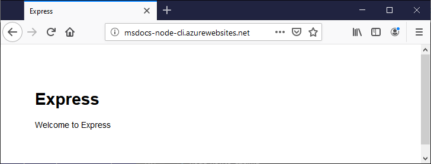

# 4. Deploy the app to App Service

In this step, you deploy your Node.js app code to Azure App Service using a basic process of pushing your local Git repository to Azure.

1. To initialize a local Git repository and make an initial commit, at a terminal or command prompt, run the following command. 

    ```bash
    git init && \
    git add -A && \
    git commit -m "Initial Commit"
    ```

    (The *node_modules* folder is ignored because it's specified in the *.gitignore* file created when you ran the Express Generator earlier.)

1. To [set up new user-level deployment credentials with Azure CLI](/azure/app-service/deploy-configure-credentials), run the following command. Replace `username` and `password` with new credentials specific to deployment only. These credentials are not the same as your Azure subscription credentials. 

    ```azurecli
    az webapp deployment user set --user-name <username> --password <password>
    ```

1. To [retrieve the Git endpoint with Azure CLI](/cli/azure/webapp/deployment/source) to which we want to push the app code, run the following command. Replace `<your_app_name>` with the name you used when creating the App Service in the previous step:

    ```azurecli
    az webapp deployment source config-local-git --name <your_app_name>
    ```

    The output from the command is similar to the following:

    <pre>
    {
      "url": "https://username@msdocs-node-cli.scm.azurewebsites.net/msdocs-node-cli.git"
    }
    </pre>

1. To set a new remote in Git named `azure`, run the following command. Use the URL from the previous step *omitting the username*. Using the example in the previous step, the command would be as follows:

    ```bash
    git remote add azure https://msdocs-node-cli.scm.azurewebsites.net/msdocs-node-cli.git
    ```

1. To deploy the app code from the Git repository to the App Service, run the following command. The command prompts you for your credentials:

    ```bash
    git push azure main
    ```

    If you receive the error ` Error - Changes committed to remote repository but deployment to website failed.`. Try the command a second time. 

1. If you are asked for your newly created credential username and password, enter those to allow the process to complete. 

1. As the command runs, it displays a series of messages from the Azure remote host. When the process is complete, refresh the browser in which you have the app's URL open to see the running code:

    

## Next steps

* [Stream logs](tutorial-vscode-azure-cli-node-05.md)
