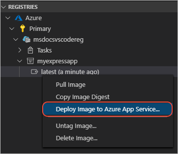

# Deploy the Registry image to Azure App Service

In this step, you deploy the Azure Container registry image to Azure App Service directly from Visual Studio Code.

## Deploy image to Azure web app from VS Code

1. In Docker Explorer, expand the nodes for your image under **Registries**, right-click `:latest`, and select **Deploy Image to Azure App Service**.

    

1. Create a new web app using the following values for prompts:

    |Prompt|Value|
    |--|--|
    |Enter a globally unique name for the new web app. |The name is used as part of the URL and must be unique across Azure.|
    |Select an existing resource group or create a new one.|Select the same resource group as you selected for your Container registry.|
    |Select a location for new resources.|Select a location close to you.|
    |Select a Linux App Service plan|Create a new App Service plan.|
    |Enter the name of the new App Service plan.|Take the default name.|
    |Select a pricing tier|Select the free pricing tier if that is available.|

1. If you receive an error that the namespace `Microsoft.Web` is not registered, run the following Azure CLI command to register the namespace: `az provider register --namespace Microsoft.Web`.

1. When deployment is complete, Visual Studio Code shows a notification with the website URL:

    

1. You can also see the results in the **Output** panel of Visual Studio Code, in the **Docker** section:

    

1. To see the resource in the **Azure** explorer, open the **Azure** explorer (<kbd>Shift</kbd> + <kbd>Alt</kbd> + <kbd>A</kbd>). 
1. In the **Resources** contextual toolbar, select the **App Services** node and expand it to find your new resource. 

## View the web site in a browser

1. To see the site in a browser, open the **Azure** explorer (<kbd>Shift</kbd> + <kbd>Alt</kbd> + <kbd>A</kbd>). 
1. In the **Resources** contextual toolbar, select the **App Services** node and expand it to find your new resource. 
1. Right-click your resource and select **Browse Website**.

## Next steps

* [Make changes to the web app and redeploy](tutorial-vscode-docker-node-06.md)
