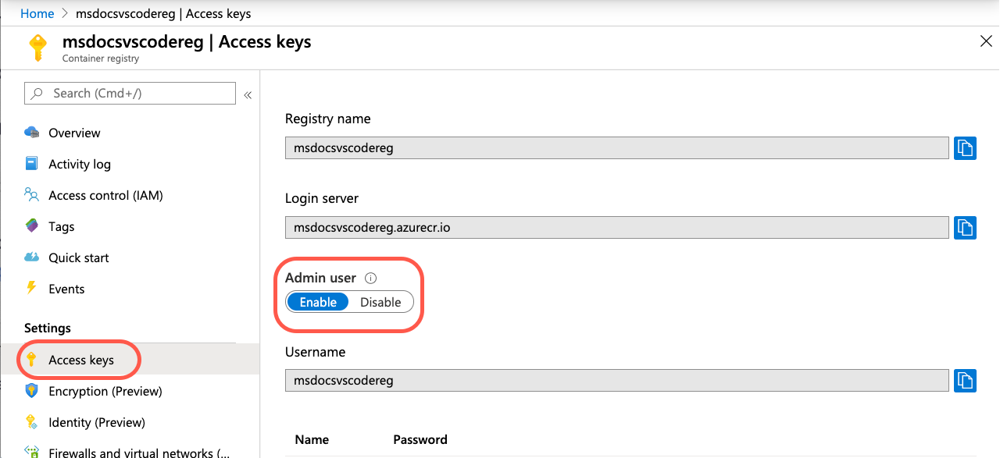

# Deploy the Registry image to Azure App Service

In this step, you deploy the Azure Container registry image to Azure App Service directly from Visual Studio Code.

## Enable Admin access on the registry

In order to deploy your image to a web application, you need to enable "Admin" access on your registry in the Azure portal.

1. In the **Docker** explorer, right-click your registry name and select "Open in portal". 

    

    This will open your registry in the Azure portal.

1. Click on "Access keys" in the sidebar and then toggle the "Admin user" setting to "Enabled".  
    
    

1. Close the browser to the Azure portal. 

## Deploy image

1. In the **DOCKER** explorer, expand the nodes for your image under **Registries**, right-click `:latest`, and select **Deploy Image to Azure App Service**.

    

1. Create a new web app using the following values for prompts:

    |Prompt|Value|
    |--|--|
    |Enter a globally unique name for the new web app. |The name is used as part of the URL and must be unique across Azure.|
    |Select an existing resource group or create a new one.|Select the same resource group as you selected for your Container registry.|
    |Select a location for new resources.|Select a location close to you.|
    |Select a Linux App Service plan|Create a new App Service plan.|
    |Enter the name of the new App Service plan.|Take the default name.|
    |Select a pricing tier|Select the free pricing tier if that is available.|

1. When deployment is complete, Visual Studio Code shows a notification with the website URL:

    

1. You can also see the results in the **Output** panel of Visual Studio Code, in the **Docker** section:

    

## Add application setting for port 3000

1. In VSCode, in the Azure Explorer, expand the Azure app service you just created. 

1. Right-click the **Application Settings**, then select **Add New Setting**.
1. Enter the name **WEBSITES_PORT** with the value 3000. 

## View the web site in a browser

To browse the deployed website, you can **Ctrl**+**Click** the URL in the **Output** panel then select **Open website**. The new App Service also appears in the **AZURE** explorer in Visual Studio Code under the **APP SERVICE** section, where you can right-click the website and select **Browse Website**.

## Next steps

* [Make changes to the web app and redeploy](tutorial-vscode-docker-node-06.md)
