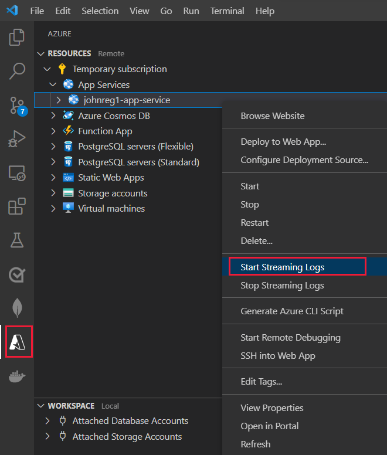
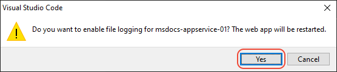

# Stream logs into Visual Studio Code

[Previous step: Make changes and redeploy](tutorial-vscode-docker-node-06.md)

In this step, you learn how to view or "tail" any output that the running website generates through calls to `console.log`. This output appears in the **Output** window in Visual Studio Code.

1. In the **Azure App Service** explorer, right-click the app node and choose **Start Streaming Logs**.

    

1. When prompted, choose to enable logging and restart the application.

    

1. Once the app is restarted, the **Output** panel in Visual Studio Code opens with a connection to the log stream, starting with the message `Starting Live Log Stream`.

> [!div class="nextstepaction"]
> [I see the logs](tutorial-vscode-docker-node-08.md) [I ran into an issue](https://www.research.net/r/PWZWZ52?tutorial=node-deployment-docker-extension&step=tailing-logs)
