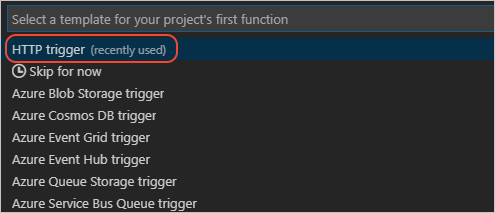
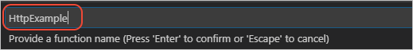

# Create the local Functions app with the Visual Studio Code _Functions_ extension

[Previous step: Introduction and prerequisites](tutorial-vscode-serverless-node-install.md)

In this step, you create a local Azure Functions (serverless) application that contains a function that uses an [HTTP trigger](/azure/azure-functions/functions-reference-node#http-triggers-and-bindings). An Azure Functions app can contain many Functions with [different triggers](/azure/azure-functions/functions-triggers-bindings). The HTTP trigger specifically handles incoming HTTP traffic.

1. From a terminal or command prompt, run Visual Studio Code from within a suitable folder for the project:

    ```bash
    # Create and navigate to a project folder

    # Run VS Code in that folder
    code .
    ```

1. In Visual Studio Code, select the Azure logo to open the **Azure Functions** explorer, then select the **Create Project** command:

    

1. At the first two prompts, select the current folder, then select **JavaScript** for the language.

1. At the prompt, **Select a template for your project's first function**, select **HTTP Trigger**:

    

1. At the prompt, **Provide a function name**, enter **HttpExample**. (Avoid using the default "HttpTrigger" name because it's the same as the trigger, which can be confusing.)

    

1. At the prompt, **Authorization Level**, select **Anonymous**:

    

1. After a few moments, VS Code completes creation of the project. You have a folder named for the function, *HttpExample*, within which are three files:

    | Filename | Description |
    | --- | --- |
    | *index.js* |  The source code that responds to the HTTP request. |
    | *function.json* | The [binding configuration](/azure/azure-functions/functions-triggers-bindings) for the HTTP trigger. |
    | *sample.dat* | A placeholder data file to demonstrate that you can have other files in the folder. You can delete this file, if desired, as it's not used in this tutorial. |

    

## HTTP function JavaScript template code

The basic code to respond to the HTTP request is provided for you. If you are familiar with the HTTP request (the _req_ parmeter) and response objects, the function should seem familiar. You return response information with the **context** object on the `res` property.  

```javascript
module.exports = async function (context, req) {
    context.log('JavaScript HTTP trigger function processed a request.');

    const name = (req.query.name || (req.body && req.body.name));
    const responseMessage = name
        ? "Hello, " + name + ". This HTTP triggered function executed successfully."
        : "This HTTP triggered function executed successfully. Pass a name in the query string or in the request body for a personalized response.";

    context.res = {
        // status: 200, /* Defaults to 200 */
        body: responseMessage
    };
}
```

Each Function [trigger](/azure-functions/functions-triggers-bindings?tabs=csharp) type provides a template function for you, to allow you to immediately focus on the code for your application. When moving from Express.js to Azure Functions, [review the necessary changes](/azure-functions/shift-expressjs?tabs=javascript) for your application. 

> [!div class="nextstepaction"]
> [I created the Functions app](tutorial-vscode-serverless-node-test-local.md) [I ran into an issue](https://www.research.net/r/PWZWZ52?tutorial=node-deployment-azurefunctions&step=create-app)