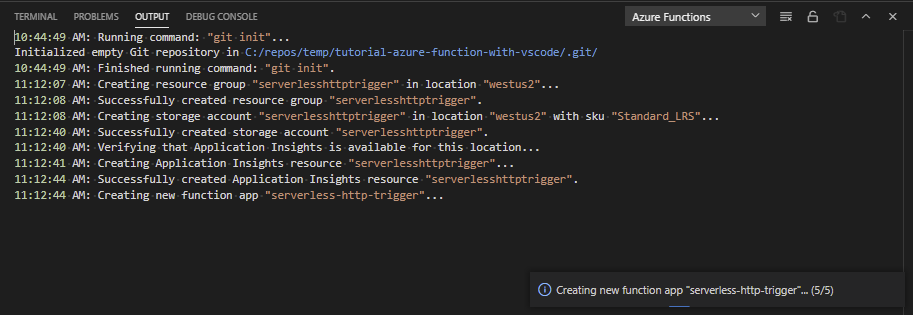

# 4. Deploy the Functions app to Azure cloud

[Previous step: Test the function locally](tutorial-vscode-serverless-node-test-local.md)

In this step, use the Visual Studio Code extension for Azure Functions to deploy the Functions app to the Azure cloud. Verify the Functions app is publicly available with a browser. 

## Use Visual Studio Code extension to deploy to hosting environment

1. In VS Code, select the Azure logo to open the **Azure Explorer**, then under **Functions**, select the blue up arrow to deploy your app:

    

    Alternately, you can deploy by opening the **Command Palette** (**F1**), entering 'deploy to function app', and running the **Azure Functions: Deploy to Function App** command.

1. At the prompt, **Select Function App in Azure**, choose **Create new Function app in Azure**.

1. At the next prompt, enter a globally unique name for your Function App and press **Enter**. Valid characters for a function app name are 'a-z', '0-9', and '-'.

1. Choose the Node.js version/runtime.

1. At the next prompt, select an Azure [region](https://azure.microsoft.com/regions/) close to you.

1. The VS Code **Output** panel for **Azure Functions** shows progress:

    

    When deploying, the entire Functions application is deployed, so changes to all individual Functions are deployed at once.

1. In the notifications, select **Stream logs** and keep the view open while you make a request to the API in the next section.

## Verify Functions app is available with browser

1. Once deployment is completed, go to the **Azure Functions** explorer, expand the node for your Azure subscription, expand the node for your Functions app, then expand **Functions (read only)**. Right-click the function name and select **Copy Function Url**:

    

1. Paste the URL into a browser. The URL includes the function key, `code` query parameter. 
1. Append a querystring name/value pair,`name=YOUR-NAME`, to the URL. 1. The browser shows the successful function running in the cloud.
1. Now remove the `code=` querystring parameter from the URL and submit the URL in the browser again. This simulates an unauthorized request to your secured API.

    :::image type="content" source="../../media/functions-extension/api-request-fails-401.png" alt-text="Screenshot of a browser showing the result of the API returns an HTTP error code of 401.":::

1. Review the streaming log in VS Code to find your `context.log` output. 

    :::image type="content" source="../../media/functions-extension/context-log-output.log" alt-text="Partial screenshot of VSCodes showing Remote Azure Function's streaming log, with the console.log output of the context value.":::

## Query your Azure Function logs

Streaming logs is good for in-the-moment scanning but generally you want to search across logs, which is available in the Azure portal. 

1. In VS Code, select the Azure logo to open the **Azure Explorer**, then under **Functions**, right-click on your function app, then select **Open in Portal**.

    This opens the Azure portal to your Azure Function.

1. Select **Application Insights** from the Settings, then select **View Application Insights data**.

    :::image type="content" source="../../media/functions-extension/azure-portal-function-application-insights-link.png" alt-text="Browser screenshot showing menu choices. Select **Application Insights** from the Settings, then select **View Application Insights data**." lightbox="../../media/functions-extension/azure-portal-function-application-insights-link.png":::

    This link takes you to your separate metrics resource created for you when you created your Azure Function with VS Code.

1. Select **Logs** in the Monitoring section. If a **Queries** pop-up window appears, select the **X** in the top-right corner of the pop-up to close it. 
1. In the **Schema and Filter** pane, on the **Tables** tab, double-click the **traces** table. 

    This enters the [Kusto query](/azure/data-explorer/kusto/query/), `traces` into the query window. 
1. Edit the query to search for the custom logs:

    ```kusto
    traces 
    | where message startswith "***"
    ```

1. Select **Run**.

    If the log doesn't display any results, it may be because there is a few minutes delay between the HTTP request to the Azure Function and the log availability in Kusto. Wait a few minutes and run the query again.

    :::image type="content" source="../../media/functions-extension/azure-portal-application-insights-function-log-trace.png" alt-text="Browser screenshot showing Azure portal Kusto query result for Trace table." lightbox="../../media/functions-extension/azure-portal-application-insights-function-log-trace.png":::


## Next steps

> [!div class="nextstepaction"]
> [I deployed the Function app](tutorial-vscode-serverless-node-remove-resource.md) [I ran into an issue](https://www.research.net/r/PWZWZ52?tutorial=node-deployment-azurefunctions&step=deploy-app)
