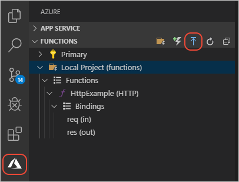

# 4. Deploy the Functions app to Azure cloud

[Previous step: Test the function locally](tutorial-vscode-serverless-node-test-local.md)

In this step, use the Visual Studio Code extension for Azure Functions to deploy the Functions app to the Azure cloud. Verify the Functions app is publicly available with a browser. 

## Use Visual Studio Code extension to deploy to hosting environment

1. In Visual Studio Code, select the Azure logo to open the **Azure Explorer**, then under **Functions**, select the **Deploy to Function app** icon to deploy your app:

    

    Alternately, you can deploy by opening the **Command Palette** (**F1**), entering 'deploy to function app', and running the **Azure Functions: Deploy to Function App** command.

1. Use the following table to complete the prompts to create a new Azure Function resource. 

    |Prompt|Value|Notes|
    |--|--|--|
    |Select Function App in Azure|Create new Function app in Azure (Advanced)|Create a cloud-based resource for your function.|
    |Enter a globally unique name for the new Function App|The name becomes part of the API's URL.|API is invoked with an HTTP request. Valid characters for a function app name are 'a-z', '0-9', and '-'. An example is `cosmosdb-mongodb-function-app`.|
    |Select a runtime stack|Select a Node.js stack with the `LTS` descriptor.||
    |Select an OS.|Windows||
    |Select a resource group for new resources.|`cosmosdb-mongodb-function-resource-group`|Select the [resource group](tutorial-vscode-serverless-node-install.md#create-a-resource-group) you created in the first article of this series.|
    |Select a location for new resources.|Select the recommended region.||
    |Select a hosting plan.|Consumption||
    |Select a storage account.|+ Create new storage account||
    |Enter the name of the new storage account.|`cosmosdbmongodbstorage`||
    |Enter an Application Insights resource for your app.|`cosmosdb-mongodb-function-app-insights`||

1. The Visual Studio Code **Output** panel for **Azure Functions** shows progress:

    ```console
    12:26:48 PM: Creating new function app "Visual Studio Codecosmosdb-mongodb-function-app"...
    12:27:09 PM: Successfully created function app "Visual Studio Codecosmosdb-mongodb-function-app": https://Visual Studio Codecosmosdb-mongodb-function-app.azurewebsites.net
    12:27:38 PM Visual Studio Codecosmosdb-mongodb-function-app: Starting deployment...
    12:27:40 PM Visual Studio Codecosmosdb-mongodb-function-app: Creating zip package...
    12:27:41 PM Visual Studio Codecosmosdb-mongodb-function-app: Uploading zip package to storage container...
    12:27:41 PM Visual Studio Codecosmosdb-mongodb-function-app: Zip package size: 2.73 kB
    12:27:44 PM Visual Studio Codecosmosdb-mongodb-function-app: Deployment successful.
    12:27:44 PM Visual Studio Codecosmosdb-mongodb-function-app: Started postDeployTask "npm install (functions)".
    12:27:55 PM Visual Studio Codecosmosdb-mongodb-function-app: Syncing triggers...
    12:27:57 PM Visual Studio Codecosmosdb-mongodb-function-app: Querying triggers...
    12:28:01 PM Visual Studio Codecosmosdb-mongodb-function-app: WARNING: Some http trigger urls cannot be displayed in the output window because they require an authentication token. Instead, you may copy them from the Azure Functions explorer.
    ```

    When deploying, the entire Functions application is deployed, any changes to individual APIs are deployed at once.

1. In the notifications, select **Stream logs** and keep the view open while you make a request to the API in the next section.

## Verify Functions app is available with browser

1. Once deployment is completed, go to the **Azure Functions** explorer, expand the node for your Azure subscription, expand the node for your Functions app, then expand **Functions (read only)**. Right-click the function name and select **Copy Function Url**:

    

1. Paste the URL into a browser. The URL includes the function key, `code` query parameter. 

1. Append a querystring name/value pair,`&name=YOUR-NAME`, to the URL. The browser shows the successful function running in the cloud.

    :::image type="content" source="../../media/functions-extension/api-request-succeeds-200.png" alt-text="Screenshot of a browser showing the result of the API returns successfully.":::

1. Now remove the `code=` querystring parameter from the URL and submit the URL in the browser again. This simulates an unauthorized request to your secured API.

    :::image type="content" source="../../media/functions-extension/api-request-fails-401.png" alt-text="Screenshot of a browser showing the result of the API returns an HTTP error code of 401.":::

1. Review the streaming log in Visual Studio Code to find your `context.log` output. 

## Query your Azure Function logs

Streaming logs is good for in-the-moment scanning. To search the logs, use the Azure portal. 

1. In Visual Studio Code, select the Azure logo to open the **Azure Explorer**, then under **Functions**, right-click on your function app, then select **Open in Portal**.

    This opens the Azure portal to your Azure Function.

1. Select **Application Insights** from the Settings, then select **View Application Insights data**.

    :::image type="content" source="../../media/functions-extension/azure-portal-function-application-insights-link.png" alt-text="Browser screenshot showing menu choices. Select **Application Insights** from the Settings, then select **View Application Insights data**." lightbox="../../media/functions-extension/azure-portal-function-application-insights-link.png":::

    This link takes you to your separate metrics resource created for you when you created your Azure Function with Visual Studio Code.

1. Select **Logs** in the Monitoring section. If a **Queries** pop-up window appears, select the **X** in the top-right corner of the pop-up to close it. 
1. In the **New Query 1** pane, on the **Tables** tab, double-click the **traces** table. 

    This enters the [Kusto query](/azure/data-explorer/kusto/query/), `traces` into the query window. 
1. Edit the query to search for the custom logs:

    ```kusto
    traces 
    | where message startswith "***"
    ```

1. Select **Run**.

    If the log doesn't display any results, it may be because there is a few minutes delay between the HTTP request to the Azure Function and the log availability in Kusto. Wait a few minutes and run the query again.

    :::image type="content" source="../../media/functions-extension/azure-portal-application-insights-function-log-trace.png" alt-text="Browser screenshot showing Azure portal Kusto query result for Trace table." lightbox="../../media/functions-extension/azure-portal-application-insights-function-log-trace.png":::

    You didn't need to do anything extra to get this logging information:

    * The code used the standard `console.log` function.
    * The Function app added Application Insights _for you_.
    * The Query tool is included in the Azure portal.
    * You can click on `traces` instead of having to learn to write a [Kusto query](/azure/data-explorer/kusto/concepts/) to get even the minimum information from your logs.

## Next steps

> [!div class="nextstepaction"]
> [Add database integration](tutorial-vscode-serverless-node-database-integration.md) 