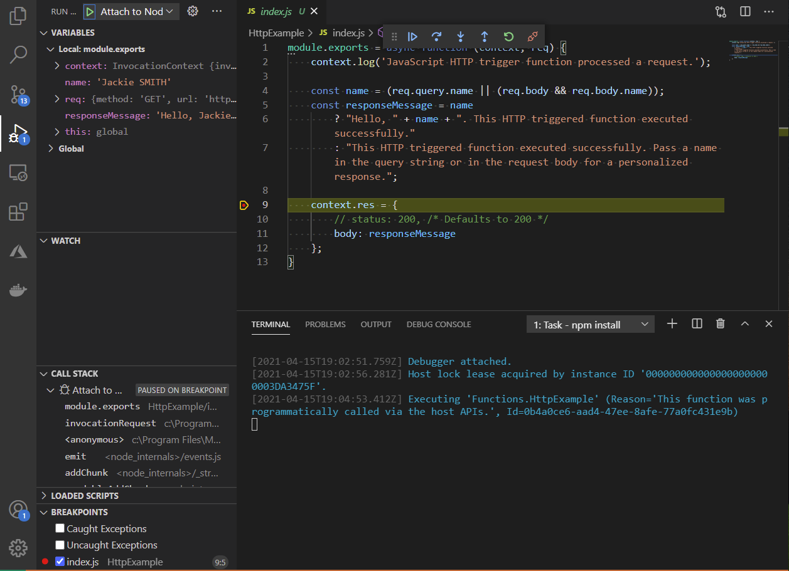

# 3. Run the function locally

Run the Azure Functions project locally to test it before deploying to Azure. Set a break point just before the serverless function returns the response. 

## Run the local serverless function

1. In Visual Studio Code, press **F5**  to launch the debugger and attach to the Azure Functions host. 

    You could also use the **Debug** > **Start Debugging** menu command.

1. Output from the Functions Core tools appears in the VS Code **Terminal** panel. Once the host has started, **Alt**+click the local URL shown in the output to open the browser and run the function:

    

    The code created by the default HTTP trigger template parses a `name` query parameter to customize the response. 

1. In your browser, enter the URL displayed in the terminal, then add `?name=YOUR-NAME` to the end of URL, replacing `YOUR-NAME` with your name:

    

    Your local API doesn't need the function key to work successfully.

## Set and stop at break point in serverless app

With your function running locally, set breakpoints on different parts of the code. 

1. Open *index.js*, then click in the margin to the left of line 13, ``context.res`, in the editor window. 
1. A small red dot appears to indicate a breakpoint. 
1. Remove the `?name=` argument from the URL in the browser and resubmit the browser request to the function. 
1. When the browser makes that request, VS Code stops the function code on that breakpoint:

    

    Expand the local **Variables** to see the request properties. You can view all the properties passed into the function.

1. Stop the debugger in Visual Studio Code. 

## Same Local and Azure Function runtime 

When you created the Functions app, the Azure Functions extension automatically added a VS Code launch configuration to your project, which is found in the *.vscode/launch.json* file. This configuration uses the same runtime that runs on Azure, so you can be sure that your source code works before deploying to the cloud.

## Next steps

> [!div class="nextstepaction"]
> [I ran the Function app locally](tutorial-vscode-serverless-node-deploy-hosting.md) [I ran into an issue](https://www.research.net/r/PWZWZ52?tutorial=node-deployment-azurefunctions&step=run-app)
