# Tutorial: Use Azure Container Instances as a Jenkins build agent

[!INCLUDE [jenkins-integration-with-azure.md](includes/jenkins-integration-with-azure.md)]

Azure Container Instances (ACI) provides an on-demand, burstable, and isolated environment for running containerized workloads. Because of these attributes, ACI makes a great platform for running Jenkins build jobs at a large scale. This article walks through deploying and using a Jenkins server that's pre-configured with ACI as a build target.

For more information on Azure Container Instances, see [About Azure Container Instances](/azure/container-instances/container-instances-overview).

## Requirement

- **Azure subscription**: If you don't have an Azure subscription, [create a free Azure account](https://azure.microsoft.com/free/?ref=microsoft.com&utm_source=microsoft.com&utm_medium=docs&utm_campaign=visualstudio) before you begin.
- **Jenkins server**: If you don't have a Jenkins server installed, [create a Jenkins server on Azure](./configure-on-linux-vm.md).
- **AZ CLI**: Make sure you have [Az CLI installed](https://docs.microsoft.com/en-us/cli/azure/install-azure-cli), version 2.0.67 or higher installed on your Jenkins server.
- **SSH tool**: for example OpenSSH etc.

## Prepare Jenkins master

1. Configure Jenkins URL. Navigate to `Configure System` -> Jenkins Location. Update `Jenkins URL` to the HTTP address of your Jenkins installation, such as http://yourhost.yourdomain:8080/.
1. Open the TCP port for the agents. Navigate to `Manage Jenkins` -> `Configure Global Security` -> `Agents`. Change the `TCP port for inbound agents` option to `Fixed` and set a port number. 
    Configuration example:
    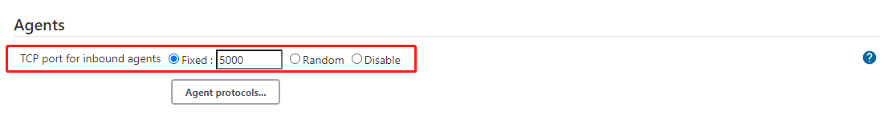

## Create Jenkins work agent
  Open your Jenkins portal, navigate to `Jenkins -> Manage Jenkins -> Manage Nodes and cloud -> New Node`.
  - Node Configure
    - `Name`  Jenkins node name, the `AGENT_NAME` you will used for agent connection.
    - `Remote root directory` Remote working directory, example: `/home/jenkins/work`
    - `Labels`: Labels are used to group multiple agents into one logical group. Example : `linux`
    - `Launch method`: `Launch agent by connecting to the master`
    Configuration example:   
     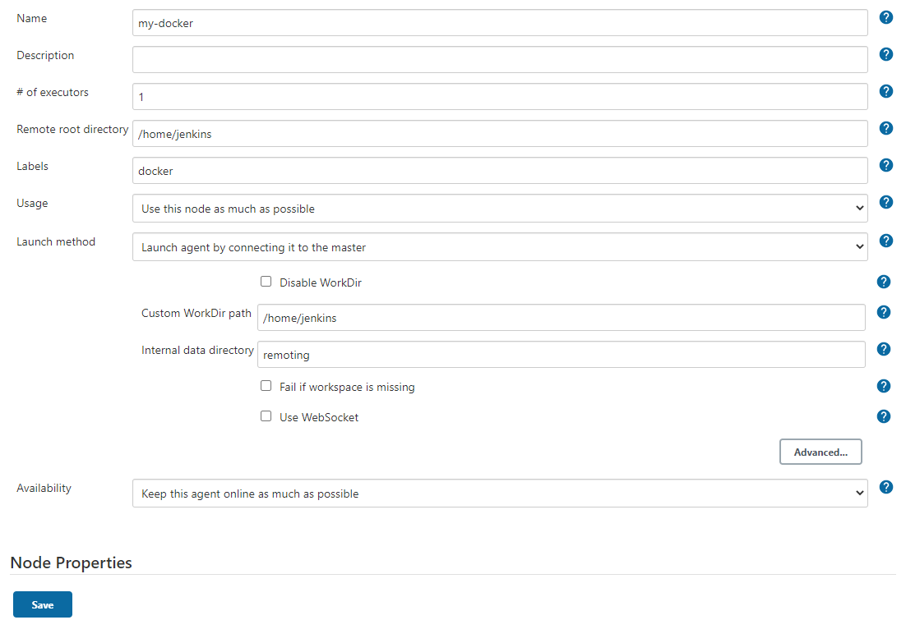

    Click the `Save` button save the agent configuration. Go to the agent status page, you will find the `JENKINS_SECRET` ,`AGENT_NAME` in the status page.
    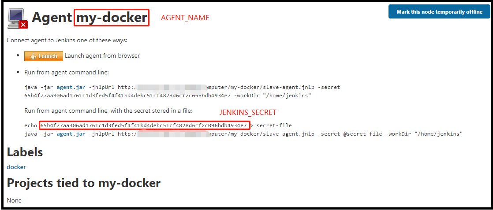

## Create Azure Container Instance with CLI 
 - Create Resource group
      ```
      az group create --name my-resourcegroup --location westus
      ```

 - Create Azure Container Instance
    Replace the `JENKINS_SECRET` and `AGENT_NAME` with the `JENKINS_SECRET` and `AGENT_NAME` you find in step 1.
    ```cmd
    az container create \
      --name my-dock \
      --resource-group my-resourcegroup \
      --ip-address Public --image jenkins/inbound-agent:latest \
      --os-type linux \
      --ports 80 \
      --command-line "jenkins-agent -url http://jenkinsserver:port <JENKINS_SECRET> <AGENT_NAME>"
    ```

  After the container started, it will connect to the Jenkins controller server automatically.
  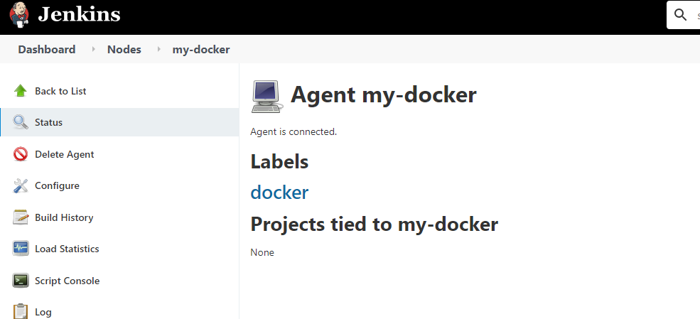

## Create a build job

Now, a Jenkins build job is created to demonstrate Jenkins builds on an Azure container instance.

1. Select **New Item**, give the build project a name such as **aci-demo**, select **Freestyle project**, and select **OK**.

   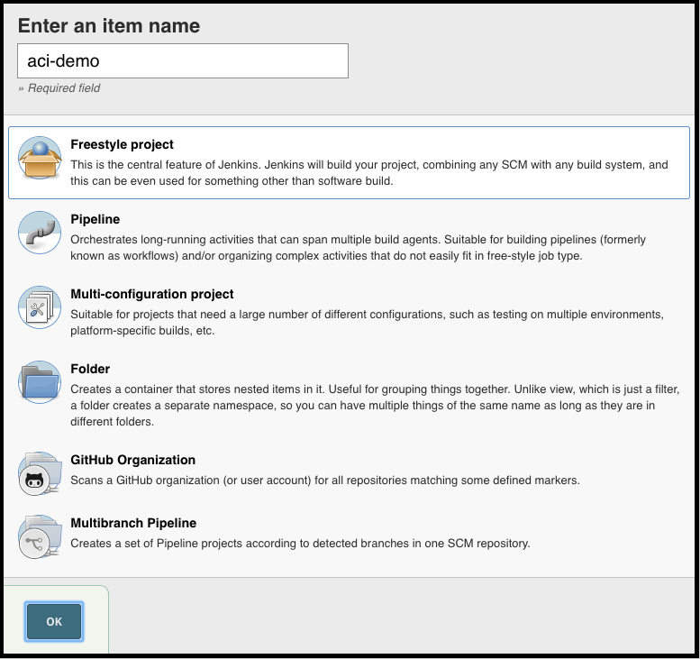

2. Under **General**, ensure that **Restrict where this project can be run** is selected. Enter **linux** for the label expression. This configuration ensures that this build job runs on the ACI cloud.

   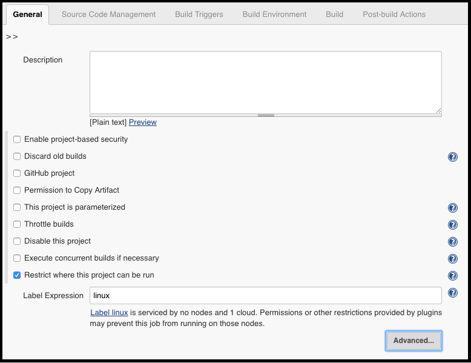

3. Under **Build**, select **Add build step** and select **Execute Shell**. Enter `echo "aci-demo"` as the command.

   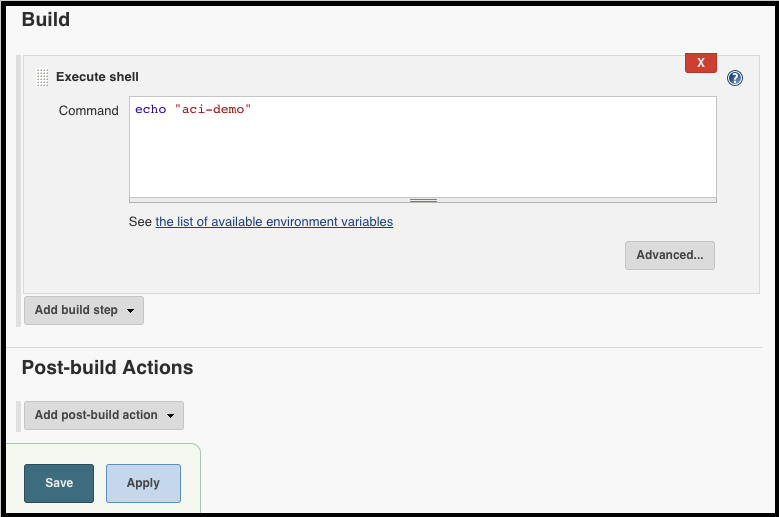

5. Select **Save**.

## Run the build job

To test the build job and observe Azure Container Instances as the build platform, manually start a build.

1. Select **Build Now** to start a build job. It takes a few minutes for the job to start. You should see a status that's similar to the following image:

   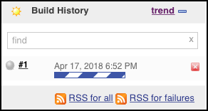

2. While the job is running, open the Azure portal and look at the Jenkins resource group. You should see that a container instance has been created. The Jenkins job is running inside this instance.

   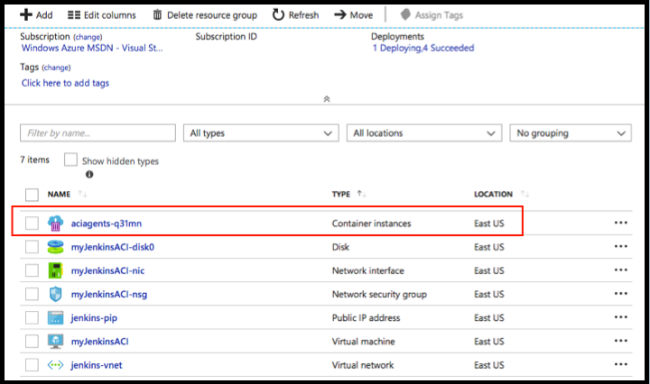

3. As Jenkins runs more jobs than the configured number of Jenkins executors (default 2), multiple container instances are created.

   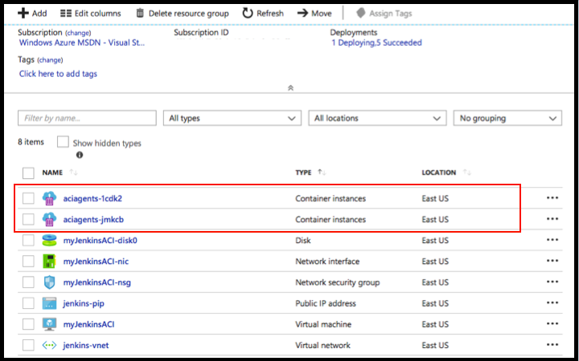

4. After all build jobs have finished, the container instances are removed.

   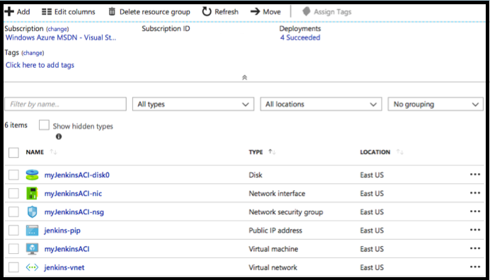

## Next steps

> [!div class="nextstepaction"]
> [CI/CD to Azure App Service](/azure/jenkins/tutorial-jenkins-deploy-web-app-azure-app-service)