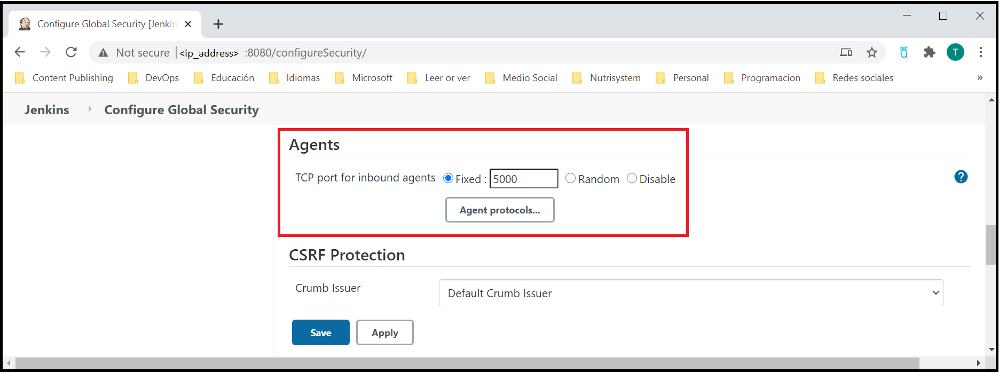

# Tutorial: Use Azure Container Instances as a Jenkins build agent

[!INCLUDE [jenkins-integration-with-azure.md](includes/jenkins-integration-with-azure.md)]

Azure Container Instances (ACI) provides an on-demand, burstable, and isolated environment for running containerized workloads. Because of these attributes, ACI makes a great platform for running Jenkins build jobs at a large scale. This article walks through deploying and using a Jenkins server that's pre-configured with ACI as a build target.

For more information on Azure Container Instances, see [About Azure Container Instances](/azure/container-instances/container-instances-overview).

## Prerequisites

- **Azure subscription**: If you don't have an Azure subscription, [create a free Azure account](https://azure.microsoft.com/free/?ref=microsoft.com&utm_source=microsoft.com&utm_medium=docs&utm_campaign=visualstudio) before you begin.
- **Jenkins server**: If you don't have a Jenkins server installed, [create a Jenkins server on Azure](./configure-on-linux-vm.md).

## Prepare the Jenkins controller

1. Browse to your Jenkins portal.

1. From the menu, select **Manage Jenkins**.

1. Under **System Configuration**, select **Configure System**.

1. Verify that the **Jenkins URL** is set to the HTTP address of your Jenkins installation - `http://<your_host>.<your_domain>:8080/`.

1. From the menu, select **Manage Jenkins**.

1. Under **Security**, select **Configure Global Security**.

1. Under **Agents**, specify **Fixed** port and enter the appropriate port number for your environment.

    Configuration example:
    

1. Select **Save**.

## Create Jenkins work agent

1. Browse to your Jenkins portal.

1. From the menu, select **Manage Jenkins**.

1. Under **System Configuration**, select **Manage Nodes and Clouds**.

1. From the menu, select **New Node**.

1. Enter a value for **Node Name**.

1. Select **Permanent Agent**.

1. Select **OK**.

1. Enter a value for **Remote root directory**. For example, `/home/jenkins/work`

1. Optionally, enter a label. Labels are used to group multiple agents into one logical group. An example of a label would be `linux` to group your Linux agents.

1. Set **Launch method** to **Launch agent by connecting to the master**.

1. Verify that all required fields have been specified or entered:

    

1. Select **Save**.

1. On the agent status page, you should see the `JENKINS_SECRET` and `AGENT_NAME`. The following screen shot shows how to identify the values. Both values are needed when you create the Azure Container Instance.

    

## Create Azure Container Instance with CLI

1. Use [az group create](/cli/azure/group?#az_group_create) to create an Azure resource group.

      ```azurecli
      az group create --name my-resourcegroup --location westus
      ```

1. Use [az container create](https://docs.microsoft.com/cli/azure/container#az_container_create) to create and Azure Container Instance. Replace the placeholders with the values obtained when you created the work agent.

    ```azurecli
    az container create \
      --name my-dock \
      --resource-group my-resourcegroup \
      --ip-address Public --image jenkins/inbound-agent:latest \
      --os-type linux \
      --ports 80 \
      --command-line "jenkins-agent -url http://jenkinsserver:port <JENKINS_SECRET> <AGENT_NAME>"
    ```

    After the container starts, it will connect to the Jenkins controller server automatically.

    

## Create a build job

Now, a Jenkins build job is created to demonstrate Jenkins builds on an Azure container instance.

1. Select **New Item**, give the build project a name such as **aci-demo**, select **Freestyle project**, and select **OK**.

   

2. Under **General**, ensure that **Restrict where this project can be run** is selected. Enter **linux** for the label expression. This configuration ensures that this build job runs on the ACI cloud.

   

3. Under **Build**, select **Add build step** and select **Execute Shell**. Enter `echo "aci-demo"` as the command.

   

5. Select **Save**.

## Run the build job

To test the build job and observe Azure Container Instances as the build platform, manually start a build.

1. Select **Build Now** to start a build job. It takes a few minutes for the job to start. You should see a status that's similar to the following image:

   

2. While the job is running, open the Azure portal and look at the Jenkins resource group. You should see that a container instance has been created. The Jenkins job is running inside this instance.

   

3. As Jenkins runs more jobs than the configured number of Jenkins executors (default 2), multiple container instances are created.

   

4. After all build jobs have finished, the container instances are removed.

   

## Next steps

> [!div class="nextstepaction"]
> [CI/CD to Azure App Service](/azure/jenkins/tutorial-jenkins-deploy-web-app-azure-app-service)