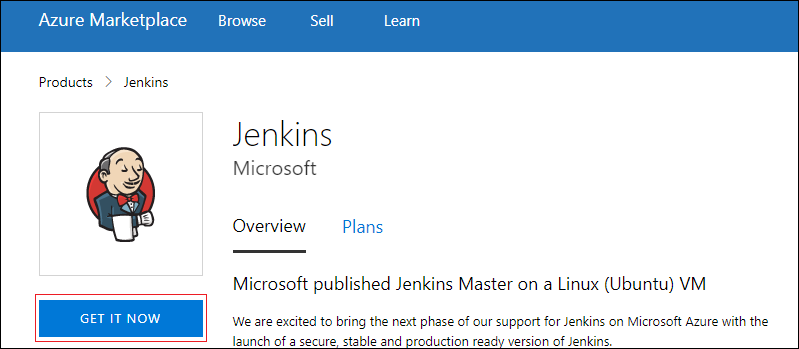
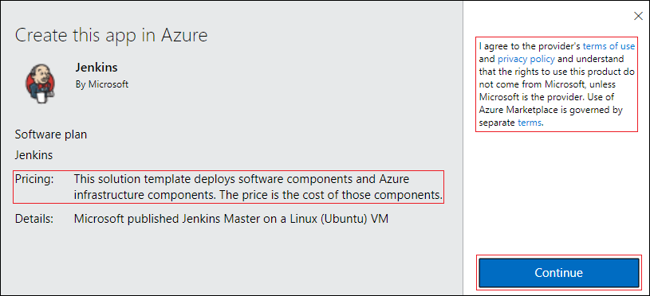
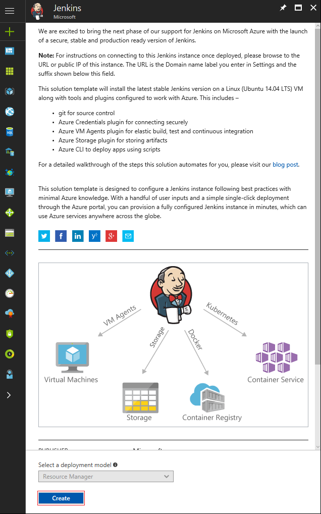
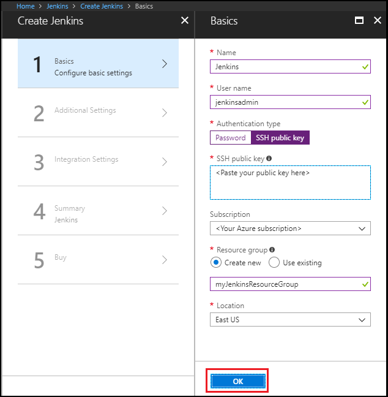
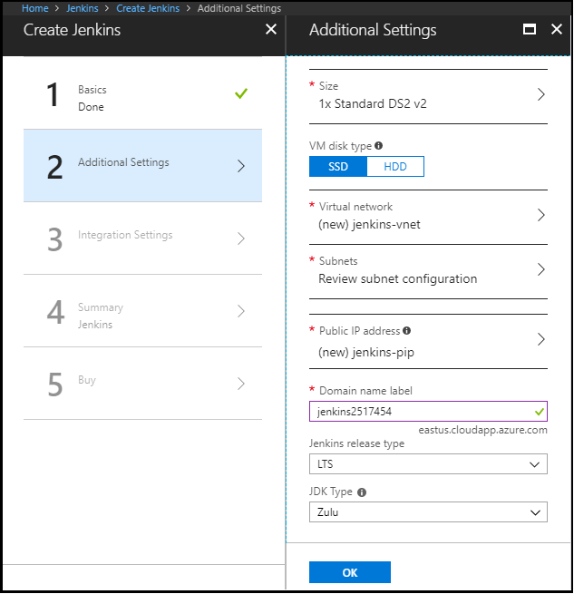
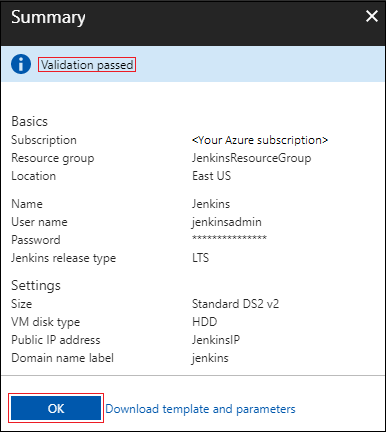
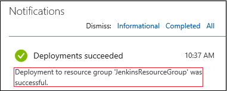

# Quickstart: Create a Jenkins server on an Azure Linux VM

This quickstart shows how to install [Jenkins](https://jenkins.io) on an Ubuntu Linux VM with the tools and plug-ins configured to work with Azure. When you're finished, you have a Jenkins server running in Azure building a sample Java app from [GitHub](https://github.com).

## Prerequisites

* Access to SSH on your computer's command line (such as the Bash shell or [PuTTY](https://www.putty.org/))

## Create the Jenkins VM from the solution template

Jenkins supports a model where the Jenkins server delegates work to one or more agents to allow a single Jenkins installation to host a large number of projects or to provide different environments needed for builds or tests. The steps in this section guide you through installing and configuring a Jenkins server on Azure.

1. In your browser, open the [Azure Marketplace image for Jenkins](https://azuremarketplace.microsoft.com/marketplace/apps/azure-oss.jenkins?tab=Overview).

1. Select **GET IT NOW**.

    

1. After reviewing the pricing details and terms information, select **Continue**.

    

1. Select **Create** to configure the Jenkins server in the Azure portal. 

    

1. In the **Basics** tab, specify the following values:

   - **Name** - Enter `Jenkins`.
   - **User name** - Enter the user name to use when signing in to the virtual machine on which Jenkins is running. The user name must meet [specific requirements](/azure/virtual-machines/linux/faq#what-are-the-username-requirements-when-creating-a-vm).
   - **Authentication type** - Select **SSH public key**.
   - **SSH public key** - Copy and paste an RSA public key in single-line format (starting with `ssh-rsa`) or multi-line PEM format. You can generate SSH keys using ssh-keygen on Linux and macOS, or PuTTYGen on Windows. For more information about SSH keys and Azure, see the article, [How to Use SSH keys with Windows on Azure](/azure/virtual-machines/linux/ssh-from-windows).
   - **Subscription** - Select the Azure subscription into which you want to install Jenkins.
   - **Resource group** - Select **Create new**, and enter a name for the resource group that serves as a logical container for the collection of resources that make up your Jenkins installation.
   - **Location** - Select **East US**.

     

1. Select **OK** to proceed to the **Additional Settings** tab. 

1. In the **Additional Settings** tab, specify the following values:

   - **Size** - Select the appropriate sizing option for your Jenkins virtual machine.
   - **VM disk type** - Specify either HDD (hard-disk drive) or SSD (solid-state drive) to indicate which storage disk type is allowed for the Jenkins virtual machine.
   - **Virtual network** - (Optional) Select **Virtual network** to modify the default settings.
   - **Subnets** - Select **Subnets**, verify the information, and select **OK**.
   - **Public IP address** - The IP address name defaults to the Jenkins name you specified in the previous page with a suffix of -IP. You can select the option to change that default.
   - **Domain name label** - Specify the value for the fully qualified URL to the Jenkins virtual machine.
   - **Jenkins release type** - Select the desired release type from the options: `LTS`, `Weekly build`, or `Azure Verified`. The `LTS` and `Weekly build` options are explained in the article, [Jenkins LTS Release Line](https://jenkins.io/download/lts/). The `Azure Verified` option refers to a [Jenkins LTS version](https://jenkins.io/download/lts/) that has been verified to run on Azure. 
   - **JDK Type** - JDK to be installed. Default is Zulu tested, certified builds of OpenJDK.

     

1. Select **OK** to proceed to the **Integration Settings** tab.

1. In the **Integration Settings** tab, specify the following values:

    - **Service Principal** - The service principal is added into Jenkins as a credential for authentication with Azure. `Auto` means that the principal will be created by MSI (Managed Service Identity). `Manual` means that the principal should be created by you. 
        - **Application ID** and **Secret** - If you select the `Manual` option for the **Service Principal** option, you'll need to specify the `Application ID` and `Secret` for your service principal. When [creating a service principal](/cli/azure/create-an-azure-service-principal-azure-cli), note that the default role is **Contributor**, which is sufficient for working with Azure resources.
    - **Enable Cloud Agents** - Specify the default cloud template for agents where `ACI` refers to Azure Container Instance, and `VM` refers to virtual machines. You can also specify `No` if you don't wish to enable a cloud agent.

1. Select **OK** to proceed to the **Summary** tab.

1. When the **Summary** tab displays, the information entered is validated. Once you see the **Validation passed** message (at the top of the tab), select **OK**. 

     

1. When the **Create** tab displays, select **Create** to create the Jenkins virtual machine. When your server is ready, a notification displays in the Azure portal.

     

## Connect to Jenkins

1. Navigate to your virtual machine (for example, `http://jenkins2517454.eastus.cloudapp.azure.com/`) in  your web browser. The Jenkins console is inaccessible through unsecured HTTP so instructions are provided on the page to access the Jenkins console securely from your computer using an SSH tunnel.

    

1. Set up the tunnel using the `ssh` command on the page from the command line, replacing `username` with the name of the virtual machine admin user chosen earlier when setting up the virtual machine from the solution template.

    ```bash
    ssh -L 127.0.0.1:8080:localhost:8080 jenkinsadmin@jenkins2517454.eastus.cloudapp.azure.com
    ```
    
1. After you have started the tunnel, navigate to `http://localhost:8080/` on your local machine. 

1. Get the initial password by running the following command in the command line while connected through SSH to the Jenkins VM.

    ```bash
    sudo cat /var/lib/jenkins/secrets/initialAdminPassword
    ```
    
1. Unlock the Jenkins dashboard for the first time using this initial password.

    

1. Select **Install suggested plugins** on the next page and then create a Jenkins admin user used to access the Jenkins dashboard.

    

The Jenkins server is now ready to build code.

## Create your first job

1. Select **Create new jobs** from the Jenkins console, then name it **mySampleApp** and select **Freestyle project**, then select **OK**.

     

1. Select the **Source Code Management** tab, enable **Git**, and enter the following URL in **Repository URL**  field: `https://github.com/spring-guides/gs-spring-boot.git`

     

1. Select the **Build** tab, then select **Add build step**, **Invoke Gradle script**. Select **Use Gradle Wrapper**, then enter `complete` in **Wrapper location** and `build` for **Tasks**.

     

1. Select **Advanced** and then enter `complete` in the **Root Build script** field. Select **Save**.

     

## Build the code

1. Select **Build Now** to compile the code and package the sample app. When your build completes, select the **Workspace** link for the project.

     

1. Navigate to `complete/build/libs` and ensure the `gs-spring-boot-0.1.0.jar` is there to verify that your build was successful. Your Jenkins server is now ready to build your own projects in Azure.

## Troubleshooting the Jenkins solution template

If you encounter any bugs with the Jenkins solution template, file an issue in the [Jenkins GitHub repo](https://github.com/azure/jenkins/issues).

## Next Steps

> [!div class="nextstepaction"]
> [Jenkins on Azure](/azure/developer/jenkins)