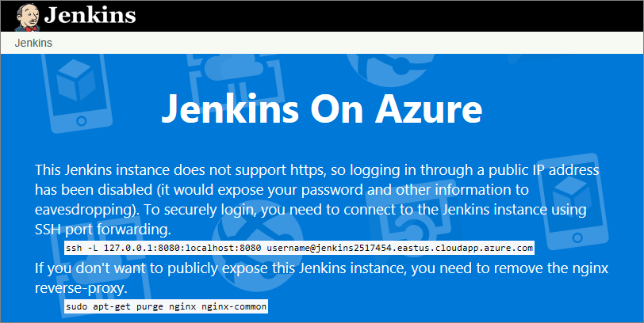
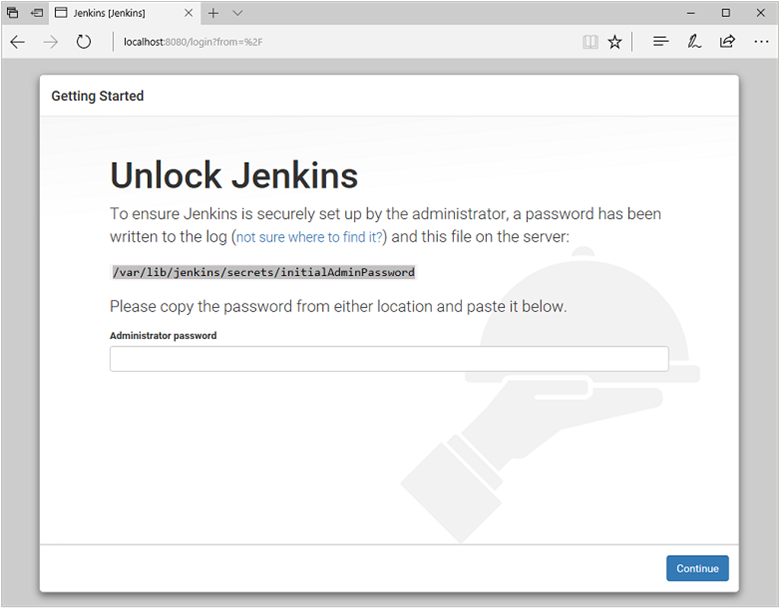
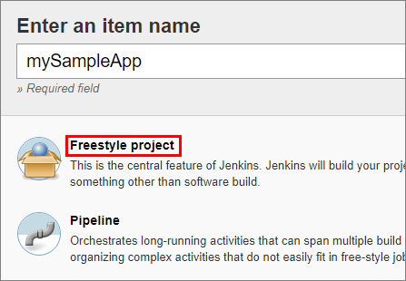
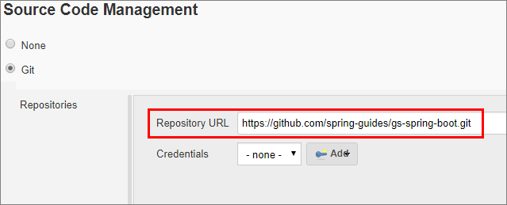
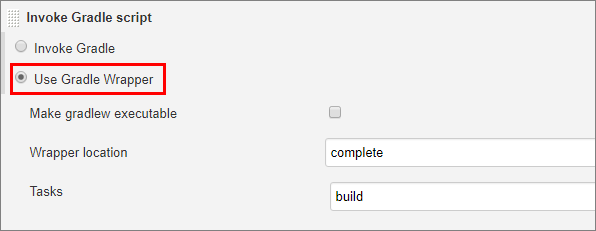
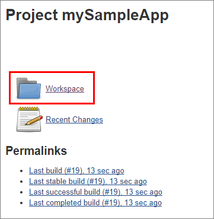

# Quickstart: Get started with Jenkins

This quickstart shows how to install [Jenkins](https://jenkins.io) on an Ubuntu Linux VM with the tools and plug-ins configured to work with Azure.

In this quickstart, you'll complete these tasks:

> [!div class="checklist"]

> * Create a setup file that downloads and installs Jenkins
> * Create a resource group
> * Create a virtual machine with the setup file
> * Open port 8080 so that you can SSH into the virtual machine
> * Connect to the virtual machine via SSH
> * Run the setup file to download and install Jenkins
> * Configure a sample Jenkins job based on a sample Java app in GitHub
> * Build the Jenkins job

## Prerequisites

* Access to SSH on your computer's command line (such as the Bash shell or [PuTTY](https://www.putty.org/))

## Create a virtual machine

1. Sign in to the [Azure portal](https://portal.azure.com).

1. Open [Azure Cloud Shell](/azure/cloud-shell/overview) and - if not done already - switch to **Bash**.

1. Create a file named `cloud-init-jenkins.txt`.

    ```bash
    code cloud-init-jenkins.txt
    ```

1. Paste the following code into the new file:

    ```json
    #cloud-config
    package_upgrade: true
    runcmd:
      - apt install openjdk-8-jdk -y
      - wget -qO - https://pkg.jenkins.io/debian-stable/jenkins.io.key | sudo apt-key add -
      - sh -c 'echo deb https://pkg.jenkins.io/debian-stable binary/ > /etc/apt/sources.list.d/jenkins.list'
      - apt-get update && apt-get install jenkins -y
      - service jenkins restart
    ```

1. Save the file (**&lt;Ctrl>S**) and exit the editor (**&lt;Ctrl>Q**).

1. Create a resource group using [az group create](/cli/azure/group#az-group-create). You might need to replace the `--location` parameter with the appropriate value for your environment.

    ```azurecli
    az group create --name QuickstartJenkins-rg --location eastus
    ```

1. Create a virtual machine using [az vm create](/cli/azure/vm#az-vm-create).

    ```azurecli
    az vm create --resource-group QuickstartJenkins-rg --name QuickstartJenkins-vm --image UbuntuLTS --admin-username "azureuser" --generate-ssh-keys --custom-data cloud-init-jenkins.txt
    ```

1. Open port 8080 on the new virtual machine using [az vm open](/cli/azure/vm#az-vm-open-port).

    ```azurecli
    az vm open-port --resource-group QuickstartJenkins-rg --name QuickstartJenkins-vm  --port 8080 --priority 1010
    ```

## Configure Jenkins

1. Get the public IP address for the sample virtual machine using [az vm show](/cli/azure/vm#az-vm-show).

    ```azurecli
    az vm show --resource-group QuickstartJenkins-rg --name QuickstartJenkins-vm -d --query [publicIps] --output tsv
    ```

    **Notes**:
    - The `--query` parameter limits the output to the public IP addresses for the virtual machine.

1. SSH into the virtual machine. You'll need to confirm the connection request.

    ```azurecli
    ssh jenkins_admin@<ip_address>
    ```


1. [Configure Jenkins](pipeline-with-github-and-docker.md?#configure-jenkins).

1. [Add service principal to Jenkins credential store](scale-deployments-using-vm-agents.md#configure-the-azure-vm-agents-plugin).

## Connect to Jenkins

1. Navigate to your virtual machine (for example, `http://jenkins2517454.eastus.cloudapp.azure.com/`) in  your web browser. The Jenkins console is inaccessible through unsecured HTTP so instructions are provided on the page to access the Jenkins console securely from your computer using an SSH tunnel.

    

1. Set up the tunnel using the `ssh` command on the page from the command line, replacing `username` with the name of the virtual machine admin user chosen earlier when setting up the virtual machine from the solution template.

    ```bash
    ssh -L 127.0.0.1:8080:localhost:8080 jenkinsadmin@jenkins2517454.eastus.cloudapp.azure.com
    ```
    
1. After you have started the tunnel, navigate to `http://localhost:8080/` on your local machine. 

1. Get the initial password by running the following command in the command line while connected through SSH to the Jenkins VM.

    ```bash
    sudo cat /var/lib/jenkins/secrets/initialAdminPassword
    ```
    
1. Unlock the Jenkins dashboard for the first time using this initial password.

    

1. Select **Install suggested plugins** on the next page and then create a Jenkins admin user used to access the Jenkins dashboard.

    

The Jenkins server is now ready to build code.

## Create your first job

1. Select **Create new jobs** from the Jenkins console, then name it **mySampleApp** and select **Freestyle project**, then select **OK**.

     

1. Select the **Source Code Management** tab, enable **Git**, and enter the following URL in **Repository URL**  field: `https://github.com/spring-guides/gs-spring-boot.git`

     

1. Select the **Build** tab, then select **Add build step**, **Invoke Gradle script**. Select **Use Gradle Wrapper**, then enter `complete` in **Wrapper location** and `build` for **Tasks**.

     

1. Select **Advanced** and then enter `complete` in the **Root Build script** field. Select **Save**.

     

## Build the code

1. Select **Build Now** to compile the code and package the sample app. When your build completes, select the **Workspace** link for the project.

     

1. Navigate to `complete/build/libs` and ensure the `gs-spring-boot-0.1.0.jar` is there to verify that your build was successful. Your Jenkins server is now ready to build your own projects in Azure.

## Troubleshooting the Jenkins solution template

If you encounter any bugs with the Jenkins solution template, file an issue in the [Jenkins GitHub repo](https://github.com/azure/jenkins/issues).

## Next Steps

> [!div class="nextstepaction"]
> [Jenkins on Azure](/azure/developer/jenkins)