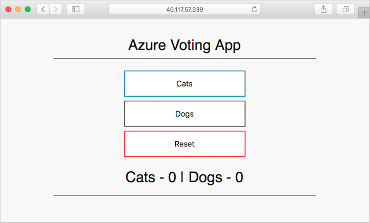
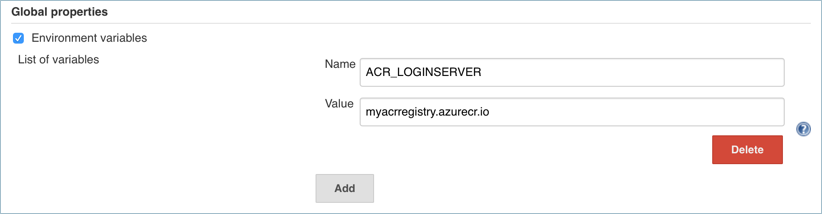
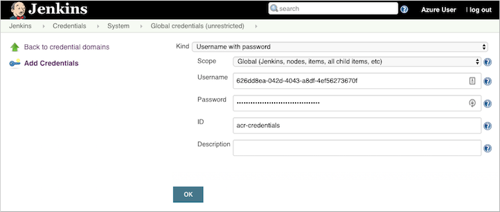
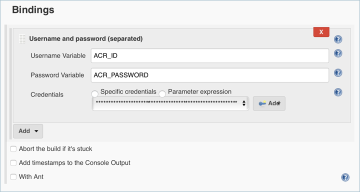
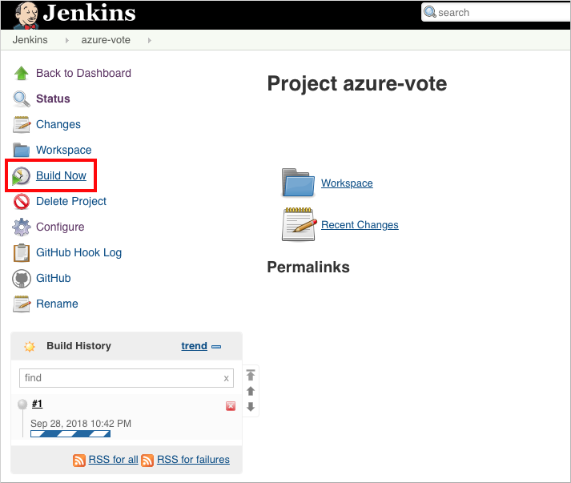
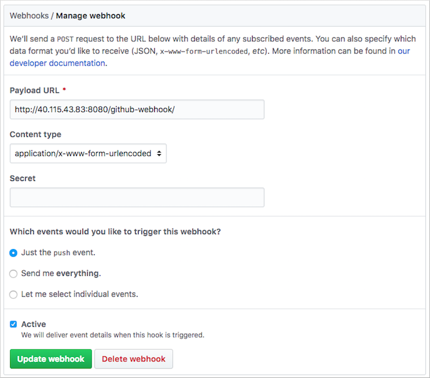
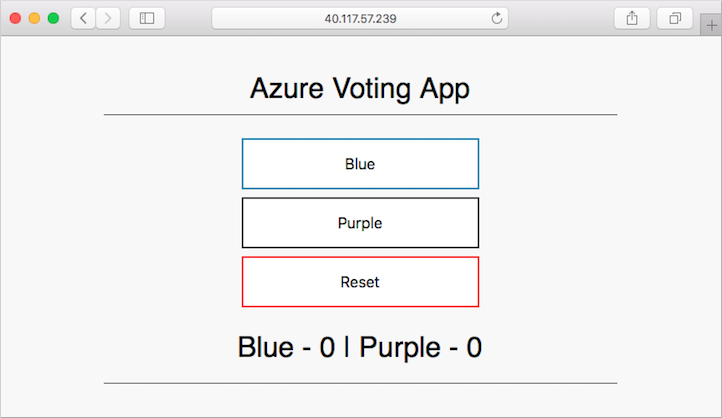

# Tutorial: Deploy from GitHub to Azure Kubernetes Service using Jenkins

[!INCLUDE [jenkins-integration-with-azure.md](includes/jenkins-integration-with-azure.md)]

This tutorial deploys a sample app from GitHub to an
[Azure Kubernetes Service (AKS)](/azure/aks/intro-kubernetes)
cluster by setting up continuous integration (CI) and
continuous deployment (CD) in Jenkins.

In this tutorial, you'll complete these tasks:

> [!div class="checklist"]
> * Deploy a sample Azure vote app to an AKS cluster.
> * Create a basic Jenkins project.
> * Set up credentials for Jenkins to interact with ACR.
> * Create a Jenkins build job and GitHub webhook for automated builds.
> * Test the CI/CD pipeline to update an application in AKS based on GitHub code commits.

## Prerequisites

To complete this tutorial, you need these items:

- Basic understanding of Kubernetes, Git, CI/CD, and container images

- An [AKS cluster](/azure/aks/kubernetes-walkthrough) and `kubectl` configured with the 
[AKS cluster credentials](/cli/azure/aks#az-aks-get-credentials).

- An [Azure Container Registry (ACR) registry](/azure/container-registry/container-registry-get-started-azure-cli), 
the ACR login server name, and the AKS cluster configured to 
[authenticate with the ACR registry](/azure/aks/cluster-container-registry-integration).

- A [Jenkins Controller](./configure-on-linux-vm.md) Deployed to an Azure Virtual Machine.

- The Azure CLI version 2.0.46 or later installed and configured. 
Run `az --version` to find the version. If you need to install or upgrade, 
see [Install Azure CLI](/cli/azure/install-azure-cli).

- [Docker installed](https://docs.docker.com/install/) on your development system

- A GitHub account, [GitHub personal access token](https://help.github.com/articles/creating-a-personal-access-token-for-the-command-line/), 
and Git client installed on your development system

- If you provide your own Jenkins instance rather 
than this sample scripted way to deploy Jenkins, 
your Jenkins instance needs [Docker installed and configured](https://docs.docker.com/install/) 
and [kubectl](https://kubernetes.io/docs/tasks/tools/install-kubectl/).

## Prepare your app

In this article, you use a sample Azure vote application that contains a web interface and Redis for temporary data storage.

Before you integrate Jenkins and AKS for automated deployments, first manually prepare and deploy the Azure vote application to your AKS cluster. This manual deployment lets you see the application in action.

> [!NOTE]
> The sample Azure vote application uses a Linux pod that is scheduled to run on a Linux node. The flow outlined in this article also works for a Windows Server pod scheduled on a Windows Server node.

Fork the following GitHub repository for the sample application - [https://github.com/Azure-Samples/azure-voting-app-redis](https://github.com/Azure-Samples/azure-voting-app-redis). To fork the repo to your own GitHub account, select the **Fork** button in the top right-hand corner.

Clone the fork to your development system. Make sure you use the URL of your fork when cloning this repo:

```console
git clone https://github.com/<your-github-account>/azure-voting-app-redis.git
```

Change to the directory of your cloned fork:

```console
cd azure-voting-app-redis
```

To create the container images needed for the sample application, use the *docker-compose.yaml* file with `docker-compose`:

```console
docker-compose up -d
```

The required base images are pulled and the application containers built. You can then use the [docker images](https://docs.docker.com/engine/reference/commandline/images/) command to see the created image. Three images have been downloaded or created. The `azure-vote-front` image contains the application and uses the `nginx-flask` image as a base. The `redis` image is used to start a Redis instance:

```
$ docker images

REPOSITORY                   TAG        IMAGE ID            CREATED             SIZE
azure-vote-front             latest     9cc914e25834        40 seconds ago      694MB
redis                        latest     a1b99da73d05        7 days ago          106MB
tiangolo/uwsgi-nginx-flask   flask      788ca94b2313        9 months ago        694MB
```

Sign in to your Azure container registry.

```azurecli
az acr login -n <acrLoginServer>
```

Replace `<acrLoginServer>` with your ACR login server.

Use the [docker tag](https://docs.docker.com/engine/reference/commandline/tag/) command to tag the image with the ACR login server name and a version number of `v1`. Use your own `<acrLoginServer>` name obtained in the previous step:

```console
docker tag azure-vote-front <acrLoginServer>/azure-vote-front:v1
```

Finally, push the *azure-vote-front* image to your ACR registry. Again, replace `<acrLoginServer>` with the login server name of your own ACR registry, such as `myacrregistry.azurecr.io`:

```console
docker push <acrLoginServer>/azure-vote-front:v1
```

## Deploy the sample application to AKS

To deploy the sample application to your AKS cluster, you can use the Kubernetes manifest file in the root of the Azure vote repository repo. Open the `azure-vote-all-in-one-redis.yaml` manifest file with an editor such as `vi`. Replace `microsoft` with your ACR login server name. This value is found on line **60** of the manifest file:

```yaml
containers:
- name: azure-vote-front
  image: azuredocs/azure-vote-front
```

Next, use the [kubectl apply](https://kubernetes.io/docs/reference/generated/kubectl/kubectl-commands#apply) command to deploy the application to your AKS cluster:

```console
kubectl apply -f azure-vote-all-in-one-redis.yaml
```

A Kubernetes load balancer service is created to expose the application to the internet. This process can take a few minutes. To monitor the progress of the load balancer deployment, use the [kubectl get service](https://kubernetes.io/docs/reference/generated/kubectl/kubectl-commands#get) command with the `--watch` argument.

```console
$ kubectl get service azure-vote-front --watch
```

Once the *EXTERNAL-IP* address has changed from *pending* to an *IP address*, use `Control + C` to stop the kubectl watch process.

```
NAME               TYPE           CLUSTER-IP    EXTERNAL-IP   PORT(S)        AGE
```

To see the application in action, open a web browser to the external IP address of your service. The Azure vote application is displayed, as shown in the following example:



## Configure Jenkins Controller

Apply the following changes to enable AKS deployments from the Jenkins Controller:

Open port `80` inbound.

```azurecli
az vm open-port \
--resource-group <Resource_Group_name> \
--name <Jenkins_Controller_VM>  \
--port 80 --priority 1020
```

Replace `<Resource_Group_name>` and `<Jenkins_Controller_VM>` with the appropriate values.

SSH into the Jenkins Controller

```azurecli
ssh azureuser@<PublicIPAddress>
```

Replace `<PublicIPAddress>` with the IP address of the Jenkins Controller.

### Install & Log into AzCLI

```azurecli
curl -L https://aka.ms/InstallAzureCli | bash
``````

```azurecli
az login
```

   > [!NOTE]
   > To manually install AzCLI, follow these [instructions](/cli/azure/install-azure-cli).

### Install Docker

```bash
sudo apt-get install apt-transport-https ca-certificates curl software-properties-common -y;
curl -fsSL https://download.docker.com/linux/ubuntu/gpg | sudo apt-key add -;
sudo apt-key fingerprint 0EBFCD88;
sudo add-apt-repository "deb [arch=amd64] https://download.docker.com/linux/ubuntu $(lsb_release -cs) stable";
sudo apt-get update;
sudo apt-get install docker-ce -y;
```

### Install Kubectl and Connect to AKS

```azurecli
sudo az aks install-cli
sudo az aks get-credentials --resource-group <Resource_Group> --name <AKS_Name>
```

Replace `<Resource_Group>` and `<AKS_Name>` with the appropriate values.

### Configure access

```bash
sudo usermod -aG docker jenkins;
sudo usermod -aG docker azureuser;
sudo touch /var/lib/jenkins/jenkins.install.InstallUtil.lastExecVersion;
sudo service jenkins restart;
sudo cp ~/.kube/config /var/lib/jenkins/.kube/
sudo chmod 777 /var/lib/jenkins/
sudo chmod 777 /var/lib/jenkins/config
```

## Create a Jenkins environment variable

A Jenkins environment variable is used to hold the ACR login server name. This variable is referenced during the Jenkins build job. To create this environment variable, complete the following steps:

- On the left-hand side of the Jenkins portal, select **Manage Jenkins** > **Configure System**
- Under **Global Properties**, select **Environment variables**. Add a variable with the name `ACR_LOGINSERVER` and the value of your ACR login server.

    

- When complete, Select **Save** at the bottom of the page.

## Create a Jenkins credential for ACR

During the CI/CD process, Jenkins builds new container images based on application updates, and needs to then *push* those images to the ACR registry.

To allow Jenkins to push updated container images to ACR, you need to specify credentials for ACR. 

For separation of roles and permissions, configure a service principal for Jenkins with *Contributor* permissions to your ACR registry.

### Create a service principal for Jenkins to use ACR

First, create a service principal using the [az ad sp create-for-rbac](/cli/azure/ad/sp#az-ad-sp-create-for-rbac) command:

```azurecli
az ad sp create-for-rbac
```

This command produces output similar to the following example:

```output
{
  "appId": "<app-ID>",
  "displayName": "azure-cli-2018-09-28-22-19-34",
  "name": "http://azure-cli-2018-09-28-22-19-34",
  "password": "<password>",
  "tenant": "<tenant-ID>"
}
```

Make a note of the *appId* and *password*. These values are used in following steps to configure the credential resource in Jenkins.

Get the resource ID of your ACR registry using the [az acr show](/cli/azure/acr#az-acr-show) command, and store it as a variable.

```azurecli
ACR_ID=$(az acr show --resource-group <Resource_Group> --name <acrLoginServer> --query "id" --output tsv)
```

Replace `<Resource_Group>` and `<acrLoginServer>` with the appropriate values.

Create a role assignment to assign the service principal *Contributor* rights to the ACR registry.

```azurecli
az role assignment create --assignee <appID> --role Contributor --scope $ACR_ID
```

Replace `<appId>` with the value provided in the output of the pervious command use to create the service principal.

### Create a credential resource in Jenkins for the ACR service principal

With the role assignment created in Azure, now store your ACR credentials in a Jenkins credential object. These credentials are referenced during the Jenkins build job.

Back on the left-hand side of the Jenkins portal, select **Manage Jenkins** > **Manage Credentials** > **Jenkins Store** > **Global credentials (unrestricted)** > **Add Credentials**

Ensure that the credential kind is **Username with password** and enter the following items:

- **Username** - The *appId* of the service principal created for authentication with your ACR registry.
- **Password** - The *password* of the service principal created for authentication with your ACR registry.
- **ID** - Credential identifier such as *acr-credentials*

When complete, the credentials form looks like the following example:



Select **OK** and return to the Jenkins portal.

## Create a Jenkins project

From the home page of your Jenkins portal, select **New item** on the left-hand side:

1. Enter *azure-vote* as job name. Choose **Freestyle project**, then select **OK**
1. Under the **General** section, select **GitHub project** and enter your forked repo URL, such as *https:\//github.com/\<your-github-account\>/azure-voting-app-redis*
1. Under the **Source code management** section, select **Git**, enter your forked repo `.git` URL, such as *https:\//github.com/\<your-github-account\>/azure-voting-app-redis.git*

1. Under the **Build Triggers** section, select **GitHub hook trigger for GITscm polling**
1. Under **Build Environment**, select **Use secret texts or files**
1. Under **Bindings**, select **Add** > **Username and password (separated)**
   - Enter `ACR_ID` for the **Username Variable**, and `ACR_PASSWORD` for the **Password Variable**

     

1. Choose to add a **Build Step** of type **Execute shell** and use the following text. This script builds a new container image and pushes it to your ACR registry.

    ```bash
    # Build new image and push to ACR.
    WEB_IMAGE_NAME="${ACR_LOGINSERVER}/azure-vote-front:kube${BUILD_NUMBER}"
    docker build -t $WEB_IMAGE_NAME ./azure-vote
    docker login ${ACR_LOGINSERVER} -u ${ACR_ID} -p ${ACR_PASSWORD}
    docker push $WEB_IMAGE_NAME
    ```

1. Add another **Build Step** of type **Execute shell** and use the following text. This script updates the application deployment in AKS with the new container image from ACR.

    ```bash
    # Update kubernetes deployment with new image.
    WEB_IMAGE_NAME="${ACR_LOGINSERVER}/azure-vote-front:kube${BUILD_NUMBER}"
    kubectl set image deployment/azure-vote-front azure-vote-front=$WEB_IMAGE_NAME
    ```

1. Once completed, click **Save**.

## Test the Jenkins build

Before you automate the job based on GitHub commits, manually test the Jenkins build.

This build validates that the job has been correctly configured. It confirms the proper Kubernetes authentication file is in place, and that authentication to ACR working.

On the left-hand menu of the project, select **Build Now**.



The first build longer as the Docker image layers are pulled down to the Jenkins server.

The builds do the following tasks:

1. Clones the GitHub repository
1. Builds a new container image
1. Pushes the container image to the ACR registry
1. Updates the image used by the AKS deployment

Because no changes have been made to the application code, the web UI is unchanged.

Once the build job is complete, select **build #1** under build history. Select **Console Output** and view the output from the build process. The final line should indicate a successful build.

## Create a GitHub webhook

With a successful manual build complete, now integrate GitHub into the Jenkins build. Use a webhook to run the Jenkins build job each time code is committed to GitHub.

To create the GitHub webhook, complete the following steps:

1. Browse to your forked GitHub repository in a web browser.
1. Select **Settings**, then select **Webhooks** on the left-hand side.
1. Choose to **Add webhook**. For the *Payload URL*, enter `http://<publicIp:8080>/github-webhook/`, where `<publicIp>` is the IP address of the Jenkins server. Make sure to include the trailing `/`. Leave the other defaults for content type and to trigger on *push* events.
1. Select **Add webhook**.

    

## Test the complete CI/CD pipeline

Now you can test the whole CI/CD pipeline. When you push a code commit to GitHub, the following steps happen:

1. The GitHub webhook notifies Jenkins.
1. Jenkins starts the build job and pulls the latest code commit from GitHub.
1. A Docker build is started using the updated code, and the new container image is tagged with the latest build number.
1. This new container image is pushed to Azure Container Registry.
1. Your application running on Azure Kubernetes Service updates with the latest image from Azure Container Registry.

On your development machine, open up the cloned application with a code editor. Under the */azure-vote/azure-vote* directory, open the file named **config_file.cfg**. Update the vote values in this file to something other than cats and dogs, as shown in the following example:

```
# UI Configurations
TITLE = 'Azure Voting App'
VOTE1VALUE = 'Blue'
VOTE2VALUE = 'Purple'
SHOWHOST = 'false'
```

When updated, save the file, commit the changes, and push them to your fork of the GitHub repository. The GitHub webhook triggers a new build job in Jenkins. In the Jenkins web dashboard, monitor the build process. It takes a few seconds to pull the latest code, create and push the updated image, and deploy the updated application in AKS.

Once the build is complete, refresh your web browser of the sample Azure vote application. Your changes are displayed, as shown in the following example:



## Next steps

> [!div class="nextstepaction"]
> [Jenkins on Azure](/azure/jenkins)
