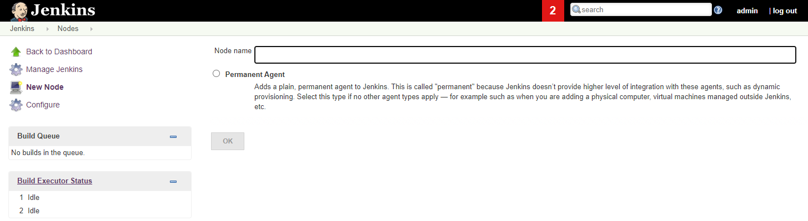

# Tutorial: Scale Jenkins deployments with VM running in Azure

[!INCLUDE [jenkins-integration-with-azure.md](includes/jenkins-integration-with-azure.md)]

This tutorial shows how to create a Linux virtual machines in Azure and add the VM as a work node to Jenkins.

In this tutorial, you will:

> [!div class="checklist"]
> * Create agent machine
> * Add agent to Jenkins
> * Create a new Jenkins freestyle job
> * Run the job on an Azure VM agent

## Prerequisites

- **Jenkins installation**: If you don't have access to a Jenkins installation, [configure Jenkins using Azure CLI](configure-on-linux-vm.md)

## Create agent machine

1. Use [az group create](/cli/azure/group?#az_group_create) to create an Azure resource group.

    ```azurecli
    az group create --name <resource_group> --location <location>
    ```

1. Use [az vm create](/cli/azure/vm#az_vm_create) to create a virtual machine.

    ```azurecli
    az vm create --resource-group <resource-group> --name <vm_name> --image UbuntuLTS --admin-username azureuser --admin-password "<password>"
    ```

    **Notes**:

    - You can also upload your ssh key with the following command `--ssh-key-value <ssh_path>`.

1. Install the JDK.  

    #### [Linux](#tab/linux)
    
    1. Log in to the virtual machine using an SSH tool.
    
        ```bash
        ssh username@123.123.123.123
        ```
        
    1. Install the JDK with apt. You can also install with other package manager tools such as yum or pacman.
    
        ```bash
        sudo apt-get install -y default-jdk
        ```
    
    1. After installation is complete, run `java -version` to verify the Java environment. The output will include the version numbers associated with various parts of the JDK.
    
    #### [Windows](#tab/windows)
    
    1. Log in to the virtual machine using an SSH tool or using Remote Desktop Connection.
    
    1. [Download the JDK](https://www.oracle.com/java/technologies/javase-downloads.html) that is appropriate for your environment.
    
    1. Install JDK
    
## Add agent to Jenkins
  - Open your Jenkins portal, navigate to `Jenkins -> Manage Jenkins -> Manage Nodes and cloud -> New Node`, set a name for the new node; select **Permanent Agent** and click **OK**.
    
  - Configure node
    - `Name`  Jenkins node name
    - `Remote root directory` remote working directory, example: `/home/azureuser/work`
    - `Labels`: Labels are used to group multiple agents into one logical group. Example : `UBUNTU`
    - `Launch method`, you have two optionals to start the remote Jenkins Node
        - `SSH`
            - `Host`: VM public IP address or domain name, example: `123.123.123.123, example.com`
            - `Credentials`: Create a new Jenkins Username/Password credentials to store your VM username/password
            - `Host Key Verification Strategy`: Controls how Jenkins verifies the SSH key presented by the remote host whilst connecting. Default selection is OK.
            Configuration example: 

        - Execution of command of the master
            - Download the `agent.jar`  from https://yourjenkinshostname/jnlpJars/agent.jar, exmaple: `https://localhost:8443/jnlpJars/agent.jar`
            - Upload the `agent.jar` to your VM
            - Start Jenkisn now with command `ssh nodeHost java -jar remote_agentjar_path`, example: `ssh azureuser@40.85.162.9 java -jar /home/azureuser/agent.jar`   
            Configuration example: 

    > **Note**: Make sure you Configure Jenkins URL if you use JNLP. Navigate to `Configure System` -> Jenkins Location. Update `Jenkins URL` to the HTTP address of your Jenkins installation, such as http://yourhost.yourdomain:8080/.

After you set all the configurations, save the configuration and Jenkins will add the VM as a new work node. 

## Create a job in Jenkins

1. Within the Jenkins dashboard, click **New Item**. 
1. Enter `demoproject1` for the name and select **Freestyle project**, then select **OK**.
1. In the **General** tab, choose **Restrict where project can be run** and type `ubuntu` in **Label Expression**. You see a message confirming that the label is served by the cloud configuration created in the previous step. 
   
1. In the **Source Code Management** tab, select **Git** and add the following URL into the **Repository URL** field: `https://github.com/spring-projects/spring-petclinic.git`
1. In the **Build** tab, select **Add build step**, then **Invoke top-level Maven targets**. Enter `package` in the **Goals** field.
1. Select **Save** to save the job definition.

## Build the new job on an Azure VM agent

1. Go back to the Jenkins dashboard.
1. Select the job you created in the previous step, then click **Build now**. A new build is queued, but does not start until an agent VM is created in your Azure subscription.
1. Once the build is complete, go to **Console output**. You see that the build was performed remotely on an Azure agent.


## Next steps

> [!div class="nextstepaction"]
> [CI/CD to Azure App Service](deploy-from-github-to-azure-app-service.md)