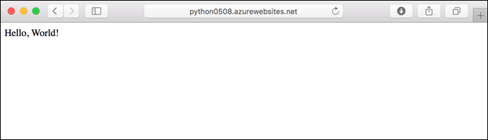

Browse to the deployed application in your web browser at the URL `http://<app-name>.azurewebsites.net`. It takes a few moments to start the app initially.

The Python sample code is running a Linux container in App Service using a built-in image.

**Congratulations!** You've deployed your Python app to App Service.
