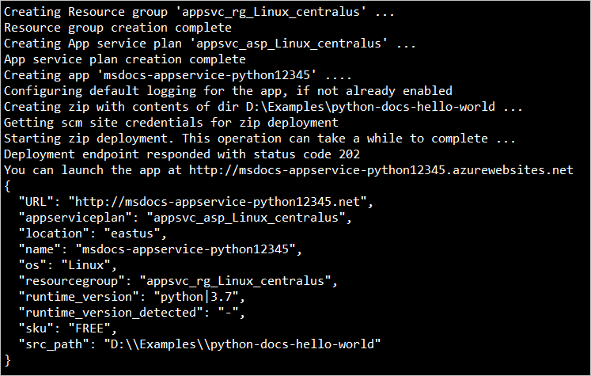

Deploy the code in your local folder (*python-docs-hello-world*) using the `az webapp up` command:

```azurecli
az webapp up --sku F1 --name <app-name>
```

- If the `az` command isn't recognized, be sure you have the Azure CLI installed as described in [Set up your initial environment](#set-up-your-initial-environment).
- If the `webapp` command isn't recognized, because that your Azure CLI version is 2.0.80 or higher. If not, [install the latest version](/cli/azure/install-azure-cli).
- Replace `<app_name>` with a name that's unique across all of Azure (*valid characters are `a-z`, `0-9`, and `-`*). A good pattern is to use a combination of your company name and an app identifier.
- The `--sku F1` argument creates the web app on the Free pricing tier. Omit this argument to use a faster premium tier, which incurs an hourly cost.
- You can optionally include the argument `--location <location-name>` where `<location_name>` is an available Azure region. You can retrieve a list of allowable regions for your Azure account by running the [`az account list-locations`](/cli/azure/appservice#az-appservice-list-locations) command.
- If you see the error, "Could not auto-detect the runtime stack of your app," make sure you're running the command in the *python-docs-hello-world* folder (Flask) or the *python-docs-hello-django* folder (Django) that contains the *requirements.txt* file. (See [Troubleshooting auto-detect issues with az webapp up](https://github.com/Azure/app-service-linux-docs/blob/master/AzWebAppUP/runtime_detection.md) (GitHub).)

The command may take a few minutes to complete. While running, it provides messages about creating the resource group, the App Service plan and hosting app, configuring logging, then performing ZIP deployment. It then gives the message, "You can launch the app at http://&lt;app-name&gt;.azurewebsites.net", which is the app's URL on Azure.



[!include [az webapp up command note](../app-service-web-az-webapp-up-note.md)]