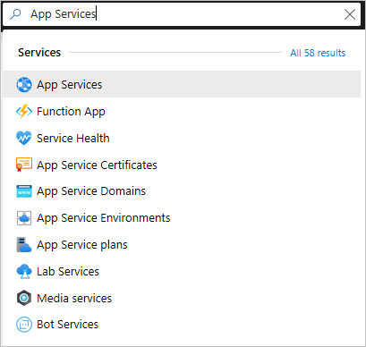
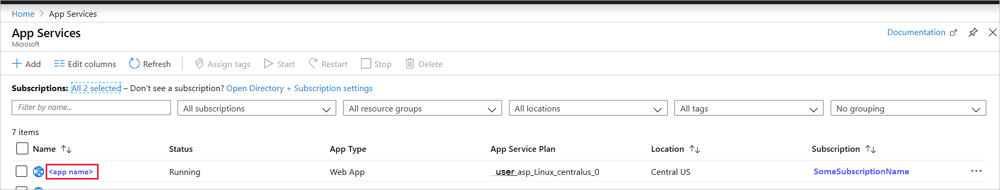
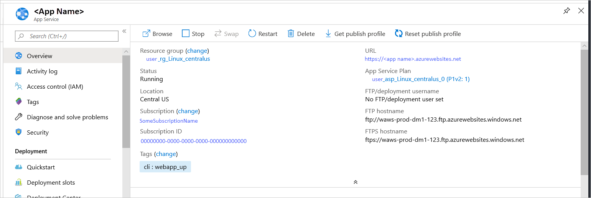

Go to the <a href="https://portal.azure.com" target="_blank">Azure portal</a> to manage the app you created. Search for and select **App Services**.

Select the name of your Azure app.

Selecting the app opens its **Overview** page, where you can perform basic management tasks like browse, stop, start, restart, and delete.

The App Service menu provides different pages for configuring your app.
