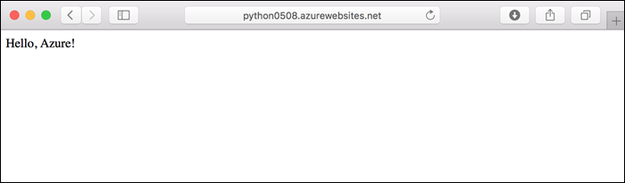

In this section, you make a small code change and then redeploy the code to Azure. The code change includes a `print` statement to generate logging output that you work with in the next section.

Open *app.py* in an editor and update the `hello` function to match the following code. 

```python
def hello():
    print("Handling request to home page.")
    return "Hello, Azure!"
```

    
Save your changes, then redeploy the app using the `az webapp up` command again:

```azurecli
az webapp up
```

This command uses values that are cached locally in the *.azure/config* file, including the app name, resource group, and App Service plan.

Once deployment is complete, switch back to the browser window open to `http://<app-name>.azurewebsites.net`. Refresh the page, which should display the modified message:



> [!TIP]
> Visual Studio Code provides powerful extensions for Python and Azure App Service, which simplify the process of deploying Python web apps to App Service. For more information, see [Deploy Python apps to App Service from Visual Studio Code](/azure/python/tutorial-deploy-app-service-on-linux-01).