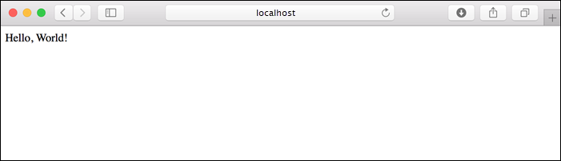

1. Make sure you're in the *python-docs-hello-world* folder. 

1. Create a virtual environment and install dependencies:

    [!include [virtual environment setup](../app-service-quickstart-python-venv.md)]

    If you encounter "[Errno 2] No such file or directory: 'requirements.txt'.", make sure you're in the *python-docs-hello-world* folder.

1. Run the development server.

    ```terminal  
    flask run
    ```
    
    By default, the server assumes that the app's entry module is in *app.py*, as used in the sample. (If you use a different module name, set the `FLASK_APP` environment variable to that name.)

1. Open a web browser and go to the sample app at `http://localhost:5000/`. The app displays the message **Hello, World!**.

    
    
1. In your terminal window, press **Ctrl**+**C** to exit the development server.
