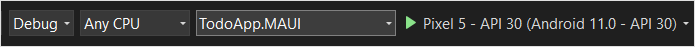
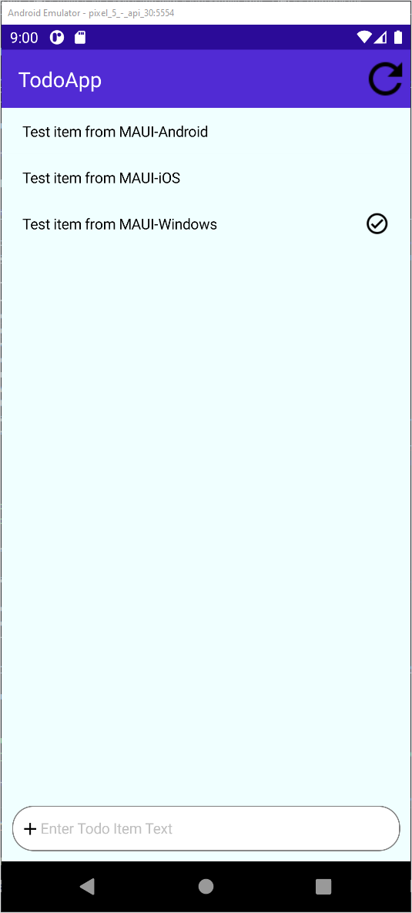
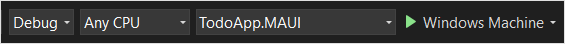
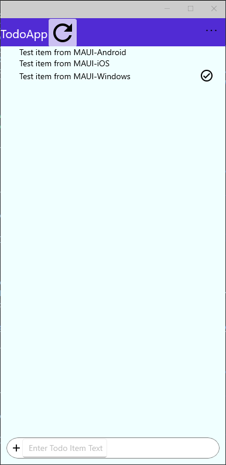

# Build a .NET MAUI app with Azure Mobile Apps

This tutorial shows you how to add a cloud-based backend service to a cross-platform mobile app by using .NET MAUI and an Azure mobile app backend.  You'll create both a new mobile app backend and a simple *Todo list* app that stores app data in Azure.

You must complete this tutorial before other .NET MAUI tutorials using the Mobile Apps feature in Azure App Service.

## Prerequisites

To complete this tutorial, you need:

* [Visual Studio 2022](/visualstudio/install/install-visual-studio?view=vs-2022&preserve-view=true) with the following workloads:
  * ASP.NET and web development
  * Azure development
  * Mobile development with .NET
* An [Azure account](https://azure.microsoft.com/pricing/free-trial).
* The [Azure CLI](/cli/azure/install-azure-cli).
  * Sign in with `az login` and select an appropriate subscription before starting.
* (Optional) The [Azure Developer CLI](/azure/developer/azure-developer-cli/install-azd).
* An [Android Virtual Device](https://developer.android.com/studio/run/managing-avds), with the following settings:
  * Phone: Any phone image - we use the Pixel 5 for testing.
  * System Image: Android 11 (API 30 with Google APIs)
* An available Mac (for compiling and running the iOS version):
  * Install [XCode](https://itunes.apple.com/us/app/xcode/id497799835?mt=12)
  * Open Xcode after installing so that it can add any extra required components.
  * Once open, select **XCode Preferences...** > **Components**, and install an iOS simulator.
  * Follow the guide to [Pair to Mac](/xamarin/ios/get-started/installation/windows/connecting-to-mac/).

A mac is required to compile the iOS version.

You can complete this tutorial on Mac or Windows.

## Download the sample app

[!INCLUDE [Instructions to download the sample from GitHub on Windows.](~/mobile-apps/azure-mobile-apps/includes/quickstart/windows/download-sample.md)]

## Deploy the backend to Azure

> [!NOTE]
> If you have already deployed the backend from another quick start, you can use the same backend and skip this step.

[!INCLUDE [Instructions for deploying a backend service on Windows.](~/mobile-apps/azure-mobile-apps/includes/quickstart/windows/deploy-backend.md)]

## Configure the sample app

[!INCLUDE [Instructions for configuring the sample code on Windows.](~/mobile-apps/azure-mobile-apps/includes/quickstart/windows/configure-sample.md)]

## Build and run the Android app

1. In the solutions explorer, expand the `maui` folder.
2. Right-click the `TodoApp.MAUI` project and select **Set as Startup Project**.
3. In the top bar, select an appropriate Android emulator:

   

4. If no Android emulators are available, you need to create one.  For more information, see [Android emulator setup](/xamarin/android/get-started/installation/android-emulator/).  To create a new Android emulator:

   * Select **Tools** > **Android** > **Android Device Manager**.
   * Select **+ New**.
   * Select the following options on the left-hand side:
     * Name: `quickstart`
     * Base Device: **Pixel 5**
     * Processor: **x86_64**
     * OS: **Android 11.0 - API 30**
     * Google APIs: **Checked**
   * Select **Create**.
   * If necessary, accept the license agreement.  The image will then be downloaded.
   * Once the **Start** button appears, press **Start**.
   * If you're prompted about Hyper-V hardware acceleration, read the documentation to enable hardware acceleration before continuing.  The emulator will be slow without enabling hardware acceleration.

   > [!TIP]
   > Start your Android emulator before continuing.  You can do this by opening the Android Device Manager and pressing **Start** next to your chosen emulator.

5. Press **F5** to build and run the project.

Once the app has started, you'll see an empty list and a text box to add items in the emulator.  You can:

* Enter some text in the box, then press Enter to insert a new item.
* Select an item to set or clear the completed flag.
* Press the refresh icon to reload data from the service.

## Build and run the Windows app

1. In the solutions explorer, expand the `maui` folder.
2. Right-click the `TodoApp.MAUI` project and select **Set as Startup Project**.
3. In the top bar, select **Windows Machine**.

   

4. Press **F5** to build and run the project.

Once the app has started, you'll see an empty list and a text box to add items.  You can:

* Enter some text in the box, then press Enter to insert a new item.
* Select an item to set or clear the completed flag.
* Press the refresh icon to reload data from the service.

## Next steps

Continue the tutorial by [adding authentication to the app](./authentication.md).
