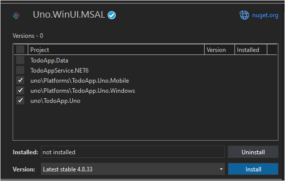
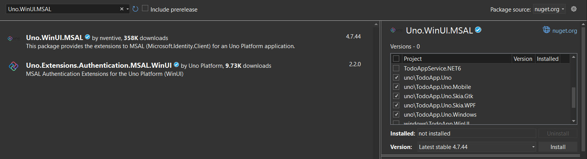

# Add authentication to your Uno Platform app

> [!NOTE]
> This product is retired. For a replacement for projects using .NET 8 or later, see the [Community Toolkit Datasync library](https://aka.ms/azure-mobile-apps/docs).

In this tutorial, you add Microsoft authentication to the TodoApp project using Microsoft Entra ID. Before completing this tutorial, ensure you've [created the project and deployed the backend](./index.md).

> [!TIP]
> Although we use Microsoft Entra ID for authentication, you can use any authentication library you wish with Azure Mobile Apps.  

[!INCLUDE [Register with AAD for the backend](~/mobile-apps/azure-mobile-apps/includes/quickstart/common/register-aad-backend.md)]

[!INCLUDE [Configure the service for authentication](~/mobile-apps/azure-mobile-apps/includes/quickstart/windows/configure-auth-backend.md)]

## Register your app with the identity service

The Microsoft Data sync Framework has built-in support for any authentication provider that uses a Json Web Token (JWT) within a header of the HTTP transaction.  This application uses the [Microsoft Authentication Library (MSAL)](/azure/active-directory/develop/msal-overview) to request such a token and authorize the signed in user to the backend service.  For more information on integrating MSAL into an Uno Platform project, review [their documentation](https://platform.uno/docs/articles/interop/MSAL.html);

[!INCLUDE [Configure a native app for authentication](~/mobile-apps/azure-mobile-apps/includes/quickstart/common/register-aad-client.md)]

## Add the Microsoft Identity Client to your app

Open the `TodoApp.sln` solution in Visual Studio. Add the [Uno.WinUI.MSAL](https://platform.uno/docs/articles/interop/MSAL.html) to each of the `TodoApp.Uno` projects:

1. Right-click on the solution, then select **Manage NuGet Packages for Solution...**.
2. Select the **Browse** tab.
3. Enter `Uno.WinUI.MSAL` in the search box, then press Enter.
4. Select the `Uno.WinUI.MSAL` result.
5. In the right hand panel, select each of the `TodoApp.Uno` projects.
6. Select **Install**.

   

7. Accept the license agreement to continue the installation.

Use the same technique to add the [Microsoft.Identity.Client](/azure/active-directory/develop/msal-overview) library to each of the `TodoApp.Uno` projects:

1. Enter `Microsoft.Identity.Client` in the search box, then press Enter.
2. Select the `Microsoft.Identity.Client` result.
3. In the right hand panel, select each of the `TodoApp.Uno` projects.
4. Select **Install**.

   

5. Accept the license agreement to continue the installation.

> [!NOTE]
> Ensure you install the latest versions of these two libraries.  The minimum version numbers are:
>
> * Uno.WinUI.MSAL v4.9.20
> * Microsoft.Identity.Client v4.54.1

Add the native client ID and backend scope to the configuration.

Open the `TodoApp.Data` project and edit the `Constants.cs` file. Add constants for `ApplicationId` and `Scopes`:

``` csharp
  public static class Constants
  {
      /// <summary>
      /// The base URI for the Datasync service.
      /// </summary>
      public static string ServiceUri = "https://demo-datasync-quickstart.azurewebsites.net";

      /// <summary>
      /// The application (client) ID for the native app within Azure Active Directory
      /// </summary>
      public static string ApplicationId = "<client-id>";

      /// <summary>
      /// The list of scopes to request
      /// </summary>
      public static string[] Scopes = new[]
      {
          "<scope>"
      };
  }
```

Replace the `<client-id>` with the _Native Client Application ID_ you received when registering the client application in Microsoft Entra ID, and the `<scope>` with the _Web API Scope_ you copied when you used **Expose an API** while registering the service application.

Open the `MainPage.xaml.cs` file in the top folder of the `TodoApp.Uno` project.  

Add the following `using` statements to the top of the file:

``` csharp
using Microsoft.Datasync.Client;
using Microsoft.Identity.Client;
using System.Diagnostics;
using System.Linq;
using Uno.UI.MSAL;
```

Replace the fields and constructor with the following code:

``` csharp
    private readonly IPublicClientApplication _identityClient;
    private readonly TodoListViewModel _viewModel;
    private readonly ITodoService _service;

    public MainPage() {
        this.InitializeComponent();

        _identityClient = PublicClientApplicationBuilder
            .Create(Constants.ApplicationId)
            .WithAuthority(AzureCloudInstance.AzurePublic, "common")
#if __IOS__ || __MACOS__ || __ANDROID__
            .WithRedirectUri($"msal{Constants.ApplicationId}://auth")
#else
            .WithRedirectUri("https://login.microsoftonline.com/common/oauth2/nativeclient")
#endif
#if __IOS__
            .WithIosKeychainSecurityGroup("com.microsoft.adalcache")
#endif
            .WithUnoHelpers()
            .Build();
        _service = new RemoteTodoService(GetAuthenticationToken);
        _viewModel = new TodoListViewModel(this, _service);
        mainContainer.DataContext = _viewModel;
    }
```

Add the following method into the `MainPage` class:

``` csharp
    public async Task<AuthenticationToken> GetAuthenticationToken()
    {
        var accounts = await _identityClient.GetAccountsAsync();
        AuthenticationResult? result = null;
        bool tryInteractiveLogin = false;

        try
        {
            result = await _identityClient
                .AcquireTokenSilent(Constants.Scopes, accounts.FirstOrDefault())
                .ExecuteAsync();
        }
        catch (MsalUiRequiredException)
        {
            tryInteractiveLogin = true;
        }
        catch (Exception ex)
        {
            System.Diagnostics.Debug.WriteLine($"MSAL Silent Error: {ex.Message}");
        }

        if (tryInteractiveLogin)
        {
            try
            {
                result = await _identityClient
                    .AcquireTokenInteractive(Constants.Scopes)
                    .WithUnoHelpers()
                    .ExecuteAsync();
            }
            catch (Exception ex)
            {
                System.Diagnostics.Debug.WriteLine($"MSAL Interactive Error: {ex.Message}");
            }
        }

        return new AuthenticationToken
        {
            DisplayName = result?.Account?.Username ?? string.Empty,
            ExpiresOn = result?.ExpiresOn ?? DateTimeOffset.MinValue,
            Token = result?.AccessToken ?? string.Empty,
            UserId = result?.Account?.Username ?? string.Empty
        };
    }
```

The `GetAuthenticationToken()` method works with the Microsoft Identity Library (MSAL) to get an access token suitable for authorizing the signed-in user to the backend service.  This function is then passed to the `RemoteTodoService` for creating the client.  If the authentication is successful, the `AuthenticationToken` is produced with data necessary to authorize each request.  If not, then an expired bad token is produced instead.

## Configure the Android app for authentication

Open the `TodoApp.Uno.Mobile` project and expand the `Android` folder.  Create a new class `MsalActivity.Android.cs` (alongside the existing `MainActivity.Android.cs`) with the following code:

``` csharp
using Android.Content;
using Microsoft.Identity.Client;

namespace TodoApp.Uno.Droid
{
    [Activity(Exported = true)]
    [IntentFilter(new[] { Intent.ActionView },
       Categories = new[] { Intent.CategoryBrowsable, Intent.CategoryDefault },
       DataHost = "auth",
       DataScheme = "msal{client-id}")]
    public class MsalActivity : BrowserTabActivity
    {
    }
}
```

Replace `{client-id}` with the application ID of the native client (which is the same as `Constants.ApplicationId`).

If your project targets Android version 11 (API version 30) or later, you must update your `AndroidManifest.xml` to meet the [Android package visibility requirements](https://developer.android.com/preview/privacy/package-visibility).  Open `TodoApp.Uno.Mobile/Android/AndroidManifest.xml` and add the following `queries/intent` nodes to the `manifest` node:

```xml
<manifest>
  ...
  <queries>
    <intent>
      <action android:name="android.support.customtabs.action.CustomTabsService" />
    </intent>
  </queries>
</manifest>
```

Edit the `MainActivity.Android.cs` class; add the `OnActivityResult` method:

``` csharp
using Android.Views;
using Microsoft.Identity.Client;

namespace TodoApp.Uno.Droid
{
    [Activity(
        MainLauncher = true,
        ConfigurationChanges = global::Uno.UI.ActivityHelper.AllConfigChanges,
        WindowSoftInputMode = SoftInput.AdjustNothing | SoftInput.StateHidden
    )]
    public class MainActivity : Microsoft.UI.Xaml.ApplicationActivity
    {
        protected override void OnActivityResult(int requestCode, Result resultCode, Android.Content.Intent data)
        {
            base.OnActivityResult(requestCode, resultCode, data);
            AuthenticationContinuationHelper.SetAuthenticationContinuationEventArgs(requestCode, resultCode, data);
        }
    }
}
```

When the Android requires authentication, it obtains an identity client, then switch to an internal activity that opens the system browser. Once authentication is complete, the system browser redirects to the defined redirect URL (`msal{client-id}://auth`). The `MasalActvity` traps the redirect URL, which then switches back to the main activity by calling `OnActivityResult()`. The `OnActivityResult()` method calls the MSAL authentication helper to complete the transaction.

## Test the Android app  

Set `TodoApp.Uno.Mobile` as the startup project, select an android emulator as the target, then press **F5** to build and run the app. When the app starts, you're prompted to sign in to the app. On the first run, you're also asked to consent to the app. Once authentication is complete, the app runs as normal.

## Next steps

Next, configure your application to operate offline by [implementing an offline store](./offline.md).

## Further reading

* [Quickstart: Protect a web API with the Microsoft identity platform](/azure/active-directory/develop/web-api-quickstart?pivots=devlang-aspnet-core)
  
