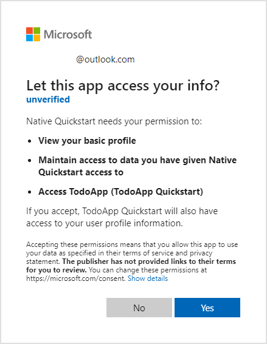

# Add authentication to your Windows (UWP) app

> [!NOTE]
> This product is retired. For a replacement for projects using .NET 8 or later, see the [Community Toolkit Datasync library](https://aka.ms/azure-mobile-apps/docs).

In this tutorial, you add Microsoft authentication to the TodoApp project using Microsoft Entra ID. Before completing this tutorial, ensure you've [created the project and deployed the backend](./index.md).

> [!TIP]
> Although we use Microsoft Entra ID for authentication, you can use any authentication library you wish with Azure Mobile Apps.  

[!INCLUDE [Register with AAD for the backend](~/mobile-apps/azure-mobile-apps/includes/quickstart/common/register-aad-backend.md)]

[!INCLUDE [Configure the service for authentication](~/mobile-apps/azure-mobile-apps/includes/quickstart/windows/configure-auth-backend.md)]

## Register your app with the identity service

The Microsoft Data sync Framework has built-in support for any authentication provider that uses a Json Web Token (JWT) within a header of the HTTP transaction.  This application uses the [Microsoft Authentication Library (MSAL)](/azure/active-directory/develop/msal-overview) to request such a token and authorize the signed in user to the backend service.

[!INCLUDE [Configure a native app for authentication](~/mobile-apps/azure-mobile-apps/includes/quickstart/common/register-aad-client.md)]

## Add the Microsoft Identity Client to your app

Open the `TodoApp.sln` solution in Visual Studio and set the `TodoApp.UWP`project as the startup project.  Add the [Microsoft Identity Library (MSAL)](/azure/active-directory/develop/msal-overview) to the `TodoApp.UWP` project:

[!INCLUDE [Set up MSAL in Windows](~/mobile-apps/azure-mobile-apps/includes/quickstart/windows/add-msal-library.md)]

Open the `App.xaml.cs` file in the `TodoApp.UWP` project.

Add the following `using` statements to the top of the file:

``` csharp
using Microsoft.Datasync.Client;
using Microsoft.Identity.Client;
using System.Diagnostics;
using System.Linq;
using System.Threading.Tasks;
```

Replace the constructor and the `TodoService` code with the following code:

``` csharp
public App()
{
    InitializeComponent();
    Suspending += OnSuspending;

    IdentityClient = GetIdentityClient();
    TodoService = new RemoteTodoService(GetAuthenticationToken);
}

public static IPublicClientApplication IdentityClient { get; set; }

public ITodoService TodoService { get; }

public IPublicClientApplication GetIdentityClient()
{
    var identityClient = PublicClientApplicationBuilder.Create(Constants.ApplicationId)
        .WithAuthority(AzureCloudInstance.AzurePublic, "common")
        .WithUseCorporateNetwork(false)
        .WithRedirectUri("https://login.microsoftonline.com/common/oauth2/nativeclient")
        .Build();
    return identityClient;
}

public async Task<AuthenticationToken> GetAuthenticationToken()
{
    var accounts = await IdentityClient.GetAccountsAsync();
    AuthenticationResult result = null;
    bool tryInteractiveLogin = false;

    try
    {
        result = await IdentityClient
            .AcquireTokenSilent(Constants.Scopes, accounts.FirstOrDefault())
            .ExecuteAsync()
            .ConfigureAwait(false);
    }
    catch (MsalUiRequiredException)
    {
        tryInteractiveLogin = true;
    }
    catch (Exception ex)
    {
        Debug.WriteLine($"MSAL Silent Error: {ex.Message}");
    }

    if (tryInteractiveLogin)
    {
        try
        {
            result = await IdentityClient
                .AcquireTokenInteractive(Constants.Scopes)
                .ExecuteAsync()
                .ConfigureAwait(false);
        }
        catch (Exception ex)
        {
            Debug.WriteLine($"MSAL Interactive Error: {ex.Message}");
        }
    }

    return new AuthenticationToken
    {
        DisplayName = result?.Account?.Username ?? "",
        ExpiresOn = result?.ExpiresOn ?? DateTimeOffset.MinValue,
        Token = result?.AccessToken ?? "",
        UserId = result?.Account?.Username ?? ""
    };
}
```

The `GetAuthenticationToken()` method works with the Microsoft Identity Library (MSAL) to get an access token suitable for authorizing the signed-in user to the backend service.  This function is then passed to the `RemoteTodoService` for creating the client.  If the authentication is successful, the `AuthenticationToken` is produced with data necessary to authorize each request.  If not, then an expired bad token is produced instead.

## Test the app

You should be able to press **F5** to run the app.  When the app runs, a browser is opened to ask you for authentication.  The first time the app runs, you're asked to consent to the access:



Press **Yes** to continue to your app.

## Next steps

Next, configure your application to operate offline by [implementing an offline store](./offline.md).

## Further reading

* [Quickstart: Protect a web API with the Microsoft identity platform](/azure/active-directory/develop/web-api-quickstart?pivots=devlang-aspnet-core)
* [Quickstart: Acquire a token and call Microsoft Graph API from a desktop application](/azure/active-directory/develop/desktop-app-quickstart?pivots=devlang-windows-desktop)
* [Microsoft identity platform: Universal Windows Platform tutorial](/azure/active-directory/develop/tutorial-v2-windows-uwp)   
