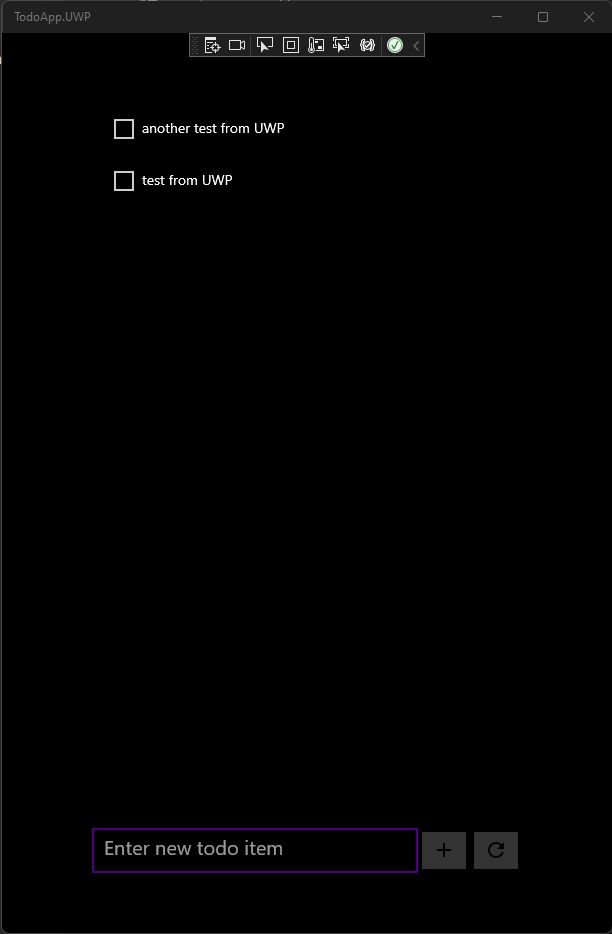

# Build a Windows (UWP) app with Azure Mobile Apps

> [!NOTE]
> This product is retired. For a replacement for projects using .NET 8 or later, see the [Community Toolkit Datasync library](https://aka.ms/azure-mobile-apps/docs).

This tutorial shows you how to add a cloud-based backend service to a Universal Windows Platform (UWP) desktop app by using Azure Mobile Apps and an Azure mobile app backend.  You'll create both a new mobile app backend and a simple *Todo list* app that stores app data in Azure.

This tutorial is required for all other Windows (UWP) tutorials about using the Mobile Apps feature in Azure App Service.

## Prerequisites

To complete this tutorial, you need:

* [Visual Studio 2022](/visualstudio/install/install-visual-studio?view=vs-2022&preserve-view=true) with the following workloads.
  * ASP.NET and web development
  * Azure development
  * Universal Windows Platform development
* An [Azure account](https://azure.microsoft.com/pricing/free-trial).
* The [Azure CLI](/cli/azure/install-azure-cli).
  * Sign in with `az login` and select an appropriate subscription before starting.
* (Optional) The [Azure Developer CLI](/azure/developer/azure-developer-cli/install-azd).

This tutorial can only be completed on a Windows system.

## Download the sample app

[!INCLUDE [Instructions to download the sample from GitHub.](~/mobile-apps/azure-mobile-apps/includes/quickstart/windows/download-sample.md)]

## Deploy the backend to Azure

> [!NOTE]
> If you have already deployed the backend from another quick start, you can use the same backend and skip this step.

[!INCLUDE [Instructions for deploying a backend service.](~/mobile-apps/azure-mobile-apps/includes/quickstart/windows/deploy-backend.md)]

## Configure the sample app

[!INCLUDE [Instructions for configuring the sample code.](~/mobile-apps/azure-mobile-apps/includes/quickstart/windows/configure-sample.md)]

## Build and run the sample app

1. In the solutions explorer, expand the `windows` folder.
1. Right-click the `TodoApp.UWP` project and select **Set as Startup Project**.
1. In the top bar, select the **Any CPU** configuration and the **TodoApp.UWP** target:

    

1. Press **F5** to build and run the project.

Once the app has started, you will see an empty list with a text box.  You can:

* Enter some text, then press the **+** icon to add the item.
* Set or clear the check box to mark any item as done.
* Press the refresh icon to reload data from the service.

    
    
## Next steps

Continue the tutorial by [adding authentication to the app](./authentication.md).
