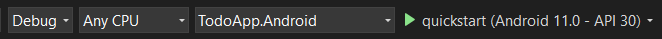
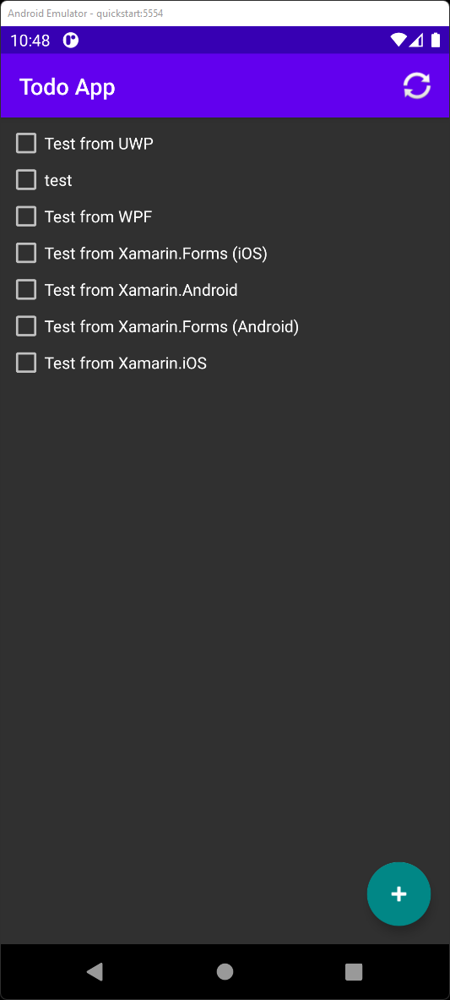

# Build a Xamarin.Android app with Azure Mobile Apps

> [!NOTE]
> This product is retired. For a replacement for projects using .NET 8 or later, see the [Community Toolkit Datasync library](https://aka.ms/azure-mobile-apps/docs).

This tutorial shows you how to add a cloud-based backend service to an Android mobile app by using Xamarin and an Azure mobile app backend.  You create both a new mobile app backend and a simple *Todo list* app that stores app data in Azure.

You must complete this tutorial before other Xamarin Android tutorials about using the Mobile Apps feature in Azure App Service.

## Prerequisites

To complete this tutorial, you need:

* [Visual Studio 2022](/visualstudio/install/install-visual-studio?view=vs-2022&preserve-view=true) with the following workloads.
  * ASP.NET and web development
  * Azure development
  * Mobile development with .NET
* An [Azure account](https://azure.microsoft.com/pricing/free-trial).
* The [Azure CLI](/cli/azure/install-azure-cli).
  * Sign in with `az login` and select an appropriate subscription before starting.
* (Optional) The [Azure Developer CLI](/azure/developer/azure-developer-cli/install-azd).
* An [Android Virtual Device](https://developer.android.com/studio/run/managing-avds), with the following settings:
  * Phone: Any phone image - we use the Pixel 5 for testing.
  * System Image: Android 11 (API 30 with Google APIs)

## Download the sample app

[!INCLUDE [Instructions to download the sample from GitHub on Windows.](~/mobile-apps/azure-mobile-apps/includes/quickstart/windows/download-sample.md)]

## Deploy the backend to Azure

> [!NOTE]
> If you have already deployed the backend from another quick start, you can use the same backend and skip this step.

[!INCLUDE [Instructions for deploying a backend service on Windows.](~/mobile-apps/azure-mobile-apps/includes/quickstart/windows/deploy-backend.md)]

## Configure the sample app

[!INCLUDE [Instructions for configuring the sample code on Windows.](~/mobile-apps/azure-mobile-apps/includes/quickstart/windows/configure-sample.md)]

## Build and run the app

1. In the solutions explorer, expand the `xamarin-native` folder.
2. Right-click the `TodoApp.Android` project and select **Set as Startup Project**.
3. In the top bar, select **Any CPU** configuration and the **TodoApp.Android** target:

   

4. If you see **Android Emulator** instead, you haven't created an Android emulator.  For more information, see [Android emulator setup](/xamarin/android/get-started/installation/android-emulator/).  To create a new Android emulator:

   * Select **Tools** > **Android** > **Android Device Manager**.
   * Select **+ New**.
   * Select the following settings on the left-hand side:
     * Name: `quickstart`
     * Base Device: **Pixel 5**
     * Processor: **x86_64**
     * OS: **Android 11.0 - API 30**
     * Google APIs: **Checked**
   * Select **Create**.
   * If necessary, accept the license agreement.  The image is then downloaded.
   * Once the **Start** button appears, press **Start**.
   * If you're prompted about Hyper-V hardware acceleration, read the documentation to enable hardware acceleration before continuing.

   Once complete, close the Android Device Manager.

   > [!TIP]
   > Start your Android emulator before continuing.  You can do this by opening the Android Device Manager and pressing **Start** next to your chosen emulator.

5. Press **F5** to build and run the project.

Once the app has started, you see an empty list and a floating action button to add items in the emulator.  You can:

* Press the floating action button, then enter some text to add an item.
* Set or clear the check box to mark any item as done.
* Press the refresh icon to reload data from the service.

## Next steps

Continue the tutorial by [adding authentication to the app](./authentication.md).
