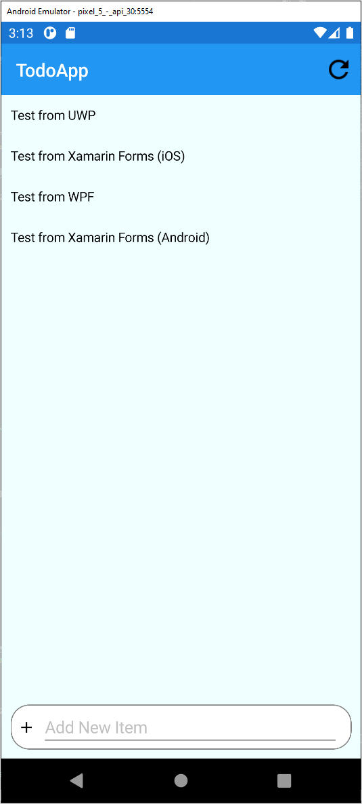
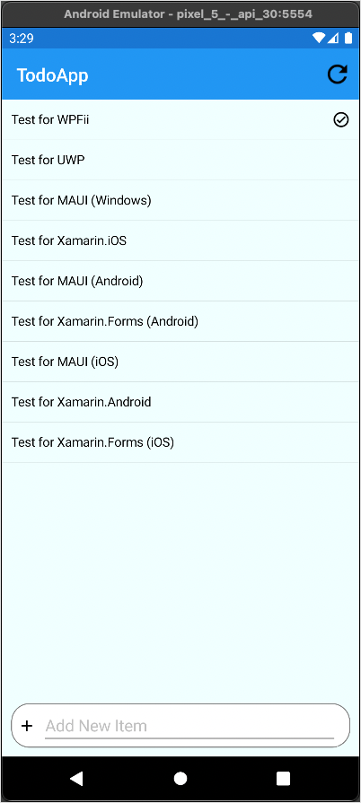
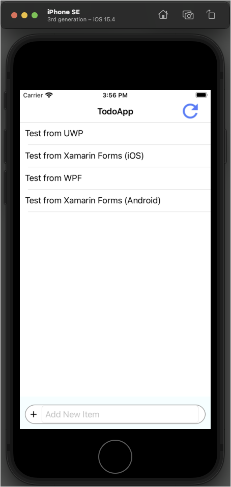
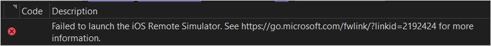
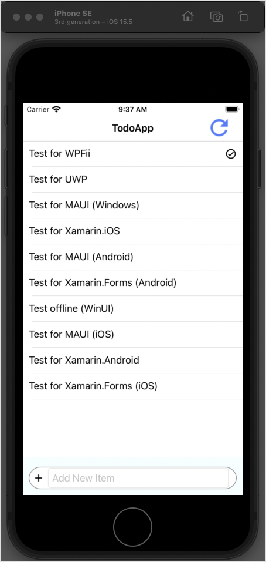

# Build a Xamarin.Forms app with Azure Mobile Apps

This tutorial shows you how to add a cloud-based backend service to a cross-platform mobile app by using Xamarin.Forms and an Azure mobile app backend.  You'll create both a new mobile app backend and a simple *Todo list* app that stores app data in Azure.

You must complete this tutorial before other Xamarin Forms tutorials using the Mobile Apps feature in Azure App Service.

## Prerequisites

You can complete this tutorial on Mac or Windows. To complete this tutorial, you need:

::: zone pivot="vs2022-windows"

* [Visual Studio 2022](/visualstudio/install/install-visual-studio?view=vs-2022&preserve-view=true) with the following workloads.
  * ASP.NET and web development
  * Azure development
  * Mobile development with .NET
* An [Azure account](https://azure.microsoft.com/pricing/free-trial).
* The [Azure CLI](/cli/azure/install-azure-cli).
  * Sign in with `az login` and select an appropriate subscription before starting.
* (Optional) The [Azure Developer CLI](/azure/developer/azure-developer-cli/install-azd).
* An [Android Virtual Device](https://developer.android.com/studio/run/managing-avds), with the following settings:
  * Phone: Any phone image - we use the Pixel 5 for testing.
  * System Image: Android 11 (API 30 with Google APIs)

If compiling the iOS edition of the app, you must have an available Mac:
  * Install [XCode](https://itunes.apple.com/us/app/xcode/id497799835?mt=12)
  * Open Xcode after installing so that it can add any extra required components.
  * Once open, select **XCode Preferences...** > **Components**, and install an iOS simulator.
  * If completing the tutorial on Windows, follow the guide to [Pair to Mac](/xamarin/ios/get-started/installation/windows/connecting-to-mac/).

::: zone-end

::: zone pivot="vs2022-mac"

* [Visual Studio 2022 for Mac](/visualstudio/mac/installation?view=vsmac-2022&preserve-view=true)
* An [Azure account](https://azure.microsoft.com/pricing/free-trial).
* The [Azure CLI](/cli/azure/install-azure-cli).
  * Sign in with `az login` and select an appropriate subscription before starting.
* An [Android Virtual Device](https://developer.android.com/studio/run/managing-avds), with the following settings:
  * Phone: Any phone image - we use the Pixel 5 for testing.
  * System Image: Android 11 (API 30 with Google APIs)
* Install [XCode](https://itunes.apple.com/us/app/xcode/id497799835?mt=12)
  * Open Xcode after installing so that it can add any extra required components.
  * Once open, select **XCode Preferences...** > **Components**, and install an iOS simulator.

::: zone-end

## Download the sample app

::: zone pivot="vs2022-windows"

[!INCLUDE [Instructions to download the sample from GitHub on Windows.](~/mobile-apps/azure-mobile-apps/includes/quickstart/windows/download-sample.md)]

::: zone-end

::: zone pivot="vs2022-mac"

[!INCLUDE [Instructions to download the sample from GitHub on macOS.](~/mobile-apps/azure-mobile-apps/includes/quickstart/mac/download-sample.md)]

::: zone-end

## Deploy the backend to Azure

> [!NOTE]
> If you have already deployed the backend from another quick start, you can use the same backend and skip this step.

::: zone pivot="vs2022-windows"

[!INCLUDE [Instructions for deploying a backend service on Windows.](~/mobile-apps/azure-mobile-apps/includes/quickstart/windows/deploy-backend.md)]

::: zone-end

::: zone pivot="vs2022-mac"

[!INCLUDE [Instructions for deploying a backend service on macOS.](~/mobile-apps/azure-mobile-apps/includes/quickstart/mac/deploy-back-end.md)]

::: zone-end

## Configure the sample app

::: zone pivot="vs2022-windows"

[!INCLUDE [Instructions for configuring the sample code on Windows.](~/mobile-apps/azure-mobile-apps/includes/quickstart/windows/configure-sample.md)]

::: zone-end

::: zone pivot="vs2022-mac"

[!INCLUDE [Instructions for configuring the sample code on macOS.](~/mobile-apps/azure-mobile-apps/includes/quickstart/mac/configure-sample.md)]

::: zone-end

## Build and run the Android app

::: zone pivot="vs2022-windows"

1. In the solutions explorer, expand the `xamarin-forms` folder.
2. Right-click the `TodoApp.Forms.Android` project and select **Set as Startup Project**.
3. In the top bar, select **Any CPU** configuration and the **TodoApp.Forms.Android** target:

   

4. If you see **Android Emulator** instead, you haven't created an Android emulator.  For more information, see [Android emulator setup](/xamarin/android/get-started/installation/android-emulator/).  To create a new Android emulator:

   * Select **Tools** > **Android** > **Android Device Manager**.
   * Select **+ New**.
   * Select the following options on the left-hand side:
     * Name: `quickstart`
     * Base Device: **Pixel 5**
     * Processor: **x86_64**
     * OS: **Android 11.0 - API 30**
     * Google APIs: **Checked**
   * Select **Create**.
   * If necessary, accept the license agreement.  The image will then be downloaded.
   * Once the **Start** button appears, press **Start**.
   * If you're prompted about Hyper-V hardware acceleration, read the documentation to enable hardware acceleration before continuing.  The emulator will be slow without enabling hardware acceleration.

   > [!TIP]
   > Start your Android emulator before continuing.  You can do this by opening the Android Device Manager and pressing **Start** next to your chosen emulator.

5. Press **F5** to build and run the project.

Once the app has started, you'll see an empty list and a text box to add items in the emulator.  You can:

* Enter some text in the box, then press Enter to insert a new item.
* Select an item to set or clear the completed flag.
* Press the refresh icon to reload data from the service.

::: zone-end

::: zone pivot="vs2022-mac"

1. In the solutions explorer, expand the `xamarin-forms` folder.
2. Right-click the `TodoApp.Forms.Android` project and select **Set as Startup Project**.
3. In the top bar, select an appropriate Android emulator:

   

4. In the top menu, select **Debug** > **Start Debugging**.

Once the app has started, you'll see an empty list and a text box to add items in the emulator.  You can:

* Press the **+** button to add an item.
* Select an item to set or clear the completed flag.
* Press the refresh icon to reload data from the service.

::: zone-end

## Build and run the iOS app

::: zone pivot="vs2022-windows"

> [!NOTE] 
> You **MUST** follow the guide to [Pair to Mac](/xamarin/ios/get-started/installation/windows/connecting-to-mac/).  You'll receive errors when compiling or running iOS applications without a paired Mac.

1. In the solutions explorer, expand the `xamarin-forms` folder.
2. Right-click the `TodoApp.Forms.iOS` project and select **Set as Startup Project**.
3. In the top bar, select **iPhone Simulator** configuration and the **TodoApp.Forms.iOS** target:

   

4. Select the iPhone Simulator
5. Press **F5** to build and run the project.

Once the app has started, you'll see an empty list and a text box to add items in the emulator.  You can:

* Enter some text in the box, then press Enter to insert a new item.
* Select an item to set or clear the completed flag.
* Press the refresh icon to reload data from the service.

### Troubleshooting

The remote simulator that ships with Visual Studio 2022 is incompatible with XCode 13.3.  You'll receive the following error message:

To work around this issue:

* Disable the remote simulator (Tools / Options / iOS Settings / uncheck **Remote Simulator to Windows**). When unchecked, the simulator will run on the Mac instead of on Windows. You can then interact with the simulator directly on your Mac while using the debugger, etc. on Windows. 
* Disable the remote simulator as above, so that the simulator runs on the Mac. Then use a remote desktop app to connect to the Mac desktop from Windows. Remote desktop options include [Devolutions Remote Desktop Manager](https://devolutions.net/remote-desktop-manager) (fast and there’s a free version available), and VNC clients (slower and free).
* Use a physical device to test instead of the simulator.  You can obtain a [free provisioning profile](/xamarin/ios/get-started/installation/device-provisioning/free-provisioning) to complete the authentication tutorial.

::: zone-end

::: zone pivot="vs2022-mac"

1. In the solutions explorer, expand the `xamarin-forms` folder.
2. Right-click the `TodoApp.Forms.iOS` project and select **Set as Startup Project**.
3. In the top bar, select an appropriate iOS simulator:

   

4. In the top menu, select **Debug** > **Start Debugging**.

Once the app has started, you'll see an empty list and a text box to add items in the emulator.  You can:

* Press the **+** button to add an item.
* Select an item to set or clear the completed flag.
* Press the refresh icon to reload data from the service.

### Troubleshooting

Some versions of Visual Studio 2022 for Mac do not work with some versions of XCode.  If you receive a _HE0042_ error when running the app on a simulator, it's likely you need to update your version of Visual Studio 2022 for Mac.  Use the [latest preview version](https://visualstudio.microsoft.com/vs/mac/preview/) and ensure all available updates are applied.  The app is deployed to the simulator.  If you still have problems running via the debugger, start the app from the simulator instead.

::: zone-end

## Next steps

Continue the tutorial by [adding authentication to the app](./authentication.md).
