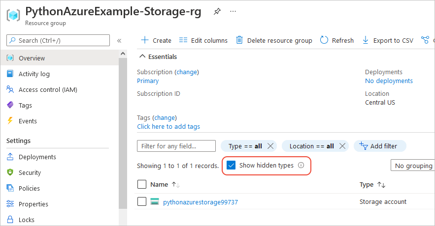
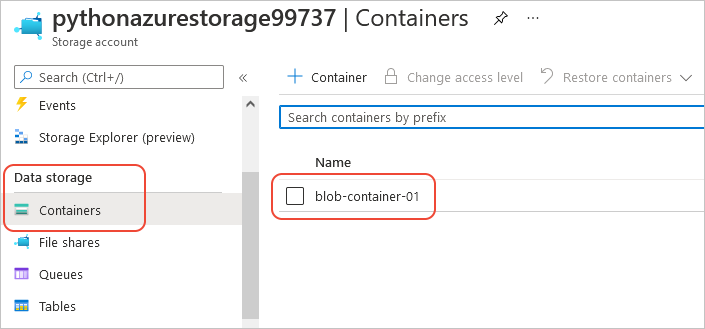
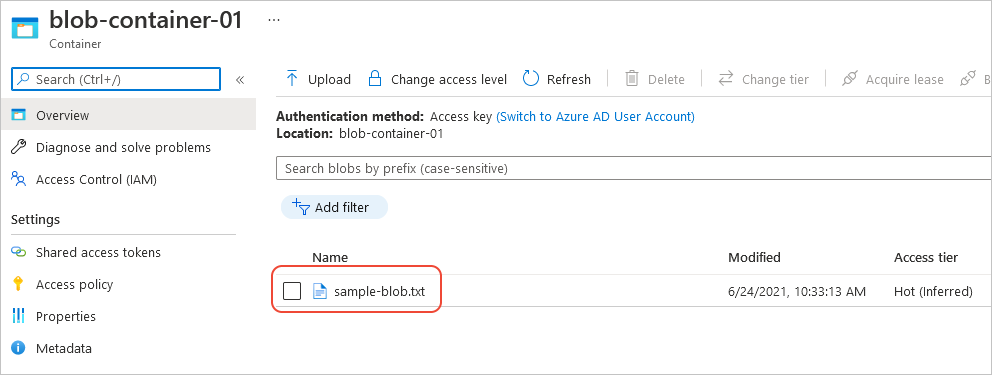

# Example: Use the Azure SDK with Azure Storage

In this article, you learn how to use the Azure SDK management libraries in a Python script to create a resource group that contains and Azure Storage account and a Blob storage container. You then learn how to use the Azure SDK client libraries in Python application code to upload a file to that Blob storage container.

All the commands in this article work the same in Linux/Mac OS bash and Windows command shells.

## Set up your local development environment

If you haven't already, follow all the instructions on [Configure your local Python dev environment for Azure](configure-local-development-environment.md).

Be sure to create a service principal for local development, and create and activate a virtual environment for this project.

## Provision resources with the management libraries

1. In your terminal with the virtual environment activated, install the management library for resource groups:

    ```bash
    pip install azure-mgmt-resource
    ```

1. Install the management library for Azure Storage:

    ```bash
    pip install azure-mgmt-storage
    ```

1. Create a Python file named *provision_blob.py* with the following code. The comments explain the details:

    ```python
    import os, random

    # Import the needed management objects from the libraries. The azure.common library
    # is installed automatically with the other libraries.
    from azure.common.client_factory import get_client_from_cli_profile
    from azure.mgmt.resource import ResourceManagementClient
    from azure.mgmt.storage import StorageManagementClient
    from msrest.exceptions import ClientException

    # Obtain the management object for resources, using the credentials from the CLI login.
    resource_client = get_client_from_cli_profile(ResourceManagementClient)

    # Constants we need in multiple places: the resource group name and the region
    # in which we create resources. You can change these values however you want.
    RESOURCE_GROUP_NAME = "PythonSDKExample-Storage-rg"
    LOCATION = "centralus"

    # Step 1: Create the resource group.
    #
    # Within the ResourceManagementClient is an object named resource_groups,
    # which is of class ResourceGroupsOperations, which contains methods like
    # create_or_update.
    #
    # The second parameter to create_or_update here is technically a ResourceGroup
    # object. However, the Python SDK allows you to specify the object as inline
    # JSON for convenience. Alternately, you can create the object inline using
    # `ResourceGroup(location=LOCATION)``.
    #
    # The return value is another ResourceGroup object with all the details of the
    # new group. In this case the call is synchronous: the resource group has been
    # created by the time the call returns.

    rg_result = resource_client.resource_groups.create_or_update(RESOURCE_GROUP_NAME,
        {
            "location": LOCATION
        }
    )

    print(f"Created resource group {rg_result.name}")

    # Step 2: Create the storage account
    #
    # First, obtain the storage management object. This example uses the CLI
    # profile credentials because we assume the script is being used to provision
    # the resource in the same way the Azure CLI would be used.
    storage_client = get_client_from_cli_profile(StorageManagementClient)

    # You can replace the storage account here with any unique name. A random number is used
    # by default, but note that the name changes every time you run this script.
    # The name must be 3-24 lower case letters and numbers only.
    STORAGE_ACCOUNT_NAME = f"pythonsdkstorage{random.randint(1,100000):05}"

    # Check if the account name is available. Storage account names must be unique across
    # Azure because they're used in URLs.
    availability_result = storage_client.storage_accounts.check_name_availability(STORAGE_ACCOUNT_NAME)

    if not availability_result.name_available:
        print(f"Storage name {STORAGE_ACCOUNT_NAME} is already in use. Try another name.")
        exit()

    # The name is available, so create the account
    poller = storage_client.storage_accounts.create(RESOURCE_GROUP_NAME, STORAGE_ACCOUNT_NAME,
        {
            "location" : LOCATION,
            "kind": "StorageV2",
            "sku": {"name": "Standard_LRS"}
        }
    )

    # Long-running operations return a poller object; calling poller.result()
    # waits for completion.
    account_result = poller.result()
    print(f"Created storage account {account_result.name}")

    # Retrieve the account's primary access key and generate a connection string.
    keys = storage_client.storage_accounts.list_keys(RESOURCE_GROUP_NAME, STORAGE_ACCOUNT_NAME)

    print(f"Primary key for storage account: {keys.keys[0].value}")

    conn_string = f"DefaultEndpointsProtocol=https;EndpointSuffix=core.windows.net;AccountName={STORAGE_ACCOUNT_NAME};AccountKey={keys.keys[0].value}"
    print(f"Connection string: {conn_string}")

    # Create the blob container in the account, using the management object's
    # BlobContainersOperation.create method. The fourth argument is a required
    # BlobContainer object, but because we don't need any special values there,
    # so we just pass empty JSON.
    #
    # This create method is synchronous.

    CONTAINER_NAME = "blob-container-01"
    container = storage_client.blob_containers.create(RESOURCE_GROUP_NAME, STORAGE_ACCOUNT_NAME, CONTAINER_NAME, {})

    print(f"Created blob container {container.name}")
    ```

    This code uses the CLI-based authentication methods (`get_client_from_cli_profile`) because it demonstrates actions that you might otherwise do with the Azure CLI directly. In both cases you're using the same identity for authentication.

    To use such code in a production script, you should instead use `DefaultAzureCredential` (recommended) or a service principal based method as describe in [How to authenticate Python apps with Azure services](azure-sdk-authenticate.md).

1. Run the script:

    ```bash
    python provision_blob.py
    ```

1. Open the [Azure portal](https://portal.azure.com) to verify that the resource group and storage account were created as expected. You may need to select **Show hidden types** in the resource group to see a storage account provisioned from a Python script:

    

1. Select the storage account, then select **Blob service** > **Containers** in the left-hand menu to verify that the "bloc-container-01" appears:

    

For an additional example using Azure Storage, see the [Manage Python Storage sample](https://docs.microsoft.com/samples/azure-samples/storage-python-manage/storage-python-manage/).

### For reference: equivalent Azure CLI commands

The following Azure CLI commands complete the same provisioning steps as the Python script:

```azurecli
# Create the resource group

az group create -n PythonSDKExample-Storage-rg -l centralus

# Create the storage account

az storage account create -g PythonSDKExample-Storage-rg -l centralus -n pythonsdkstorage12345 --kind StorageV2 --sku Standard_LRS

# Retrieve the connection string

az storage account show-connection-string -g PythonSDKExample-Storage-rg -n pythonsdkstorage12345

# Create the blob container; NOTE: this command assumes you have an environment variable
# named AZURE_STORAGE_CONNECTION_STRING with the connection string for the storage account.

set AZURE_STORAGE_CONNECTION_STRING=<connection_string>

az storage container create --account-name pythonsdkoverview12345 -n blob-container-01
```

## Use resources with the client libraries

The following sections show two different ways to use the Azure SDK to access the blob container provisioned in the previous section. These examples specifically upload a file blob to that container.

Follow the [common steps](#common-steps-for-both-methods) to try the code yourself.

The first method authenticates the app with `DefaultAzureCredential` as described in [How to authentication Python apps](azure-sdk-authenticate.md#authenticate-with-defaultazurecredential). With this method you must first assign the appropriate permissions to the app identity, which is the recommended practice.

The second method uses a connection string to access the storage account directly. Although this method seems simpler, it has two significant drawbacks:

- A connection string inherently authenticates the connecting agent with the Storage *account* rather than with individual resources within that account. As a result, a connection string provides grants broader authorization than may be required.

- A connection string contains an access key in plain text and therefore presents potential vulnerabilities if it's improperly constructed or improperly secured. If such a connection string is exposed it can be used to access a wide range of resources within the Storage account.

For these reasons, production code should use the authentication method. For experimentation, however, it's fine to use the connection string.

### Common steps for both methods

1. In your terminal with the virtual environment activated, install the management library for resource groups:

    ```bash
    pip install azure-storage-blob
    ```

1. Create a source file named *sample-source.txt* (as the code expects), with contents like the following:

    ```text
    Hello there, Azure Storage. I'm a friendly file ready to be stored in a blob.
    ```

1. Follow the steps for a specific method in the sections that follow.

1. After running the code, go to the [Azure portal](https://portal.azure.com), navigate into the blob container to verify that a new blob exists named *sample-blob.txt* with the same contents as the *sample-source.txt* file:

    

### Authentication method

1. Create a file named *use_blob_auth.py* with the following code. The comments explain the steps.

    ```python
    TODO
    ```

1. Attempt to run the code:

    ```bash
    python use_blob_auth.py
    ```

    Because the local service principal that you're using does not have permission to access the blob container, you see the error: TODO.

1. Use the Azure CLI command [az role assignment create]() to set container permissions for the service principal:

    ```azurecli
    az role assignment create --assignee localtest-sp-rbac --role "Storage Blob Data Contributor"
        --scope "/subscriptions/<subscription>/resourceGroups/PythonSDKExample-Storage-rg/providers/Microsoft.Storage/storageAccounts/pythonsdkoverview12345/blobServices/default/containers/blob-container-01"
    ```

    In the `--scope` string, replace `<subscription>` with your subscription ID and modify the storage account name with the exact account name you're using (the five-digit number will be different). You might also need to modify the resource group name.

    The `--scope` argument guarantees that the service principal is granted permissions for *only* the one blob container specified in the string. If you remove the `/blobServices/...` part of the string to the end, you grant permissions to all containers in the storage account. If you omit the `/providers/...` part of the string to the end, or omit the entire argument, you grant the service principal Blob container permissions across your entire subscription. Accordingly, we recommend using the `--scope` argument to grant exact permissions.

1. Run the code again to verify that it now works.

## Use resources with the client libraries and a connection string

1. Create a Python file named *use_blob_conn_string.py* with the following code. The comments explain the steps.

    ```python
    import os

    # Import the client object from the SDK library
    from azure.storage.blob import BlobClient

    # Retrieve the connection string from an environment variable.
    conn_string = os.environ["AZURE_STORAGE_CONNECTION_STRING"]

    # Create the client object for the resource identified by the connection string,
    # indicating also the blob container and the name of the specific blob we want.
    blob_client = BlobClient.from_connection_string(conn_string, container_name="blob-container-01", blob_name="sample-blob.txt")

    # Open a local file and upload its contents to Blob Storage
    with open("./sample-source.txt", "rb") as data:
        blob_client.upload_blob(data)
    ```

1. Run the code:

    ```bash
    python use_blob_conn_string.py
    ```

## Clean up resources

Run the following command if you don't need to keep the resources created in this example and would like to avoid ongoing charges in your subscription:

```azurecli
az group delete -n PythonSDKExample-Storage-rg
```

