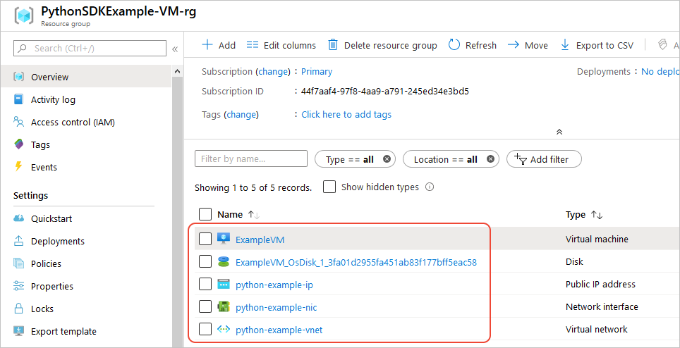

# Example: Use the Azure SDK to provision a virtual machine

This example demonstrates how to use the Azure SDK management libraries in a Python script to create a resource group that contains a Linux virtual machine.

There are no client libraries in this example because virtual machines have only a management interface.

All the commands in this article work the same in Linux/Mac OS bash and Windows command shells unless noted.

> [!NOTE]
> Provisioning a virtual machine through code is a multi-step process that involves provisioning a number of other resources that the virtual machine requires. If you're simply running such code from teh command line, it's much easier to use the [`az vm create`](/cli/azure/vm?view=azure-cli-latest#az-vm-create) command, which automatically creates these secondary resources with defaults for any setting you choose to omit. The only required arguments are a resource group, VM name, image name, and login credentials. For more information, see [Quick Create a virtual machine with the Azure CLI](/azure/virtual-machines/scripts/virtual-machines-windows-cli-sample-create-vm-quick-create).

## 1: Set up your local development environment

If you haven't already, follow all the instructions on [Configure your local Python dev environment for Azure](configure-local-development-environment.md).

Be sure to create a service principal for local development, and create and activate a virtual environment for this project.

## 2: Install the needed SDK libraries

1. Create a *requirements.txt* file that lists the management libraries used in this example:

    ```txt
    azure-mgmt-resource
    azure-mgmt-network
    azure-mgmt-compute
    azure-core-cli
    ```

1. In your terminal or command prompt with the virtual environment activated, install the management libraries listed in *requirements.txt*:

    ```bash
    pip install -r requirements.txt
    ```

## 3: Provision a virtual machine with the management libraries

1. Create a Python file named *provision_vm.py* with the following code. The comments explain the details:

    ```python
    # Import the needed management objects from the libraries. The azure.common library
    # is installed automatically with the other libraries.
    from azure.common.client_factory import get_client_from_cli_profile
    from azure.mgmt.resource import ResourceManagementClient
    from azure.mgmt.network import NetworkManagementClient
    from azure.mgmt.compute import ComputeManagementClient

    print(f"Provisioning a virtual machine...some operations might take a minute or two.")

    # Obtain the management object for resources, using the credentials from the CLI login.
    resource_client = get_client_from_cli_profile(ResourceManagementClient)

    # Constants we need in multiple places: the resource group name and the region
    # in which we provision resources. You can change these values however you want.
    RESOURCE_GROUP_NAME = "PythonSDKExample-VM-rg"
    LOCATION = "centralus"

    # Provision the resource group.
    rg_result = resource_client.resource_groups.create_or_update(RESOURCE_GROUP_NAME,
        {
            "location": LOCATION
        }
    )

    print(f"Provisioned resource group {rg_result.name} in the {rg_result.location} region")

    # For details the previous code, see Example: Provision a resource group
    # at https://docs.microsoft.com/azure/developer/python/azure-sdk-example-resource-group


    # A virtual machine requires a network inteface client (NIC). A NIC requires
    # a virtual network and subnet along with an IP address. Therefore we must provision
    # these downstream components first, then provision the NIC, after which we
    # can provision the VM.

    # Network and IP address names
    VNET_NAME = "python-example-vnet"
    SUBNET_NAME = "python-example-subnet"
    IP_NAME = "python-example-ip"
    IP_CONFIG_NAME = "python-example-ip-config"
    NIC_NAME = "python-example-nic"

    # Obtain the management object for networks
    network_client = get_client_from_cli_profile(NetworkManagementClient)

    # Provision the virtual network
    poller = network_client.virtual_networks.create_or_update(RESOURCE_GROUP_NAME,
        VNET_NAME,
        {
            "location": LOCATION,
            "address_space": {
                "address_prefixes": ["10.0.0.0/16"]
            }
        }
    )

    # Wait for completion
    vnet_result = poller.result()

    print(f"Provisioned virtual network {vnet_result.name} with address prefixes {vnet_result.address_space.address_prefixes}")

    # Provision the subnet and wait for completion
    poller = network_client.subnets.create_or_update(RESOURCE_GROUP_NAME, 
        VNET_NAME, SUBNET_NAME,
        { "address_prefix": "10.0.0.0/24" }
    )
    subnet_result = poller.result()

    print(f"Provisioned virtual subnet {subnet_result.name} with address prefix {subnet_result.address_prefix}")

    # Provision an IP address and wait for completion
    poller = network_client.public_ip_addresses.create_or_update(RESOURCE_GROUP_NAME,
        IP_NAME,
        {
            "location": LOCATION,
            "sku": { "name": "Standard" },
            "public_ip_allocation_method": "Static",
            "public_ip_address_version" : "IPV4"
        }
    )

    ip_address_result = poller.result()

    print(f"Provisioned public IP address {ip_address_result.name} with address {ip_address_result.ip_address}")

    # Provision the network interface client and wait for completion.
    poller = network_client.network_interfaces.create_or_update(RESOURCE_GROUP_NAME,
        NIC_NAME, 
        {
            "location": LOCATION,
            "ip_configurations": [ {
                "name": IP_CONFIG_NAME,
                "subnet": { "id": subnet_result.id },
                "public_ip_address": {"id": ip_address_result.id }
            }]
        }
    )

    nic_result = poller.result()

    # The public_ip_address parameter is optional, but we're including it here
    # for demonstration purposes.

    print(f"Provisioned network interface client {nic_result.name}")

    # With the NIC in hand, we can provision the VM

    # Obtain the management object for virtual machines
    compute_client = get_client_from_cli_profile(ComputeManagementClient)

    VM_NAME = "ExampleVM"
    USERNAME = "azureuser"
    PASSWORD = "ChangePa$$w0rd24"

    print(f"Provisioning virtual machine {VM_NAME}; this operation might take a few minutes.")

    poller = compute_client.virtual_machines.create_or_update(RESOURCE_GROUP_NAME,
        VM_NAME,
        {
            "location": LOCATION,
            "storage_profile": {
                "image_reference": {
                    "publisher": 'Canonical',
                    "offer": "UbuntuServer",
                    "sku": "16.04.0-LTS",
                    "version": "latest"
                }
            },
            "hardware_profile": {
                "vm_size": "Standard_DS1_v2"
            },
            "os_profile": {
                "computer_name": VM_NAME,
                "admin_username": USERNAME,
                "admin_password": PASSWORD
            },
            "network_profile": {
                "network_interfaces": [{
                    "id": nic_result.id,
                }]
            }
        }
    )

    vm_result = poller.result()

    print(f"Provisioned virtual machine {vm_result.name}")
    ```

    This code uses the CLI-based authentication methods (`get_client_from_cli_profile`) because it demonstrates actions that you might otherwise do with the Azure CLI directly. In both cases you're using the same identity for authentication.

    To use such code in a production script (for example, to automate VM management), use `DefaultAzureCredential` (recommended) or a service principal based method as describe in [How to authenticate Python apps with Azure services](azure-sdk-authenticate.md).

1. Run the script:

    ```bash
    python provision_vm.py
    ```

    The provisioning process takes a few minutes to complete.

1. Verify that the resource group, the virtual machine, and related resources were created as expected.

    1. Azure CLI: run the [`az resource list`](/cli/azure/resource?view=azure-cli-latest#az-resource-list) command:

        ```azurecli
        az resource list -g PythonSDKExample-VM-rg
        ```

    1. Azure portal: open the [Azure portal](https://portal.azure.com), navigate to the "PythonSDKExample-VM-rg" resource group, and note the virtual machine, virtual disk, network security group, public IP address, network interface, and virtual network:

        

### For reference: equivalent Azure CLI commands

# [bash](#tab/bash)

```azurecli
# Provision the resource group

az group create -n PythonSDKExample-VM-rg -l centralus

# Provision a virtual network and subnet

az network vnet create -g PythonSDKExample-VM-rg -n python-example-vnet \
    --address-prefix 10.0.0.0/16 --subnet-name python-example-subnet \
    --subnet-prefix 10.0.0.0/24

# Provision a public IP address

az network public-ip create -g PythonSDKExample-VM-rg -n python-example-ip \
    --allocation-method Dynamic --version IPv4

# Provision a network interface client

az network nic create -g PythonSDKExample-VM-rg --vnet-name python-example-vnet \
    --subnet python-example-subnet -n python-example-nic \
    --public-ip-address python-example-ip

# Provision the virtual machine

az vm create -g PythonSDKExample-VM-rg -n ExampleVM -l "centralus" \
    --nics python-example-nic --image UbuntuLTS \
    --admin-username azureuser --admin-password ChangePa$$w0rd24

```

# [cmd](#tab/cmd)

```azurecli
# Provision the resource group

az group create -n PythonSDKExample-VM-rg -l centralus

# Provision a virtual network and subnet

az network vnet create -g PythonSDKExample-VM-rg -n python-example-vnet ^
    --address-prefix 10.0.0.0/16 --subnet-name python-example-subnet ^
    --subnet-prefix 10.0.0.0/24

# Provision a public IP address

az network public-ip create -g PythonSDKExample-VM-rg -n python-example-ip ^
    --allocation-method Dynamic --version IPv4

# Provision a network interface client

az network nic create -g PythonSDKExample-VM-rg --vnet-name python-example-vnet ^
    --subnet python-example-subnet -n python-example-nic ^
    --public-ip-address python-example-ip

# Provision the virtual machine

az vm create -g PythonSDKExample-VM-rg -n ExampleVM -l "centralus" ^
    --nics python-example-nic --image UbuntuLTS ^
    --admin-username azureuser --admin-password ChangePa$$w0rd24
```

---

## 4: Clean up resources

```azurecli
az group delete -n PythonSDKExample-VM-rg
```

Run this command if you don't need to keep the resources created in this example and would like to avoid ongoing charges in your subscription:

## See also

The following resources container more comprehensive examples using Python to create a virtual machine:

- [Create and manage Windows VMs in Azure using Python](/azure/virtual-machines/windows/python). You can use this example to create Linux VMs by changing the `storage_profile` parameter.
- [SAzure Virtual Machines Management Samples - Python](https://github.com/Azure-Samples/virtual-machines-python-manage) (GitHub). The sample demonstrates additional management operations like starting and restarting a VM, stopping and deleting a VM, increasing the disk size, and managing data disks.
