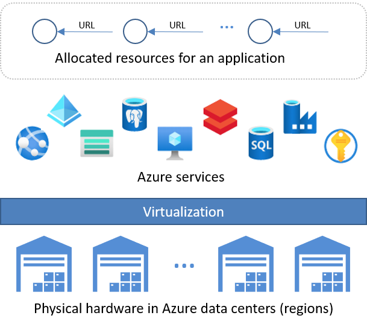

# Cloud development on Azure

You're a Python developer, and you're ready to develop cloud applications for Microsoft Azure. To help you prepare for a long and productive career, this series of three articles orients you to the basic landscape of cloud development on Azure.

## What is Azure? Data centers, services, and resources

Microsoft's CEO, Satya Nadella, often refers to Azure as "the world's computer." A computer, as you well know, is a collection of hardware that's managed by an operating system. The operating system provides a platform upon which you can build software that helps people *apply* the system's computing power to any number of tasks. (That's why we use the word "application" to describe such software.)

In Azure, the computer's hardware isn't a single machine but an enormous pool of virtualized server computers contained in [dozens of massive data centers around the world](https://azure.microsoft.com/explore/global-infrastructure/geographies/). The Azure "operating system" is then composed of *services* that dynamically allocate and de-allocate different parts of that resource pool as applications need them. Those dynamic allocations allow applications to respond quickly to any number of changing conditions, such as customer demand.

Each allocation is called a *resource*, and each resource is assigned both a unique *object identifier* (a GUID) and a unique URL. Examples of resources include virtual machines (CPU cores and memory), storage, databases, virtual networks, container registries, container orchestrators, web hosts, and AI and analytics engines.

Resources are the building blocks of a cloud application. The cloud development process thus begins with creating the appropriate environment into which you can deploy the different parts of the application. Put simply, you can't deploy any code or data to Azure until you've allocated and configured&mdash;that is *provisioned*&mdash;the suitable target resources.

The process of creating the environment for your application involves identifying the relevant services and resource types involved, and then provisioning those resources. The provisioning process is essentially how you construct the computing system to which you deploy your application. Provisioning is also the point at which you begin renting those resources from Azure.

There are hundreds of different types of Azure resources at your disposal. You might choose a basic "infrastructure" resource like a virtual machine when you need to retain full control and responsibility for the software you deploy. In other scenarios, you might choose a higher-level "platform" services that provide a more managed environment where you concern yourself with only data and application code.

While finding the right services for your application and balancing their relative costs can be challenging, it's also part of the creative fun of cloud development. To understand the many choices, review the [Azure developer's guide](/azure/guides/developer/azure-developer-guide). Here, let's next discuss how you actually work with all of these services and resources.

> [!NOTE]
> You've probably seen and perhaps have grown weary of the terms *IaaS* (infrastructure-as-a-service), *PaaS* (platform-as-a-service), and so on. The *as-a-service* part reflects the reality that you generally don't have physical access to the data centers themselves. Instead, you use tools like the Azure portal, Visual Studio Code, the Azure CLI, or Azure's REST API to provision *infrastructure* resources, *platform* resources, and so on. As a *service*, Azure is always standing by waiting to receive your requests.
>
> On this developer center, we spare you the IaaS, PaaS, etc. jargon because "as-a-service" is just inherent to the cloud to begin with!

> [!NOTE]
> A *hybrid cloud* refers to the combination of private computers and data centers with cloud resources like Azure, and has its own considerations beyond what's covered in the previous discussion. Furthermore, this discussion assumes new application development; scenarios that involve rearchitecting and migrating existing on-premises applications are not covered here. For more information on those topics, see [Get started with the Cloud Adoption Framework](/azure/cloud-adoption-framework/get-started/).

> [!NOTE]
> You might hear the terms *cloud native* and *cloud enabled* applications, which are often discussed as the same thing. There are differences, however. A cloud enabled application is often one that is migrated, as a whole, from an on-premises data center to cloud-based servers. Oftentimes, such applications retain their original structure and are simply deployed to virtual machines in the cloud (and therefore across geographic regions). Such a migration allows the application to scale to meet global demand without having to provision new hardware in your own data center. However, scaling must be done at the virtual machine (or infrastructure) level, even if only one part of the application needs increased performance.
>
> A cloud *native* application, on the other hand, is written from the outset to take advantage of the many different, independently scalable services available in a cloud such as Azure. Cloud native applications are more loosely structured (using micro-service architectures, for example), which allows you to more precisely configure deployment and scaling for each part. Such a structure simplifies maintenance and often dramatically reduces costs because you need pay for premium services only where necessary.
>
> For more information, see [Build cloud-native applications in Azure](https://azure.microsoft.com/overview/cloudnative/) and [Introduction to cloud-native applications](/dotnet/architecture/cloud-native/introduction), the principles of which apply to applications written in any language, including Python.

## Next step

> [!div class="nextstepaction"]
> [Provisioning, accessing, and managing resources >>>](cloud-development-provisioning.md)
