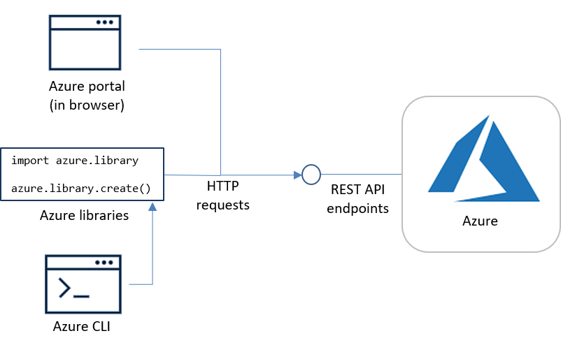

# Provisioning, accessing, and managing resources on Azure

[Previous article: overview](cloud-development-overview.md)

As described in the previous article of this series, an essential part of developing a cloud application is provisioning the necessary resources within Azure to which you can then deploy your code and data.

How is this provisioning done, exactly? How do you ask Azure to allocate resources for your application, and how do you then configure and otherwise access those resources? In short, how do you talk to Azure itself to get all these resources in place?

## Means of communicating with Azure

The answer is straightforward. As with most operating systems, you can communicate with Azure through three routes: a user interface, a command-line interface, and an API.

You can use any or all of these complementary methods to create, configure, and manage whatever Azure resources you need. In fact, you typically use all three in the course of a development project, and it's worth your time to become familiar with each of them.

Within this developer center, we primarily show use of the CLI and Python code that uses the Azure SDK because use of the portal is well covered in the documentation for each individual service.

## Azure portal

The [Azure portal](https://portal.azure.com) is Azure's fully customizable, browser-based user interface through which you can provision and manage resources with all Azure services. To access the portal, you must first sign in using a Microsoft Account and then create a free Azure account with a subscription. (Once signed in, you can select the **?** icon and select **Launch guided tour** for a simple walkthrough of the main portal features.)

**Pros**: The user interface makes it easy to explore services and all their the various configuration options. Setting configuration values is secure because no information is stored on the local workstation.

**Cons**: Working with the portal is a manual process and cannot be automated. To remember what you did to change a configuration, for example, means recording your steps in a separate document.

## Azure CLI

The [Azure CLI](/cli/azure/?view=azure-cli-latest) is Azure's [open source](https://github.com/Azure/azure-cli) command-line interface. Once you're signed in to the CLI (using the `az login` command), you can perform the same tasks that you can through the portal.
  
**Pros**: Easily automated through scripts and processing of output. Provides higher-level commands that provision multiple resources together for common tasks, such as deploying a web app. Scripts can be managed in source control.

**Cons**: Steeper learning curve than using the portal, and commands are subject to bugs. Error messages are not always helpful.

You can also use [Azure PowerShell](/powershell/) in place of the Azure CLI, although the Azure CLI's Linux-style commands are typically more familiar to Python developers.

In place of the local CLI or PowerShell, you can use the Azure Cloud Shell directly via [https://shell.azure.com/](https://shell.azure.com/). However, because Cloud Shell isn't a local environment, it's more suitable for one-off operations than automation.

## Azure REST API and Azure SDK

The [Azure REST API](/rest/api/?view=Azure) is Azure's programmatic interface, provided via secure REST over HTTP because Azure's data centers are all inherently connected to the Internet. Every resource is assigned a unique URL that supports a resource-specific API, subject to stringent authentication protocols and access policies. (The Azure portal and the Azure CLI, in fact, ultimately do their work through the REST API.)

For developers, the [Azure SDK](https://azure.microsoft.com/downloads/) provides language-specific libraries that translate the capabilities of the REST API into much more convenient programming paradigms such as classes and objects. For Python, you always install individual SDK libraries with `pip install` rather than installing the SDK as a whole.

**Pros**: Precise control over all operations, including a much more direct means of using output from one operation as input to another. For Python developers, allows working within familiar language paradigms rather than using the CLI. Can also be used from application code to automate management scenarios.
  
**Cons**: Operations that can be done with one CLI command typically require multiple lines of code, all of which is subject to bugs. Does not provide higher-level operations like the Azure CLI.

## Automatic on-demand provisioning

Many Azure services allow you to configure scaling characteristics to meet variable demand, in which case Azure can automatically provision additional resources when needed and de-allocate them as appropriate. Such automatic scaling is one of the key advantages of a cloud platform that's backed by the resources of multiple data centers. Instead of designing your environment for peak demand, paying for capacity you wouldn't typically be utilizing, you can design the environment for baseline or average usage and pay for additional capability only when necessary.

For more information, see [Autoscaling](/azure/architecture/best-practices/auto-scaling) in the Azure Architecture Center.

## Subscriptions, resource groups, and regions

Within Azure's resource model, you can imagine that, over time, you'll be provisioning many different resources across many Azure services for different applications. There are three levels of hierarchy that you can use to organize these resources:

1. **Subscriptions**: each Azure subscription has its own billing account and oftentimes represents a distinct team or department within an organization. In general, you provision all the resources you need for any given application within the same subscription so they can benefit from features like shared authentication. However, because all resources can be accessed through public URLs and the necessary authorization tokens, it's certainly possible to spread resources across multiple subscriptions.

1. **Resource groups**: within a subscription, resource groups are containers for other resources, which you can then manage *as* a group. (For this reason, a resource group typically relates to a specific project.) Whenever you provision a resource, in fact, you must specify the group to which is belongs. Your first step with a new project is usually to create an appropriate resource group. And by deleting the resource group you de-allocate all of its contained resources rather than having to delete each resource individually. Trust us when we say that neglecting to organize your resource groups can lead to many headaches later on when you don't remember which resource belongs to which project!

1. **Resource naming**: within a resource group, you can then use whatever naming strategies you like to express commonalities or relationships between resources. Because the name is often used in the resource's URL, there may be limitations on the characters you can use. (Some names, for example, allow only letters and numbers, whereas others allow hyphens and underscores.)

As you work with Azure, you'll develop your own preferences for organizing your resources and your own conventions for naming subscriptions, resource groups, and individual resource groups.

### Regions and geographies

A key characteristic of a resource group is that it's always associated with a specific Azure *region*, which is the location of the specific data center. All the resources in the same group are be co-located in that data center, and can thus interact much more efficiently than if they were in different regions. Developers often choose regions that are closest to their customers, thus optimizing an application's responsiveness. Azure also offers geo-replication features to synchronize copies of your application and databases across multiple regions so you can better serve a global customer base.

Due to local laws and regulations, which are determined by the *geography* in which you create a subscription, you might have access to only certain regions and those regions may not support all Azure services. For details, see [Azure global infrastructure](https://azure.microsoft.com/global-infrastructure/).

## Next step

> [!div class="nextstepaction"]
> [The Azure development flow >>>](cloud-development-flow.md)
